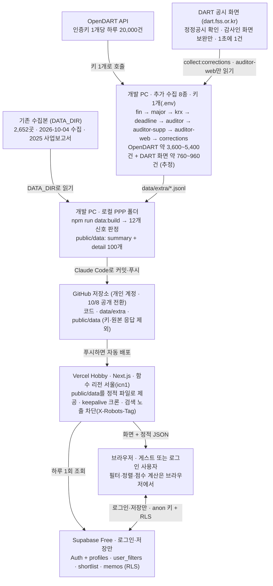

# PA Insight(가칭) 개발 설계서

> 이 파일(`docs/design.md`)이 기준본이다. 온라인 설계서(https://claude.ai/artifact/JcG83vdy2MsFCa23vBuThz)는 2026-10-05 이전 사본이며 더 갱신하지 않는다. 설계가 바뀌면 이 파일을 먼저 고친다. 같은 날 바뀐 계획(개발 PC 한 대·OpenDART 키 1개로 추가 수집, 기존 수집본으로 먼저 배포)과 10/5 점검 뒤 사용자 결정(D1 PA2 이름·유형 머리말, D2 RS1 영업정지, D3 IC1·IF3 점수 키, D4 정정공시 표시), Q1 검증 뒤 사용자 결정(E1 정정공시 최초 공시일·철회, E2 감사인 보완·이력 추정은 표시만, E3 IC2 이름·유형 머리말, E4 RS1 거래소 시장조치·영업정지 예외·영업양도, E5 자본금 계정명·RS3 이전 연도 주의·감자 중립 문구)도 이 파일에 먼저 반영했다. 신호별 해당 수는 E1~E5 반영 뒤 2026-10-06에 다시 수집·빌드한 값이다. 그 데이터로 한 Q1 재검증 뒤 사용자 결정(10/6 결정 A 감사인 DART 공시 화면 보완 `collect:auditor-web`, B 거래소 시장조치 사유 해소 정정 제외, C 영업정지 공시에 따른 자동 매매거래정지는 거래소 확인에서 제외, D RS1 시장조치 대표 근거 순위, E 내부결산 기준 공시 구분, F 놓친 철회 2건 표시)도 이 파일에 먼저 반영했다. A~F도 같은 날 다시 수집(`collect:krx` 캐시·`collect:auditor-web`·`collect:corrections`)·빌드해 신호별 해당 수에 반영했다(RS1 100→96, 감사인 미확인 29→10).

2026-10-05 (10-06 갱신) · @유태상

기존 수집본(2026-10-04, 상장사 2,652곳)에 부족한 항목만 OpenDART로 추가 수집해, 4개 용역 × 3개 신호로 PA 제안 후보를 고르는 웹서비스를 2026-10-07까지 완성한다. 무료 플랜(Vercel Hobby·Supabase Free)만 쓰고, 로컬 폴더 `C:\Users\yjh51\Desktop\PPP`에 구현한 뒤 Claude Code로 GitHub에 올려 Vercel로 배포한다.

## 범위와 제약

앱은 기존 수집본에 추가 수집분을 합친 스냅샷으로 동작하고, 실행 중에는 OpenDART나 LLM API를 호출하지 않는다.

| 구분 | 내용 |
| --- | --- |
| 대상 기업 | 기존 수집본 2,652곳(코스피 831·코스닥 1,821) 중 스팩 71곳과 리츠·인프라펀드 26곳을 뺀 2,555곳 |
| 용역·신호 | 회계·결산 지원(PA), 내부회계관리제도, IFRS 18 도입 지원, 재무자문·구조조정 × 각 3개 = 12개 |
| 데이터 | 기존 수집본(2025 사업보고서 기준) + 추가 수집 8종(OpenDART 6종 + DART 공시 화면 2종: 감사인 화면 보완·정정공시 확인). 화면에 데이터 기준일과 추가 수집 반영 여부 표시 |
| 화면 | 5개: 로그인, 대시보드, 추천 목록, 기업 상세, 내 후보·설정 |
| 사용자 | 로그인 없이 모든 조회 가능. 로그인하면 조건·후보·메모·프로필 저장 |
| 일정 | 개발 완료 2026-10-07, 제출 2026-10-08 11:00, 링크 유지 2026-10-30까지 |

**만들지 않는 것**

- 앱 실행 중 OpenDART·LLM API 호출, 데이터 자동 갱신
- 기존 수집본에 이미 있는 항목의 재수집
- 감사시간 초과, 감사보고서 강조사항, 감사 전 재무제표 미제출: 기존 수집본에 있어도 신호·화면에 쓰지 않는다
- 회원가입 화면, 이메일 인증, 비밀번호 찾기, 계정 삭제(내 데이터 지우기만 제공)
- 관리자 화면

**원칙**

- 무료 플랜만 쓴다: Supabase Free, Vercel Hobby.
- OpenDART 키는 1개이며 개발 PC의 `.env`에만 둔다. GitHub·Vercel·브라우저 어디에도 두지 않고, Supabase service\_role 키는 쓰지 않는다.
- 브라우저에는 공개용 Supabase URL과 anon 키만 두고, 사용자 데이터는 RLS로 보호한다.
- 대표자명은 공시된 기업개황 정보로 적재해 상세·연락처 복사·CSV에 표시한다. 담당자 개인 연락처와 법인·사업자등록번호는 수집하지 않는다.
- 사용자 데이터는 로그인 이메일과 본인이 입력한 프로필·메모뿐이다.
- 독립성: 현재 감사인이 삼일회계법인인 회사는 기본으로 숨기고 상세 화면에 경고를 띄운다. 현재 감사인은 공시에서 확인한 값(2026 반기 감사인 → 감사용역체결현황 보완 → DART 공시 화면 보완 → 2025 사업보고서 → 감사용역체결현황 보완 → DART 공시 화면 보완)만 쓴다. 끝내 찾지 못하면 '감사인 미확인'으로 두고, 감사인 이력의 가장 최근 감사인은 '추정'으로 표시만 한다(숨김에 쓰지 않음. 추정 감사인이 삼일이면 주황 경고). 최종 판단은 사내 독립성 절차를 따른다.
- 모든 추천은 공시 신호 기반 검토 후보이며 용역 수요를 확정하지 않는다고 화면에 적는다.

## 시스템 구성

공시 데이터는 빌드 때 정적 JSON으로 만들어 저장소에 커밋하고, Vercel이 그대로 내보낸다. Supabase는 로그인과 개인 저장에만 쓴다. 추가 수집과 `data:build`, 커밋·푸시는 모두 개발 PC 한 대에서 한다(2026-10-05 변경).



OpenDART 키는 개발 PC의 `.env` 밖으로 나가지 않는다. DART 공시 화면은 키 없이 읽으며, `collect:corrections`가 정정공시의 최초 공시일·정정 내용을, `collect:auditor-web`이 OpenDART 감사인 API 두 개가 모두 감사인을 주지 않은 보고서의 '외부감사에 관한 사항' 표만 읽는다(OpenDART API로는 받을 수 없거나 API 값이 빈 항목, 10/6 결정 A). 앱 실행 중에는 어느 쪽도 부르지 않는다. 방문자는 Vercel이 내보내는 JSON만 읽으므로 Supabase가 멈춰도 조회는 계속된다.

Vercel 함수 리전은 서울(`vercel.json`의 `regions: ["icn1"]`), Node.js는 `package.json`의 `engines.node` `"24.x"`로 고정한다. 링크를 아는 사람만 쓰는 프로토타입이라 모든 페이지에 robots `noindex`를 붙이고, `vercel.json`의 `headers`로 정적 JSON을 포함한 모든 응답에 `X-Robots-Tag: noindex, nofollow`를 붙여 검색 노출을 막는다. 자세한 설정은 '배포와 운영'에 있다.

## 데이터 수집

수집은 두 겹이다. 기존 수집본은 그대로 쓰고, 신호에 모자란 항목만 8종 추가 수집한다(OpenDART 6종, DART 공시 화면 2종: 감사인 화면 보완·정정공시 확인). 추가 수집은 개발 PC 한 대에서 OpenDART 키 1개로 모두 실행한다(2026-10-05 변경). OpenDART 예상 호출은 모두 합쳐 약 3,600\~5,400건으로 키 하나의 하루 한도(20,000건)의 18\~27%다(추정. 10/5의 5종 3,400\~5,100건에 Q1 뒤 추가한 자본금 보완 약 30건·감사인 보완 약 210건을 더함). DART 공시 화면 요청(`collect:corrections` 약 650\~700건 + `collect:auditor-web` 약 110\~260건, 합계 약 760\~960건, 추정)은 OpenDART 한도와 따로이고, 1초에 1건으로 제한한다.

**기존 수집본** — `상장기업자료_최종검토본/08_상장기업전체_웹앱용_기업데이터.json`, 2026-10-04 수집·10-05 검토 완료

| 항목 | 내용 | 쓰는 곳 |
| --- | --- | --- |
| 대상 | 네이버 증권 목록(2026-10-04 22:53) 기준 2,652곳. 중복 우선주 114종목과 상장펀드 2종목은 이미 제외 | 대상 목록 |
| 기업개황 | 시장, 업종코드, 대표자, 결산월, 상장일, 홈페이지·IR·대표전화·팩스·주소 | 목록·상세·CSV, IF2 |
| 재무 | 2025 사업보고서 자산총계·매출액·영업이익. 연결·별도 중 한 기준, 원래 통화 | 규모 구간, IC1·IF3 근사 |
| 감사인 이력 | 2020\~2025 사업연도별 감사인 (연도마다 직접 조회) | PA2, 독립성(2025 감사인. 확정 감사인이 없으면 이력 추정을 표시만) |
| 감사의견·핵심감사사항 | 2025 감사의견과 핵심감사사항 원문 | RS2, 상세 참고 |
| M&A 공시 | 2025-10-04\~2026-10-04 주요사항보고서 중 합병·주식양수·영업양수·주식교환 | PA3·IC3 |
| 쓰지 않음 | 감사시간·감사보수, 감사보고서 강조사항, 감사 전 재무제표 미제출, 비감사용역 | — |

**추가 수집** — 부족한 항목만, 대상은 `data/universe.json`의 2,555곳

| 명령 | API · 요청 조건 | 받는 것 | 호출 수 | 풀리는 신호 | 담당 · 순서 |
| --- | --- | --- | --- | --- | --- |
| `collect:fin` | 다중회사 주요계정 `fnlttMultiAcnt.json` · 100곳씩, 2025 사업보고서(11011), 없으면 2024. 자본금 보완: 응답에 자본금 행이 없는 원화 레코드(자본총계는 있음)만 단일회사 전체 재무제표 `fnlttSinglAcntAll.json`(같은 연도·연결/별도, 레코드당 1회)으로 다시 찾는다 | 연결·별도 자산·부채·자본금·자본총계·매출·영업이익 3개년·세전이익·순이익 | 약 30 + 자본금 보완 약 30 | IF1, RS3, IC1 정확화 | 개발 · 1 |
| `collect:major` | 공시검색 `list.json` · 주요사항보고서(B), 최근 12개월을 89일 이하 구간으로, 코스피·코스닥 | 합병·분할·영업양수도, 부도·회생·채권은행 관리(개시·중단)·감자·영업정지 등 | 10\~60 | RS1, PA3·IC3에 분할·영업양도 추가 | 개발 · 2 |
| `collect:krx` | `list.json` · 거래소공시(I), 최근 12개월 | 제목에 횡령·배임이 든 공시(`cat:'FRAUD'`) + 거래소 시장조치(`cat:'MARKET'`, `mkt`: 실질심사·상장폐지사유·관리종목·반기부적정·내부결산·중요한영업정지). 시장조치는 같은 응답(같은 캐시)에서 제목으로 고르므로 새 호출이 없다(Q1 뒤 추가). 내부결산은 10/6 결정 E로 관리종목에서 나눴고, 중요한영업정지는 수집·근거 공시 목록에는 남기되 RS1 근거·영업정지 예외에는 쓰지 않는다(10/6 결정 C) | 수백\~1,200 (시장조치 추가분 0) | IC2, RS1(거래소 시장조치·영업정지 예외) | 개발 · 3 (2와 같은 날) |
| `collect:deadline` | `list.json` · 2024\~2026년 3/1\~4/10(3/1\~3/19와 3/20\~4/10 두 구간으로 나눠 조회), 유형 전체(응답에 공시유형 필드가 없어 유형으로 좁히지 않음) | 사업보고서 제출기한 연장신고 | 수백\~1,200 | PA1 | 개발 · 4 |
| `collect:auditor` | 회계감사인 `accnutAdtorNmNdAdtOpinion.json` · 2026 반기(11012), 회사당 1회, 2,555곳 한 번에 | 2026 반기 감사인 | 약 2,560 | 현재 감사인, PA2 확정 | 개발 · 5 |
| `collect:auditor-supp` | 감사용역체결현황 `adtServcCnclsSttus.json`(정기보고서 주요정보 DS002) · 회사당 1회. 2026: 2026 반기 감사인에서 감사인을 얻지 못한 곳(`auditor_raw` 빈 값 — API 값 '-'·감사인 아님·당반기 행 없음·반기보고서 없음 013) → 2026 반기(11012). 2025: 기존 수집본에 2025 감사인이 없는 곳 → 2025 사업보고서(11011). `.env`에 `DATA_DIR`이 없으면 2026만 | 같은 보고서의 당기 감사인(`adtor`). 당기 행은 `auditor-2026h1.mjs`의 `pickCurrent`·`looksLikeAuditor`를 그대로 써서 고른다. 보수·시간 칸은 저장하지 않는다 | 약 210 (10/5 기준 2026 143곳 + 2025 71곳) | 현재 감사인(독립성), PA2 | 개발 · 6 (5 다음) |
| `collect:auditor-web` | DART 공시 화면(dart.fss.or.kr, OpenDART 아님, 10/6 결정 A) · 대상: 2026 — 2026 반기 회계감사인 API와 2026 감사용역체결현황 모두에서 감사인 이름을 얻지 못했고('-'·감사인 아님·당반기 행 없음) 반기보고서 접수번호(`auditor_2026h1`의 `rcept_no`)는 있는 회사(10/6 데이터 54곳. 반기보고서 없음 013은 뺀다). 2025 — 기존 수집본과 2025 감사용역체결현황 모두에 2025 감사인이 없고 2025 사업보고서 접수번호가 있는 회사. 보고서 1건에 화면 2번: ① 공시 화면 `dsaf001/main.do?rcpNo={보고서 접수번호}`의 목차에서 '외부감사에 관한 사항'(사업보고서 'V. 회계감사인의 감사의견 등' 아래) 위치 → ② 그 부분 `report/viewer.do`의 '회계감사인의 명칭 및 감사의견' 표(없거나 감사인 칸이 비면 같은 부분의 '감사용역 체결현황' 표) | 그 보고서의 당기·당반기 감사인(`auditor_raw`). 당기 행은 `auditor-2026h1.mjs`의 `pickCurrent`·`looksLikeAuditor`(감사인 API·감사용역체결현황과 같은 함수)로 고른다. 보수·시간 칸은 저장하지 않는다 | DART 화면 약 110\~260 (약 54\~130곳 × 2화면, 1초 1건이라 약 2\~5분) · OpenDART 0 | 현재 감사인(독립성), PA2 | 개발 · 7 (5·6 다음) |
| `collect:corrections` | DART 공시 화면(dart.fss.or.kr, OpenDART 아님) · 대상: `data/extra`의 `filings_major`(신호에 쓰는 제목만)·`filings_krx`·`filings_deadline` 중 제목 머리말이 정정류([기재정정]·[첨부정정]·[첨부추가]·[정정명령부과] 등. [연장결정]은 아님)인 공시. 공시 1건에 화면 2번: ① 공시 화면 `dsaf001/main.do`의 '본문' 버전 목록에서 원공시(머리말 없는 가장 오래된 버전)와 목차의 '정정신고(보고)' 위치 → ② 정정신고 부분 `report/viewer.do`의 최초제출일(거래소공시는 '정정관련 공시서류제출일')·정정사유·정정사항(정정 후). [첨부추가]처럼 버전 목록에 자기 자신만 있으면 ①만. [첨부정정]·[첨부추가]는 자기 정정신고에 철회가 없으면 ①의 버전 목록에서 같은 원공시의 다른 정정 버전(원공시 이후·이 정정본 이전, 같은 날 포함)도 ①·②로 읽어 정정사유를 확인한다(10/6 결정 F, 요청 소수 추가, 캐시) | 최초 공시일(`first_date` = 공시 화면 버전 목록의 원공시 날짜. 원공시를 못 찾으면 정정신고의 '최초제출일'. 거래소공시 '정정관련 공시서류제출일'은 바로 앞 버전 날짜라 비교에만 쓰고, 둘 다 없으면 null)·원공시 접수번호, 철회 여부(`withdrawn`·`withdraw_kw`. 거래소 시장조치·내부결산 공시의 사유 해소 정정도 `withdrawn:true`·`withdraw_kw:'사유 해소'`, 10/6 결정 B), 정정사유 요약, 첨부정정 여부(`attach_only`) | DART 화면 약 650\~700 (10/5 기준 대상 약 330건, 1초 1건이라 약 12\~15분) · OpenDART 0 | PA3·IC3·RS1·IC2·PA1의 근거일·최근 12개월 판정·철회 제외·사유 해소 제외·첨부정정 원공시 링크 | 개발 · 8 (2\~4 다음) |

**권장 실행 순서**: `collect:fin` → `collect:major` → `collect:krx` → `collect:deadline` → `collect:auditor` → `collect:auditor-supp` → `collect:auditor-web` → `collect:corrections` → `data:build`. `auditor-supp`는 `auditor` 결과를, `auditor-web`은 `auditor`·`auditor-supp` 결과를, `corrections`는 major·krx·deadline 결과를 대상으로 쓰므로 그 뒤에 돌린다. auditor·auditor-supp를 다시 받으면 `auditor-web`을, major·krx·deadline을 다시 받으면 `corrections`를 다시 실행한다(받은 화면은 캐시라 새로 필요한 화면만 요청한다).

- `collect:major`와 `collect:krx`는 같은 날 끝낸다. 조회 종료일 기본값이 실행일이라, 다음 날 옵션 없이 다시 돌리면 구간이 바뀌어 캐시를 못 쓰고 처음부터 다시 호출한다. 그래서 시작할 때 조회 종료일을 크게 출력하고, 실패·중단하면 `다시 실행: npm run collect:major -- --end YYYYMMDD`를 덧붙인다. 다음 날 이어받을 때도 같은 `--end`(첫 실행일)를 준다. 형식이 틀리거나 오늘보다 뒤인 `--end`는 호출 전에 멈춘다.
- `collect:deadline`은 날짜가 고정(2024\~2026년 3/1\~4/10)이라 언제 다시 돌려도 캐시를 쓴다. 이 기간은 12월 결산 회사의 사업보고서 기한(3월 말) 기준이라, 12월 결산이 아닌 회사(대상 2,555곳 중 31곳)는 PA1 판정 범위 밖이고 상세에 그 이유를 적는다. `-- --probe`는 '연장'이 들어간 제목 목록만 출력하고 결과 파일을 쓰지 않는다.
- 연장신고 구간 변경(2026-10-05 점검): 처음에는 3/20\~4/10만 받았는데, DART 일별 공시목록에서 대상 기업이 3/20 전에 낸 연장신고(2026-03-16·03-18, 2025-03-19, 2024-03-15·03-19 접수. 일부 날짜만 조회해 찾은 것만 10건)가 빠진 것을 확인했다. 그래서 시작일을 3/1로 당기고, 연도·시장마다 [3/1\~3/19]와 [3/20\~4/10] 두 구간으로 나눠 조회한다. 캐시 이름에 조회 구간이 들어가므로 한 구간(3/1\~4/10)으로 바꾸면 이미 받은 응답을 못 쓰지만, 두 구간으로 나누면 3/20\~4/10은 캐시를 그대로 쓰고 3/1\~3/19만 새로 받는다. 구간을 넓힌 뒤 `collect:deadline` → `data:build`를 다시 실행해야 PA1에 반영된다.
- 저장하지 않고 멈추는 경우(결과 `*.jsonl`·`*.meta.json`을 쓰지 않음): 응답 상태가 000·013이 아닌 요청이 하나라도 있을 때(OpenDART 명령 모두, 상위 10건 출력), `collect:fin`에서 주요계정을 받은 회사가 대상의 90% 미만일 때(`-- --allow-low`로만 저장), `collect:deadline`에서 연장신고가 0건일 때(제목 목록 출력, `-- --allow-empty`로만 저장), `collect:corrections`에서 화면을 받지 못했거나(HTTP 오류·이상 화면) 공시 화면에서 버전 목록을 읽지 못한 공시가 1건이라도 있을 때(DART 화면 형식이 바뀐 것으로 봄), `collect:auditor-web`에서 화면을 받지 못했거나 공시 화면에서 목차를 읽지 못한 보고서가 1건이라도 있을 때(같은 이유), 받은 외부감사 화면 5건 이상 모두에서 '사업연도·감사인' 표를 못 찾았을 때(형식 변경으로 봄). 목차는 읽었지만 '외부감사에 관한 사항'이 없는 보고서는 멈추지 않고 `invalid_raw:'목차에 외부감사 항목 없음'`으로 저장·출력. 받은 응답은 캐시에 남으므로 같은 명령을 다시 실행하면 새 호출이 거의 없다.
- `collect:krx`의 거래소 시장조치: 제목 규칙('공시 제목 분류 규칙'의 MARKET)에 맞는 공시만 `cat:'MARKET'`으로 남기고, 시장조치처럼 보이지만 규칙 밖인 제목(우려·해제·관련 안내 등)은 건수 순 10개를 출력한다. 제목에 횡령·배임이 있으면서 시장조치이기도 하면 `cat:'FRAUD'`에 `mkt`도 넣는다. `cat`이 없는 옛 행은 FRAUD로 읽는다. '내부결산시점관리종목지정ㆍ형식적상장폐지ㆍ상장적격성실질심사사유발생' 류는 회사가 감사 전에 낸 공시라 `mkt:'내부결산'`으로 관리종목과 나눈다(10/6 결정 E). '주권매매거래정지(중요한 영업정지)'는 `mkt:'중요한영업정지'`로 그대로 저장하고, 신호에서 빼는 일은 `data:build`가 한다(10/6 결정 C).
- `collect:auditor-supp`: 대상 수와 `감사인 찾음: 2026 반기 N/M곳 · 2025 N/M곳 · 데이터 없음(013) N건`, 감사인 아님으로 버린 값 상위 10개를 출력한다. 감사인 이름인 값만 `auditor_raw`에 넣고 아니면 빈 값이다. 보완으로도 못 찾은 곳은 `collect:auditor-web`이 DART 공시 화면에서 다시 찾는다('독립성 규칙').
- `collect:auditor-web`(10/6 결정 A): 맨 위 `감사인 보완(DART 공시 화면): 2026 반기 N곳 · 2025 사업보고서 N곳 = 화면 약 N번, 1초 간격`(접수번호가 없어 건너뛴 곳 수 포함), 20곳마다 진행 상황, 끝에 `감사인 찾음: 2026 반기 N/M곳 · 2025 N/M곳`, 감사인 아님으로 버린 값 상위 10개, 첫 표에서 못 얻어 '감사용역 체결현황' 표로 찾은 곳·목차에서 외부감사 항목을 못 찾은 곳·'사업연도·감사인' 표를 못 찾은 곳·반기보고서·사업보고서가 아닌 화면(접수번호 확인 필요)을 각각 최대 10개, `완료: 감사인 보완(DART 공시 화면) N건(찾음 N건)`를 출력한다. 요청 간격·재시도·403·429 멈춤은 `collect:corrections`와 같고(`createDartWeb`), 화면은 같은 캐시 폴더 `data/raw/dartweb/main/`·`data/raw/dartweb/viewer/`에 쌓아 이어받는다(모의 서버 `DARTWEB_BASE_URL`이면 `data/raw/_mock/dartweb/`). 감사인 이름인 값만 `auditor_raw`에 넣고, 그래도 못 찾으면 '감사인 미확인'으로 남는다. 원문으로 확인한 기대값(Q1·10/6 재검증): 한화오션 2026 한영회계법인(지정감사), 아시아나항공 2025·2026 삼정회계법인, 케이뱅크 2025 안진회계법인·2026 삼일회계법인, 에이아이코리아 2026 삼일회계법인.
- `collect:corrections`: 요청 간격은 1초 이상(실제 DART 화면), 실패하면 2·4·8초 뒤 다시 시도(최대 4번)하고, 403·429(차단·과다 요청)는 바로 멈춘다. 받은 화면은 `data/raw/dartweb/main/`·`data/raw/dartweb/viewer/`에 캐시해 이어받는다(모의 서버 `DARTWEB_BASE_URL`로 받은 화면은 `data/raw/_mock/dartweb/`). 끝에 `최초 공시일 확인 N/M건 · 원공시 접수번호 N건 · 첨부정정류 N건 · 철회·취하 등 N건`, 철회 감지 목록(최대 40건), 정정신고 부분을 못 읽은 공시(원공시 정보만 저장, `source:'dartweb-family'`, 철회 판단 못 함), 원공시 날짜와 정정신고의 제출일(최초제출일·정정관련 공시서류제출일)이 사흘 넘게 다른 공시(원공시 날짜를 씀)를 출력한다. 철회 감지 목록에는 사유 해소(`withdraw_kw:'사유 해소'`)와 형제 기재정정에서 찾은 철회(찾은 버전의 접수번호)도 함께 보인다(10/6 결정 B·F).
- 철회 감지(`collect:corrections`): 정정사유·정정 항목·정정 후 내용에 철회·취하·부결·해제·해지·처분 취소 확정·전 항목 삭제·모든 절차 중단이 있으면 `withdrawn:true`.
  - 사건 말: 정정사유·항목·정정 후 내용 모두 그 공시의 사건 말(합병·분할·양수·양도·영업정지·감자·회생·관리절차·횡령 등, 거래소공시는 실질심사·상장폐지·관리종목 등)이 같은 문장 앞쪽 30자(또는 뒤 12자) 안에 있을 때만 본다. '본 건'·'본건'·'본 공시'·'본공시'는 그 공시 자체를 가리키므로 사건 말로 본다(10/6 결정 F. 한화 20260311003260 감자결정 정정사유 '2026.01.14에 공시한 본 건을 철회'). 앞쪽에 다른 결정 이름이 있으면('유상증자 결정 철회에 따른 감자 일정 변경') 그 이름 뒤에 사건 말이 있어야 한다. 예외: 공백 뺀 15자 이하이고 다른 결정 이름이 없는 짧은 정정사유('계약 해지'·'계약 합의 해제에 따른 정정'), 다른 결정·안건(정관·선임 등) 이름이 없는 정정사유의 '부결'('임시주주총회 의결정족수 부족에 따른 부결').
  - 결정과 무관한 대상: 보호예수·담보·질권·근저당·신탁·임대차·대출·예금·약정·매매거래정지·관리종목·소송·고소·집행정지·반대의사·주식매수청구·주주총회·소집·최대주주 등 뒤에 바로, 또는 명사 1~2개(사건 말 없이)를 건너 오는 해지·해제·철회·취하는 빼고 본다(예: '신탁계약 해지'·'근저당권 해지'·'질권 설정 해지'·'대출 약정 해지'·'임대차 계약 해지'·'주주총회 소집 철회'·'매매거래정지 및 해제'·'정지 해제 시까지').
  - 조건·예정: '부결될 경우'·'부결 시'·'해제할 수 있다'·'해제 시까지'·'해지일까지'·'해지 예정'은 철회 사실이 아니다. 일부 해제·일부 철회·처분 일부 취소, 재접수·재신청·재결의·재소집이 뒤따르는 경우도 철회로 보지 않는다.
  - 처분 취소 확정: 같은 문장에 패소·기각·각하·'인용되지 않음'이 있으면 회사가 진 소송이라 철회가 아니다('영업정지 처분 취소 소송 패소 확정'). 승소나 상대방(피고·처분청)의 상고·항소 기각은 회사가 이긴 것으로 본다(GS건설 '영업정지 1개월 처분 취소 확정').
  - 전 항목 삭제: 행 수가 아니라 결정의 핵심 항목이 지워졌을 때만 본다. 정정 후 칸(각주 칸 '주2) 정정후' 등 빼고)이 모두 '-'·'삭제'이고, 정정 전 값이 있던 행이 지워졌으며, 항목 이름이 '전체'·공시 제목(예: 회생절차 개시신청)이거나 1·2번 항목이 지워졌거나 항목 번호가 없는 표에서 정정 전 값이 있던 행 3개 이상이 지워졌을 때다. 항목 이름에 '일부'가 있으면 보지 않는다. 뒤쪽 번호 항목(풋옵션·기타 투자판단 참고사항 등)만 지운 정정은 철회가 아니다.
  - 형제 기재정정(10/6 결정 F): [첨부정정]·[첨부추가] 공시는 정정신고 부분에 첨부서류 정정만 적혀 철회 내용이 없을 수 있다. 그래서 자기 정정신고에 철회가 없으면 ① 버전 목록(family)에서 같은 원공시의 다른 정정 버전(원공시보다 뒤이고 이 정정본보다 앞, 같은 날 접수 포함, 자기 자신 제외)의 정정신고 부분도 최신 버전부터 읽어 같은 규칙으로 철회·사유 해소를 찾는다(버전당 화면 2번 추가, 캐시, 찾으면 멈춤). 버전 목록의 '[정정]' 표시로는 기재정정과 첨부정정을 가를 수 없어 정정 버전을 모두 본다. 찾으면 그 첨부정정도 `withdrawn:true`이고, `reason`은 자기 정정사유 뒤에 `정정본 <접수번호>: <철회 문맥>`을 붙인다. 다른 버전 화면을 받지 못하면 저장 전에 멈춘다. 예: 미래에셋생명 20260326001536 [첨부정정] 감자결정 — 철회 내용은 같은 날 [기재정정] 20260326001292에만 있다. 공시검색은 최종 보고서만 받아 20260326001292는 근거 공시 목록에 없다.
  - 사유 해소(10/6 결정 B): 거래소 시장조치 공시(`filings_krx`에서 `mkt`가 있는 행, 내부결산 포함)는 정정사유·정정 후 내용에 '사유가 해소'·'해소되었'·'해당 사유 없음'이 있거나, '미해당'·'해당하지 않'이 같은 문장 앞 40자(또는 뒤 16자) 안의 사유·관리종목·상장폐지·실질심사·상장적격성·요건과 함께 있으면 사유가 해소된 것으로 보고 `withdrawn:true`·`withdraw_kw:'사유 해소'`로 저장한다. 조건·가정('해소될 경우'·'해소 여부'·'해소 시'·'해당하지 않을 경우'), 부정('해소되었다고 볼 수 없'), 표의 기준별 칸('3) 미해당')·'해당/미해당' 선택지, 투자주의 환기종목·불성실공시 등 다른 조치 이야기, 같은 칸의 '여전히 해당'·'사유는 유지'(일부 해소)는 빼고, 제목에 횡령·배임이 있는 공시는 사건 자체가 남으므로 보지 않는다. 철회·취하 판단을 먼저 하고, 철회가 없을 때만 사유 해소를 본다. `data:build`는 철회와 같이 신호에서 빼고 이유를 `nosig:'resolved'`로 남긴다. 예: 아이엘 20260316902716 [기재정정] 내부결산시점 공시의 정정사유 '최초 내부결산 시점에 … 확인되었으나, 외부감사 진행 중 재무제표 수정사항 반영으로 해당 사유가 해소되었습니다'. 해소 문구가 없는 내부결산 정정(디와이디 20260305901571, 유틸렉스 20260325901362, 디에이치엑스컴퍼니 20260317901013)은 그대로 신호다.
  - 채권은행 관리절차 공시의 '절차 중단'은 철회가 아니라 그 자체가 RS1 사건이다(E4). 키워드 방식이라 다른 표현의 철회는 놓칠 수 있다(리스크 표).
- `collect:fin`의 90%는 저장을 막는 최소선이고, 출시 합격 기준은 95%다(검증 '추가 수집 품질 기준'). 90\~95%면 저장은 되지만 합격이 아니므로 '매칭 안 된 계정명'을 보고 `fin.mjs` 계정 규칙을 고쳐 다시 실행한다(받은 응답은 캐시라 새 호출이 거의 없다).
- `*.meta.json`에는 결과 내용과 조회 조건(구간 `from`·`to`, 연도 등 기록 항목)을 함께 넣어 만든 해시(`hash`)를 남긴다. 캐시로 같은 조건·같은 결과를 다시 쓰면 수집 시각(`collectedAt`)을 그대로 두어 데이터 기준일이 밀리지 않고, 조회 구간이 바뀌면 결과가 같아도 새 수집 시각이 된다. 대시보드 '데이터 상태'는 이 기록으로 `반영 · 수집 YYYY-MM-DD · 개수`를 보여 준다. 개수는 주요계정이 받은 회사 `N곳`, 2026 반기 감사인이 `감사인 확인 N곳`(파트 합계), 주요사항·거래소공시·연장신고·감사인 보완(`auditorSupp.meta.json`)·감사인 화면 보완(`auditorWeb.meta.json`, 10/6 결정 A)·정정공시 확인(`corrections.meta.json`)이 결과 `N건`이다(칩 8개). 개수가 0이거나 감사인 파트가 덜 모이면 주황색으로 표시한다.
- `collect:auditor`는 호출이 가장 많아 가장 오래 걸린다(약 10\~25분, 추정). `collect:corrections`도 1초 간격이라 약 12\~15분, `collect:auditor-web`은 약 2\~5분 걸린다(추정). 그동안 배포 작업을 나란히 해도 된다.
- `--part 1/2`·`2/2` 분할은 여럿이 키를 나눠 받을 때만 쓰는 선택 기능이다. 지금 계획에서는 쓰지 않는다.

결과는 `data/extra/`에 명령(파트)마다 다른 파일(`*.jsonl`, `*.meta.json`)로 쌓여, 나중에 여럿이 나눠 받아도 커밋이 충돌하지 않는다. 추가 수집 전인 신호는 화면에서 '추가 수집 전'으로 비활성 표시된다.

**공통 수집 규칙**

1. 모든 호출은 `scripts/lib/dart.mjs` 하나로 한다(OpenDART는 `createDart`, DART 공시 화면은 `createDartWeb`). OpenDART 요청 간격 0.22초·타임아웃 20초(DART 공시 화면은 1초 이상·30초). 네트워크 오류·HTTP 오류·800·900이면 2·4·8초 뒤 다시 시도해 최대 4번까지 하고(마지막 시도 뒤에는 기다리지 않는다), 4번 모두 실패하면 멈춘다.
2. 상태코드: 000 정상 · 013 데이터 없음 · 020 한도 초과(즉시 멈추고 다음 날 같은 명령으로 이어받기) · 800·900 재시도 · 010·011·012·901 키 문제(멈추고 알림). 그 밖의 상태(100 잘못된 값 등)는 모아 두었다가 끝에 상위 10건(상태코드·메시지·요청 인자)을 보여 주고 결과 파일을 저장하지 않고 멈춘다. 이 응답은 캐시에 남기지 않아 다시 실행하면 그 요청부터 다시 받는다. 정상(000·013) 응답 없이 이런 응답이 10번 연속 오면 키·기간 같은 설정 문제로 보고 끝까지 가지 않고 그 자리에서 멈춘다(마지막 응답 출력, 한도 낭비 방지). 캐시에서 읽은 정상 응답도 연속 수를 되돌린다(다시 실행할 때 흩어진 실패만 몰려 와서 잘못 멈추지 않게). 공시검색 명령은 구간마다 이런 응답을 처음 받으면 그 구간의 남은 쪽을 건너뛰므로, 이런 응답은 구간 수를 넘지 않는다(`collect:deadline`은 3개년 × 2시장 × 2구간 = 12구간). 이런 응답이 10건이 안 되면 끝까지 받은 뒤 저장 전 검사에서 멈춘다.
3. 000·013 원본 응답은 `data/raw/`에 저장하고 커밋하지 않는다. 이미 받은 요청은 건너뛰어, 끊겨도 같은 명령으로 이어받는다. 캐시는 임시 파일에 다 쓴 뒤 이름을 바꿔 저장하고, 읽을 수 없는(쓰다 끊긴) 캐시는 지우고 다시 받는다. 모의 서버(`DART_BASE_URL`)로 받은 응답은 `data/raw/_mock/`에 따로 저장해 실제 캐시와 섞이지 않게 한다.
4. 수집 플래그(`--part`·`--year`·`--fallback`·`--end`·`--years`·`--type`) 뒤에 값을 빠뜨리면 기본값으로 넘어가지 않고 호출 전에 멈춘다.
5. 수집은 개발 PC에서 `.env`의 키 1개로 8종을 모두 실행한다(2026-10-05 변경, 10/6 3종 추가. DART 공시 화면 2종은 키를 쓰지 않는다). 대상 목록은 `data/universe.json` 하나라 기존 수집본 폴더 없이도 수집할 수 있고, 여럿이 나눌 때 쓰는 `--part` 분할(선택)도 어긋나지 않는다.
6. 금액은 쉼표를 지운 원 단위 정수로, '-'·빈 값은 null로 저장한다.
7. 끝나면 새 호출·캐시·정상·데이터 없음·기타·확인 필요 건수를 출력한다.

**첫날 확인할 것**

모두 개발이 실행 순서대로 확인한다. 2026-10-05에 5종을 모두 받아 반영했다(결과는 '검증'의 품질 기준 표).

- [x] 모든 명령에서 `확인 필요 0건`인지 확인. 0건이 아니면 저장 없이 멈춘 것이니 출력된 상태코드를 보고 같은 명령을 다시 실행한다
- [x] `collect:fin`의 받은 회사 `N/2555곳`이 합격 기준 95% 이상인지(90% 미만이면 저장 없이 멈춤), '매칭 안 된 계정명'에 자본금·세전이익 변형이 있는지 확인 → 있으면 `fin.mjs` 계정 규칙에 추가 (10/5: 2,531/2,555곳 = 99.1%)
- [x] `collect:major`·`collect:krx` 시작 줄의 조회 종료일을 적어 둔다. 다음 날 이어받으면 그 날짜를 `-- --end`로 준다 (10/5: 조회 종료일 20261005, 구간 20251006\~20261005)
- [x] `collect:krx`가 출력하는 제목 예에서 횡령·배임 표기('ㆍ'(U+318D)·'·' 등)가 잡히는지 확인
- [x] `collect:deadline`은 옵션 없이 유형 전체·3개년으로 받는다. `list.json` 응답에는 공시유형 필드가 없어 유형을 확인해 `--type`으로 좁힐 수 없다. `-- --probe`는 '연장'이 들어간 실제 제목 목록(규칙 밖 제목 표시)만 보여 주고 파일은 쓰지 않는다. 제목 규칙에 안 맞는 표기가 있거나 0건으로 멈추면 규칙을 고쳐 다시 실행한다(받은 응답은 캐시라 새 호출이 거의 없다). 10/5 점검에서 3/20 전 접수분 누락을 확인해 구간을 3/1\~4/10으로 넓혔다(위 '연장신고 구간 변경')
- [x] `collect:auditor`의 `감사인 확인 N곳` 비율 확인. 반기보고서가 없는 회사는 2025 감사인을 그대로 쓴다 (10/5: 감사인 확인 2,412곳)
- [x] `npm run data:build` 뒤 대시보드 '데이터 상태' 칩 5개가 모두 `반영 · 수집 날짜 · 개수`(초록, 주요계정·감사인은 `N곳`, 공시 3종은 `N건`)인지 확인

**다시 수집할 때 확인할 것** (Q1 뒤 수정 3차 E1\~E5, 재검증 뒤 10/6 결정 A\~F)

실행 순서는 위 '권장 실행 순서'와 같다. 10/5 수집분과 같은 조회 구간이면 major·krx는 `-- --end 20261005`를 주어 캐시를 쓴다(새 호출 없음). 구간을 오늘로 옮기려면 major·krx를 같은 날 함께 다시 받는다.

- [ ] `collect:fin`: 다중회사 주요계정은 캐시를 다시 읽어 계정명 앞 번호 머리('(1)자본금'·'1.자본금'·'1)자본금'·'Ⅰ.자본금'·'가.자본금'·'①자본금' 등)를 지운 뒤 매칭하고, 그래도 자본금이 없는 원화 레코드만 단일회사 전체 재무제표로 보완한다(새 호출 약 30건). 자본총계는 있는데 자본금이 없어 RS3를 판정하지 못한 곳(10/5 재빌드 기준 17곳, 예: 광명전기 '(1)자본금')이 줄었는지 본다
- [ ] `collect:krx`: '시장조치 유형별' 건수와 '시장조치 규칙 밖 제목' 목록을 보고, E4 목록에 있는데 빠진 제목이 있으면 규칙을 고친다(10/5 캐시 기준 시장조치 약 226건·99곳, 추정). '시장조치 유형별'에 내부결산이 관리종목과 따로 나오는지(10/6 결정 E)
- [ ] `collect:deadline`: 3/1\~3/19 구간이 새로 받아졌는지(Q1에서 이 구간 연장신고 13건 누락 확인: EDGC·알체라·버킷스튜디오·대산F&B·아스트·한창·코아스·유틸렉스·아스타·삼보산업·푸른저축은행·아이큐어·하이젠알앤엠)
- [ ] `collect:auditor-supp`: `감사인 찾음` 비율. Q1 원문 대조 회사가 맞게 나오는지(한화오션 2026 한영회계법인, 케이뱅크·에이아이코리아·파라택시스코리아 삼일, 아시아나항공 삼정). 10/6 재생성에서는 파라택시스코리아만 맞고 나머지 4곳은 API 값이 비어 `collect:auditor-web`으로 넘어갔다
- [ ] `collect:auditor-web`: `감사인 찾음` 비율과 '외부감사 항목 없음'·'당기 행 없음' 건수, 목차를 못 읽은 보고서 0건. 한화오션 2026 한영회계법인(지정감사), 아시아나항공 2025·2026 삼정회계법인, 케이뱅크 2025 안진회계법인·2026 삼일회계법인, 에이아이코리아 2026 삼일회계법인이 나오는지
- [ ] `collect:corrections`: `최초 공시일 확인 N/M건`과 철회 감지 목록. Q1에서 철회·취하·무효를 확인한 공시(오아·선진뷰티사이언스·HEM파마·감성코퍼레이션·광진실업·피엔티엠에스·대진첨단소재·스코넥·에코글로우·광명전기·삼영이엔씨·GS건설 등)가 잡히는지, 버전 목록을 못 읽은 공시가 0건인지. 10/6 결정 B·F: 아이엘 20260316902716이 '사유 해소'로, 한화 20260311003260('본 건' 철회)·미래에셋생명 20260326001536(형제 기재정정 20260326001292의 철회)이 철회로 잡히는지, 디와이디·유틸렉스·디에이치엑스컴퍼니의 내부결산 정정은 잡히지 않는지
- [ ] `npm run data:build` 뒤 데이터 상태 칩 8개가 모두 초록인지, 빌드 로그의 '정정 정보 … 붙임(최초일·원공시 링크)', '신호 제외 공시(nosig)'(10/6 결정으로 `selfHalt`·`resolved` 추가), 'RS1 대표 근거가 거래소 시장조치 N곳', '감사인 그룹 … 이력 추정 표시 N곳'을 확인하고, 신호 표의 해당 수를 갱신한다. HLB생명과학·블루콤·뉴온은 다른 근거가 없으면 RS1에서 빠지고(결정 C), 젠큐릭스는 실질심사로 남으며, 아이엘은 사유 해소로 빠지는지(결정 B) 본다

## 데이터 구조

공시 데이터는 DB에 넣지 않고 `npm run data:build`가 만드는 정적 JSON으로 제공한다. Supabase에는 사용자 데이터 테이블 4개만 두며, 금액은 원 단위 정수다.

| 파일·테이블 | 내용 | 만드는 곳 |
| --- | --- | --- |
| `public/data/summary.json` (약 1MB) | 메타(기준일, 대상·제외 수, 추가 수집 반영 여부, 신호별 수, 최근 신호 공시 8건, 최근 3개월 신호 공시 수) + 회사 2,555곳 요약 | `data:build` |
| `public/data/detail/00~99.json` (파일당 약 25\~75KB) | 회사 상세. 고유번호 끝 2자리로 100개 파일에 나눔 | `data:build` |
| `data/universe.json` | 추가 수집 대상 2,555곳 (고유번호·종목코드·회사명·시장) | `data:build` |
| `data/extra/*.jsonl`, `*.meta.json` | 추가 수집 결과와 수집 기록 | `collect:*` |
| profiles · user\_filters · shortlist · memos | 사용자별 저장 데이터. 본인 행만 읽고 쓴다 | 웹 (로그인 사용자) |

**추가 수집 결과 행** (Q1 뒤 추가·변경분, 공통 계약 C1\~C3)

```text
data/extra/corrections.jsonl  (collect:corrections, 기록 corrections.meta.json)
  {rcept_no(정정본), corp_code, report_nm, rcept_dt, first_date(YYYYMMDD|null), first_rcept_no(|null),
   withdrawn(bool), withdraw_kw(string|null), reason(200자 이하), attach_only(bool), source}
  first_date      공시 화면 버전 목록의 원공시 날짜(OpenDART rcept_dt와 같음, 접수번호 앞 8자리와 하루쯤 다를 수 있음).
                  원공시를 못 찾으면 정정신고의 '최초제출일'. 거래소공시 '정정관련 공시서류제출일'은 바로 앞 버전 날짜라
                  비교에만 쓴다. 둘 다 없으면 null이고 data:build는 rcept_dt로 판정한다
  attach_only     머리말이 [첨부정정]·[첨부추가]뿐이고 원공시가 따로 있음 → 화면은 원공시 접수번호로 링크
  source          'dartweb'(정정신고 부분까지 읽음) | 'dartweb-family'(버전 목록만 읽음, 철회 판단 못 함)
  withdraw_kw     철회를 찾은 말. 거래소 시장조치·내부결산 공시의 사유 해소 정정이면 '사유 해소'(10/6 결정 B →
                  data:build가 nosig 'resolved'로 표시). [첨부정정]의 철회를 같은 공시의 다른 정정
                  버전에서 찾았으면 reason 뒤에 '정정본 <접수번호>: <문맥>'을 붙인다(10/6 결정 F)

data/extra/auditor_supp.jsonl  (collect:auditor-supp, 기록 auditorSupp.meta.json)
  {corp_code, bsns_year(2026|2025), reprt_code('11012'|'11011'), status, auditor_raw, period_label, rcept_no,
   source:'adtServcCnclsSttus'}   auditor_raw는 감사인 이름일 때만, 아니면 ''

data/extra/auditor_web.jsonl  (collect:auditor-web, 기록 auditorWeb.meta.json, 10/6 결정 A)
  {corp_code, bsns_year(2026|2025), rcept_no(읽은 보고서), auditor_raw, period_label, invalid_raw, source:'dartweb'}
  invalid_raw  감사인을 못 얻은 이유: 감사인 칸의 버린 원문 | '당반기 행 없음' | '목차에 외부감사 항목 없음' |
               '감사인 표 없음' | '감사인 칸 비어 있음'. 감사인을 찾았으면 ''
  auditor_raw  감사인 이름일 때만(looksLikeAuditor), 아니면 ''. 보수·시간 칸은 저장하지 않는다

data/extra/filings_krx.jsonl  (collect:krx) 행에 추가
  cat   'FRAUD'(제목에 횡령·배임) | 'MARKET'(거래소 시장조치). cat 없는 옛 행은 FRAUD
  mkt   '실질심사' | '상장폐지사유' | '관리종목' | '반기부적정' | '내부결산' | '중요한영업정지' (시장조치일 때)
        '내부결산' = 내부결산시점 관리종목지정·형식적상장폐지·실질심사 사유발생 공시(10/6 결정 E, 관리종목과 구분)
        '중요한영업정지'는 저장만 하고 data:build가 nosig 'selfHalt'로 신호에서 뺀다(10/6 결정 C)
```

**summary.json 회사 행**

```text
c    고유번호        n    회사명          s    종목코드        m    시장(KOSPI·KOSDAQ)
ig   업종 그룹       au   현재 감사인(표시용 이름. 이력 추정이면 추정 감사인 이름 = aeAu)
ag   감사인 그룹(SAMIL·BIG4·OTHER·UNKNOWN). 확정 감사인으로만 정한다. 이력 추정만 있으면 UNKNOWN
ae   (있을 때만) 확정 감사인이 없어 이력의 가장 최근 감사인을 보였을 때 그 사업연도. 표시용(ag·삼일 숨김에 안 씀)
aeAu (ae 있을 때만) 추정 감사인 표시용 이름    aeSamil (ae 있을 때만) 추정 감사인이 삼일인지 → 주황 경고만
a    자산총계(원, 원화 재무만)            sz   규모(L 2조 이상 · M 5천억~2조 · S 5천억 미만 · U 모름)
rv   매출액(원, 원화 재무만)              op   영업이익(원, 원화 재무만)   ← 추천 목록 표 '매출 / 영업이익' 열
ceo  대표자          ph   대표전화        fx   팩스            hp   홈페이지        ad   주소
h    신호 목록 [[신호 ID, 근거 문구, 근거일, 중복 방지 키, 접수번호], …]
```

- `ag`: 확정 감사인(2026 반기 감사인 → 2026 감사용역체결현황 보완 → 2026 DART 공시 화면 보완 → 2025 사업보고서 → 2025 감사용역체결현황 보완 → 2025 DART 공시 화면 보완, 10/6 결정 A)으로 정한다. 여섯 다 없으면 `ag = 'UNKNOWN'`이고, 감사인 이력(`hist`)의 가장 최근 감사인은 `ae`·`aeAu`·`aeSamil`로 표시만 한다(2026-10-05 결정 E2. 수정 2차의 '이력 추정으로 `ag`를 정함'은 폐기). 자세한 규칙은 '독립성 규칙'.
- `au`: 화면용 감사인명(표시용 이름 규칙은 '독립성 규칙'). 추정이면 그 이력 감사인의 표시용 이름(`aeAu`와 같음, 예전 화면 호환). 원문은 detail `hist`에만 남긴다.

**summary.json 메타(일부)**

```text
recent     최근 신호 공시 8건 [{c, n, cat, t, d, r, first?, link?, samil, rel?, corr?}]
           cat: MNA·DISTRESS·FRAUD·MARKET(거래소 시장조치) · d: 접수일(정정공시면 마지막 정정 접수일)
           first: 최초 공시일(정정 정보로 확인했고 d와 다를 때만) · link: 첨부정정의 원공시 접수번호
           samil: 확정 감사인이 삼일(ag === 'SAMIL') · corr: 정정공시. 정렬은 first ?? d 최신 순
recent3m   최근 3개월 신호 공시 수(전체, 최초 공시일 기준)
recent3mNoSamil  최근 3개월 신호 공시 수(ag === 'SAMIL' 회사 공시 제외)
recentFrom 최근 12개월 시작일
```

**detail 회사 항목**: 기업개황(대표자·상장일·업종코드·결산월), 연락처(대표전화·팩스·홈페이지·IR·주소), 재무(기존 수집본 3개 항목 + 추가 수집한 연결·별도 주요계정), 현재 감사인(`au` 표시용 이름, `auSrc`, `ag`, 추정이면 `ae`·`aeAu`·`aeSamil`), 감사인 이력(`hist`, 2026 반기·보완분 포함, 원문 그대로), 감사의견·핵심감사사항, 근거 공시(`filings`), 신호별 근거, 판정하지 않은 이유(`notes`).

```text
auSrc     texts.auSrc*: '2026 반기보고서' | '2026 반기보고서(감사용역 체결현황)' | '2026 반기보고서(DART 공시 화면)' |
          '2025 사업보고서' | '2025 사업보고서(감사용역 체결현황)' | '2025 사업보고서(DART 공시 화면)' |
          '<연도> 사업보고서 이력(추정)' | '확인 못 함'
filings[] {cat, t, d, r, first?, link?, rel?, corr?, nosig?, sub?, ic2t?, mkt?}   목록은 first ?? d 최신 순
  cat     MNA(합병·분할·양수도) · DISTRESS(부도·회생·채권은행 관리·감자·영업정지) · FRAUD(횡령·배임) ·
          MARKET(거래소 시장조치, RS1 근거) · DEADLINE(연장신고). 화면 이름은 texts.catLabel<분류>
  t       원래 제목(머리말 포함)
  d       접수일(정정공시면 마지막 정정 접수일)
  first   'YYYY-MM-DD' 최초 공시일(정정 정보로 확인했고 d보다 이를 때만). 최근 12개월 판정은 first ?? d
  link    첨부정정([첨부정정]·[첨부추가])이라 결정 본문이 있는 원공시 접수번호. DART 원문 링크는 link ?? r
  rel     true = 횡령·배임 관련 공시(사실 확인 전, ic2t 'rel'과 같음)
  corr    true = 정정공시([기재정정]·[첨부정정] 등, 정정 정보에 있는 [첨부추가] 포함)
  sub     true = 자회사 공시(제목에 '(자회사의 주요경영사항)')
  ic2t    FRAUD 유형 'occur'(혐의발생) | 'progress'(진행사항) | 'fact'(사실확인) | 'rel'(관련 공시)
  mkt     MARKET 종류 '실질심사' | '상장폐지사유' | '관리종목' | '반기부적정' | '내부결산'(감사 전, 10/6 결정 E) | '중요한영업정지'
  nosig   신호에서 뺀 공시와 이유
          'withdrawn'  정정 내용이 철회·취하·부결·해제·처분 취소 확정·전 항목 삭제 (E1)
          'resolved'   거래소 시장조치·내부결산 공시의 정정 내용에 사유 해소(해소되었·해당 사유 없음·미해당 등)가 있음
                       (corrections withdraw_kw '사유 해소', 10/6 결정 B)
          'old'        최초 공시일이 최근 12개월 전(정정 접수일만 12개월 안) (E1. 연장신고는 해당 없음)
          'cap'        자본잠식 50% 미만 감자결정 (예전 데이터의 nosig:true는 'cap'으로 읽는다)
          'capUnknown' 자본잠식을 판정할 수 없는 감자결정(원화 주요계정 없음·자본금 없음·외화 재무 등)
          'susp'       감사의견 비적정(RS2)·자본잠식 50% 이상(RS3)·최근 12개월 거래소 시장조치(신호로 인정된 것.
                       selfHalt·resolved·withdrawn·old 제외)가 없는 영업정지
          'selfHalt'   주권매매거래정지(중요한 영업정지, mkt '중요한영업정지'): 회사의 영업정지 공시에 따라 그날 자동으로
                       걸리는 정지(코스닥시장공시규정 제37조)라 독립된 거래소 확인이 아님 → RS1 근거·영업정지 예외에 안 씀
                       (10/6 결정 C)
          한 공시에 여러 이유가 맞으면 withdrawn·resolved > old > selfHalt > cap·capUnknown·susp 순으로 하나만 붙인다
notes[]   판정하지 않은 이유·신호 제외 안내. 문구는 signals.json texts
          notesFx(외화 재무 → 규모 신호) · notesNoFin(재무 없음) · notesNonDec(12월 결산 아님 → PA1 범위 밖)
          notesNoCapital(자본금·자본총계 없음 → RS3) · notesNoOpinion(2025 감사의견 없음 → RS2)
          notesIrregular(결산 기수 불규칙 → PA2) · 감자·영업정지 신호 제외 · IC2 관련 공시
          withdrawnNote(철회·취하 확인 N건) · resolvedNote(사유 해소 확인 N건) · oldNote(최초 공시 12개월 전 N건)
          · selfHaltNote(영업정지 공시에 따른 자동 매매거래정지 N건 → RS1 근거·영업정지 예외에서 뺌)
```

```sql
-- PA Insight: 사용자 데이터 테이블 (본인 행만 읽기·쓰기)
-- Supabase 대시보드 → SQL Editor에 이 파일 내용을 붙여 넣고 Run 한다.
-- 공시 데이터는 DB에 넣지 않고 public/data의 JSON으로 제공한다.

create table if not exists public.profiles (
  user_id      uuid primary key default auth.uid() references auth.users on delete cascade,
  display_name text,
  team         text,
  memo_sign    text,
  updated_at   timestamptz not null default now()
);

create table if not exists public.user_filters (
  user_id    uuid primary key default auth.uid() references auth.users on delete cascade,
  filters    jsonb not null,
  updated_at timestamptz not null default now()
);

create table if not exists public.shortlist (
  user_id    uuid not null default auth.uid() references auth.users on delete cascade,
  corp_code  text not null,
  status     text not null default '검토 전'
             check (status in ('검토 전', '검토 중', '제안 대상', '제외')),
  saved_at   timestamptz not null default now(),
  updated_at timestamptz not null default now(),
  primary key (user_id, corp_code)
);

create table if not exists public.memos (
  user_id    uuid not null default auth.uid() references auth.users on delete cascade,
  corp_code  text not null,
  body       text not null check (char_length(body) <= 200),
  updated_at timestamptz not null default now(),
  primary key (user_id, corp_code)
);

alter table public.profiles     enable row level security;
alter table public.user_filters enable row level security;
alter table public.shortlist    enable row level security;
alter table public.memos        enable row level security;

drop policy if exists own_rows on public.profiles;
drop policy if exists own_rows on public.user_filters;
drop policy if exists own_rows on public.shortlist;
drop policy if exists own_rows on public.memos;

create policy own_rows on public.profiles     for all using (user_id = auth.uid()) with check (user_id = auth.uid());
create policy own_rows on public.user_filters for all using (user_id = auth.uid()) with check (user_id = auth.uid());
create policy own_rows on public.shortlist    for all using (user_id = auth.uid()) with check (user_id = auth.uid());
create policy own_rows on public.memos        for all using (user_id = auth.uid()) with check (user_id = auth.uid());
```

공시 테이블과 적재 스크립트가 없으므로 service\_role 키도 필요 없다.

## 신호 판정 로직

12개 신호는 `scripts/build-data.mjs`가 예/아니오로 판정해 JSON에 넣는다. 기준값과 문구는 `config/signals.json` 한 곳에서 관리하고, 실행이 끝나면 신호별 해당 회사 수를 출력한다. 추가 수집 전인 신호는 판정하지 않는다.

**공통 정의**

- 기준일 D = 기존 수집일(2026-10-04)과 추가 수집일 중 가장 늦은 날(한국 날짜). '최근 12개월' = D−364일 \~ D. 대시보드 '최근 3개월' = D−89일 \~ D.
- 최근 사업연도 = 2025 사업보고서. 추가 수집에서 2025가 없으면 2024를 쓴다.
- 사업연도는 결산 종료 연도 기준이다. 12월 결산이 아닌 31곳(3월 11·6월 11·9월 5, 2·4·8·11월 각 1)은 '2025 사업보고서'가 2025년 중에 끝난 사업연도(예: 3월 결산은 2025-03-31)라, 재무·감사의견·감사인·PA2가 12월 결산 회사보다 앞선 시점 기준이다. 이 회사들은 연장신고(PA1) 판정 범위 밖이고, 상세에 그 이유를 적는다.
- 별도 = OFS, 연결 = CFS. '연결 작성' = CFS 행이 있음. 추가 수집 전에는 기존 수집본의 재무기준이 CFS인지로 본다.
- 재무 통화가 원화가 아니면 규모 기준 신호(IC1·IF1·IF3·RS3)를 판정하지 않고 상세에 이유를 적는다.
- 공시검색은 최종 보고서만(`last_reprt_at=Y`) 받아 정정 전 원공시와 겹치지 않는다. 같은 접수번호는 1건으로 센다. 그래서 정정된 공시는 원공시 대신 마지막 정정본이 남고, 그 최초 공시일·원공시·정정 내용은 `collect:corrections`(DART 공시 화면)로 따로 받아 붙인다(2026-10-05 결정 E1).
- 정정공시: 제목이 '정정'이 든 대괄호 머리말([기재정정]·[첨부정정]·[정정명령부과] 등)로 시작하면 정정공시(`corr: true`, 화면 '정정' 태그)다. 정정 정보에 있는 [첨부추가]도 `corr: true`로 본다.
- 최근 12개월은 최초 공시일 기준(E1): 공시 한 건의 판정 날짜는 `first ?? d`(최초 공시일, 없으면 접수일)다. 정정본 접수일만 12개월 안이고 최초 공시가 그 전이면 신호에서 빼고 근거 공시 목록에 `nosig: 'old'`('신호 제외 · 최초 공시 12개월 전')로 남긴다. 대표 근거 고르기·정렬, 최근 신호 공시 8건, 최근 3개월 집계도 같은 날짜를 쓴다. 연장신고(PA1)는 12개월 판정이 아니라 3개년 제출분이라 `old`를 쓰지 않는다.
- 근거 날짜 표기: 최초 공시일을 알면 '최초 YYYY-MM-DD · 정정 YYYY-MM-DD'(texts `corrDates`)로 쓰고, 정정 정보가 없거나 최초일을 못 찾은 정정공시는 수정 2차처럼 'YYYY-MM-DD (정정공시)'로 쓴다. 정정 정보를 아직 받지 않았으면 판정 날짜도 정정 접수일이다(주의 문구에 적음).
- 철회·취하 제외(E1): 정정 내용이 철회·취하·부결·해제·처분 취소 확정·전 항목 삭제(`withdrawn: true`)면 그 공시는 신호·최근 공시·3개월 집계에서 빼고, 근거 공시 목록에 `nosig: 'withdrawn'`('신호 제외 · 철회·취하 확인')으로 남기며 상세 안내(`withdrawnNote`)를 붙인다. 거래소 시장조치·내부결산 공시의 정정 내용이 사유 해소(`withdraw_kw: '사유 해소'`)면 같은 방식으로 빼고 `nosig: 'resolved'`('신호 제외 · 사유 해소 확인', 안내 `resolvedNote`)로 남긴다(10/6 결정 B).
- 첨부정정 원공시 링크(E1): [첨부정정]·[첨부추가]처럼 결정 본문 없이 첨부서류만 고친 정정(`attach_only`)은 DART 원문 링크와 근거 접수번호를 원공시(`link` = `first_rcept_no`)로 둔다. 근거 키는 정정본 접수번호 그대로라 같은 공시로 걸린 PA3·IC3은 계속 1개로 센다.
- 근거(Q1, 10/5 데이터): MNA 266건 중 209건이 정정본이고, 최초 공시가 12개월 밖인 정정본만으로 신호가 잡힌 곳이 PA3·IC3 14곳·RS1 9곳(SGC E&C·웰크론한텍 등), 철회된 결정만으로 잡힌 곳이 PA3·IC3 9곳(오아 등)·RS1 2곳(광명전기 회생 신청 취하, GS건설 영업정지 처분 취소 확정)이었다. MNA 근거 링크 94건은 첨부정정이라 결정 본문이 없었다(듀켐바이오·빛과전자). 수정 2차 기준 대표 근거가 정정공시인 곳은 PA3 219곳 중 173곳, RS1 45곳 중 25곳, IC2 49곳 중 6곳이다.
- 한계: E1 최초 공시일 기준이라 정정에 새 사실이 담긴 경우(예: 남양유업 추가 고소, 삼부토건 2023년 영업정지 처분의 2026-09 집행, KC코트렐·KC그린홀딩스 관리 계속(관리기간 2027-12-31까지))도 최초 공시가 12개월 밖이면 신호에서 빠진다(`nosig: 'old'`). 근거 공시 목록에는 '신호 제외 · 최초 공시 12개월 전'으로 남아 원문으로 확인할 수 있다.

| ID | 신호 | 데이터 | 판정식 | 근거 문구 예 | 해당 수 (2026-10-06 재생성 · 뒤쪽은 10/5 수정 전 값) |
| --- | --- | --- | --- | --- | --- |
| PA1 | 사업보고서 제출기한 연장신고 이력 | 추가: 연장신고 | 2024\~2026년 제출분(2023\~2025 사업연도) 중 1회 이상. 사업연도는 제목의 '(2023.12)'로 정하고, 연속 2개년 이상이면 표시. 12월 결산 회사만 판정. 정정 내용이 철회면 뺀다(12개월 판정이 아니라 `old`는 없음) | "2024·2025 사업연도 사업보고서 제출기한 연장신고 (2년 연속)" | 76 (10/6 · 연속 11곳) · 수정 전 65, 3/20\~4/10 구간 기준. Q1에서 3/1\~3/19 누락 13건 확인) |
| PA2 | 주기적 지정 도래·첫해 추정 (6+3) | 기존: 감사인 2020\~2025, 추가: 2026 반기 감사인·감사인 보완 | 아래 PA2 규칙. 근거 문구 앞에 유형 머리말([2027 도래 가능]·[지정 유예·이월 확인]·[2026 지정 첫해 추정]·[2026 감사인 확인 필요])을 붙인다 | "[2027 도래 가능] 2021\~2026 같은 감사인(○○회계법인) 6년 연속 → 2027 사업연도 주기적 지정 가능(추정)" | 220 (10/6 A~F 반영 · 첫해 134 · 2027 도래 67 · 유예·이월 12 · 감사인 확인 필요 7. A 전 첫해 133 · 2027 도래 66 · 확인 필요 9) · 수정 전 214: 첫해 131 · 2027 도래 63 · 7년 이상 11 · 2026 감사인 없음 9) |
| PA3 | 합병·분할·영업양수도 결정 | 기존: M&A 공시, 추가: 주요사항보고서·정정 정보 | 최근 12개월(최초 공시일 기준) 1건 이상(합병·분할·분할합병·영업양수·영업양도·타법인주식 양수·주식교환·이전 결정). 철회·취하가 확인된 정정공시와 최초 공시가 12개월 전인 정정공시는 뺀다. 영업양도결정은 사업부를 떼어 내는 거래라 분할과 같이 넣는다(E4, Q1: 신세계인터내셔날·오성첨단소재·아티스트컴퍼니) | "주요사항보고서(회사합병결정) · 최초 2026-05-13 · 정정 2026-06-26" | 201 (10/6) · 수정 전 219, 분할 포함) |
| IC1 | 2029 연결 내부회계 감사 대상 | 추가: 주요계정 (전에는 기존 재무) | 2025 별도 자산총계 5,000억 이상 2조 미만 + 연결 작성. 별도 기준은 금감원 내부회계관리제도 FAQ('25.12)를 따른다. 실제 적용 여부는 직전 사업연도말(2028 사업연도 말) 자산으로 정해지므로 2025 자산으로 추정한 것이다. 적용 시기는 현행 기준 2029.1.1 이후 시작 사업연도. 추가 수집 전에는 연결 자산총계로 근사 | "자산총계 1조 2,000억(별도) · 연결 작성 → 2029 사업연도 연결 내부회계 감사(현행 일정)" | 367 (10/6) · 수정 전 367, 별도 기준) |
| IC2 | 횡령·배임 관련 공시 | 추가: 거래소공시·정정 정보 | 최근 12개월(최초 공시일 기준) 1건 이상(철회·취하 확인분·최초 공시 12개월 전 정정본 제외). 근거 문구 앞에 유형 머리말을 붙인다(E3): 제목이 '횡령ㆍ배임…'으로 시작하는 정식 공시는 [혐의발생]·[진행사항 · 결과 확인 필요]·[사실확인 · 결과 확인 필요], 그 밖(풍문 조회공시·매매거래정지·고소 접수 등)은 [관련 공시 · 사실 확인 전]. 진행사항·사실확인에는 불기소·무혐의·무죄 같은 결과도 있어(Q1: 한온시스템 '혐의없음', 국일제지 재정신청 기각) '결과 확인 필요'로 쓴다. 대표 근거는 정식 공시 중 최초 공시일 최신(같은 날이면 자사 공시 먼저, 그다음 혐의발생 > 진행사항 > 사실확인, 그다음 접수일 최신), 정식 공시가 없으면 관련 공시 중 최신. 제목에 '(자회사의주요경영사항)'이 있으면 그 말을 지우고 끝에 '· 자회사'를 붙인다 | "[혐의발생] 횡령ㆍ배임혐의발생 · 2026-05-19" / "[사실확인 · 결과 확인 필요] 횡령ㆍ배임사실확인 · 최초 2026-03-18 · 정정 2026-04-06" | 49 (10/6 · 사실확인 15 · 혐의발생 16 · 진행사항 16 · 관련 공시 2) · 수정 전 49, 관련 공시만 2곳) |
| IC3 | 합병·분할·영업양수도 결정 (통제 통합) | PA3과 같음 | PA3과 같음 | PA3과 같음 | 201 (10/6) · 수정 전 219) |
| IF1 | 영업외손익 비중 큼 | 추가: 주요계정 | 지주·금융 제외. 연결(없으면 별도)에서 abs(세전이익 − 영업이익) ≥ abs(영업이익) × 0.5, 그리고 100억 원 이상 | "영업외손익 +412억 (영업이익의 58%) · 연결" | 417 (10/6) · 수정 전 417) |
| IF2 | 지주회사·금융업 | 기존: 업종코드·회사명 | 업종코드 715·64992 → 지주회사, 64·65·66 → 금융업(회사명에 '홀딩스'·'지주'가 있으면 '지주회사(회사명·업종 기타금융)'), 그 밖에 회사명에 '홀딩스'·'지주' → 지주회사(회사명 기준) | "업종: 지주회사 · 주된 사업활동 판단 필요" | 201 (10/6) · 수정 전 201) |
| IF3 | 자산 5천억 이상 + 연결 | 기존: 재무, 추가: 주요계정 | 연결 자산총계 5,000억 이상 | "연결 자산총계 2조 1,000억 · 연결 작성" | 713 (10/6) · 수정 전 713) |
| RS1 | 부도·회생·채권은행 관리·거래소 조치 공시 (감자·영업정지는 조건부) | 추가: 주요사항보고서·거래소공시(시장조치)·정정 정보 | 아래 'RS1 규칙'. 최근 12개월(최초 공시일 기준) 근거 1건 이상: 부도·회생·해산·채권은행 관리(개시·중단) 공시, 거래소 시장조치(영업정지 공시에 따른 자동 매매거래정지 제외, 10/6 결정 C), 조건을 채운 감자결정·영업정지. 철회·취하가 확인된 정정공시, 시장조치 사유 해소 정정(10/6 결정 B)과 최초 공시 12개월 전 정정본은 뺀다. 회사당 1개(점수 1) | "주요사항보고서(회생절차개시신청) · 2026-05-19" / "[거래소] 상장적격성 실질심사 대상(사유발생) · 2026-09-16" | 96 (10/6 A~F 반영 · 대표 근거 거래소 79(상장폐지 사유 34 · 실질심사 29 · 반기 부적정 9 · 내부결산 4 · 관리종목 3) · 회생 14 · 감자 1 · 부도 2. A~F 전 100: 자동 정지(C) 3곳 · 사유 해소(B) 1곳 빠짐) · 수정 전 45, 영업정지만으로 해당 19곳 포함) |
| RS2 | 감사의견 비적정 | 기존: 2025 감사의견 | '한정'·'부적정'·'의견거절' 중 하나 포함 | "2025 감사의견: 의견거절" | 42 (10/6) · 수정 전 42) |
| RS3 | 자본잠식 50% 이상 | 추가: 주요계정 | 연결(없으면 별도) 자본금 > 0, (자본금 − 자본총계) ÷ 자본금 ≥ 0.5. 자본총계 ≤ 0이면 '전액잠식'. 연결 자본금이 비면 같은 사업연도 별도 자본금으로 대신한다(근거에 '(별도)' 표시, 지배기업 자본금은 연결·별도가 같음). 자본금·자본총계를 끝내 못 구하면 판정하지 않고 상세에 이유를 적는다. 2025 사업보고서가 없어(미제출) 2024 이전 연도로 판정하면 근거 끝에 '(2025 사업보고서 미제출 · 이후 감자·분기보고서로 달라졌을 수 있어요)'(texts `rs3OldYearCaution`)를 붙인다(E5, Q1: 피씨엘 2024 잠식률 76%였으나 2025-10 감자완료 뒤 3분기 잠식 해소) | "자본잠식률 63% (자본금 420억, 자본총계 155억)" | 25 (10/6 · 전액잠식 11) · 수정 전 24, 전액잠식 11) |

해당 수는 E1\~E5 반영 코드로 다시 수집·빌드(연장신고 3/1\~3/19, 시장조치 추출, 감사인 보완, 정정 정보, 자본금 보완)한 뒤 메인 작업에서 갱신한다. 10/6 결정 A\~F를 반영해 다시 수집·빌드하면 또 바뀐다(RS1은 자동 매매거래정지만 있던 곳(HLB생명과학·블루콤·뉴온 등)과 사유 해소 정정(아이엘)이 빠지고, 감사인 그룹·PA2는 DART 공시 화면 보완으로 바뀐다). 괄호 안 수는 10/5 추가 수집 5종을 반영한 `data:build` 결과이고, 수정 2차(D1\~D4·RS1 영업정지·RS3 별도 자본금 대체·감사인명 오타·2026 반기 '당반기 행 없음' 등)와 수정 3차(E1\~E5)를 반영하기 전 값이다. 다시 빌드하면 바뀐다(특히 PA3·IC3·RS1은 철회·최초 공시 12개월 전 정정본이 빠지고 영업양도·시장조치가 더해지며, PA1은 3/1\~3/19 재수집 뒤 늘고, 감사인 그룹은 보완·추정 규칙 변경으로 바뀐다). RS2는 '적정'이라는 글자로 판정하지 않는다. '부적정'에도 '적정'이 들어 있어서다. IF1의 0.5와 100억 원은 자체 기준이며 json에서 조정한다(2026-10-05 0.3·10억 → 0.5·100억으로 변경). 근거: 세전이익 − 영업이익에는 IFRS 18에서 영업이익으로 들어오는 기타수익·비용과 투자·재무로 가는 지분법·금융손익이 섞여 있어, 일부만 옮겨져도 영업이익이 눈에 띄게 바뀌는 수준(영업이익의 50% 이상)과 분류 작업량·자문 수요가 있는 규모(상장사 영업외손익 중앙값 36억의 약 3배인 100억)를 함께 본다. 0.3·10억이면 판정 가능 2,317곳 중 1,170곳이 걸려 신호가 변별력을 잃는다. IF3의 5,000억 원도 자체 기준(작업량 근사)이다. IFRS 18은 규모와 관계없이 적용되고, IC1의 법정 기준 5,000억 원과는 숫자만 같다.

**PA2 규칙** (결산 기수 표기가 불규칙한 회사는 판정하지 않음)

판정 규칙은 '같은 감사인 연속 연수'다(2026-10-05 결정 D1: 규칙은 그대로 두고 이름과 문구만 바꾼다). 법 요건(외부감사법 제11조 제2항)은 감사인이 같은지와 무관한 '연속 6개 사업연도 자유선임'이라, 같은 감사인 6년은 그 충분조건이다. 그래서 오탐 위험은 낮고, 3년 계약 경계에서 감사인을 스스로 바꾼 회사는 빠질 수 있다(과소 포착, 추정). 근거 문구 앞에는 아래 유형 머리말을 붙인다(문구는 `signals.json` texts의 `pa2Type*`).

| 2026 반기 감사인 | 같은 감사인 연속 | 유형 머리말 | 근거 문구 |
| --- | --- | --- | --- |
| 있음 | 2021\~2026 정확히 6년 | [2027 도래 가능] | 2027 사업연도 주기적 지정 가능(추정) |
| 있음 | 7년 이상 | [지정 유예·이월 확인] | 6년 자유선임 뒤 지정 이월 또는 우수기업 유예·면제 가능 → 2027 지정 여부 확인 필요(추정) |
| 있음 | 2020\~2025 6년 뒤 2026년 변경 | [2026 지정 첫해 추정] | 주기적 지정 첫해 추정 |
| 없음 (추가 수집 전 또는 반기 감사인 미확인) | 2020\~2025 6년 | [2026 감사인 확인 필요] | 2026년 지정 첫해이거나 유예 추정 (2026 감사인 확인 필요) |
| 없음 (추가 수집 전 또는 반기 감사인 미확인) | 2021\~2025 5년 | [2026 감사인 확인 필요] | 2026년에도 같으면 2027 사업연도 지정 대상(추정) |

'반기 감사인 미확인'은 추가 수집 뒤에도 2026 반기 감사인을 쓰지 못한 경우다: 반기보고서 없음(013), 감사인 칸이 감사인 이름이 아님('-'·감사의견·문서명 등), 당반기 행 없음(전기·전전기 행만 있음). 10/5 기준 143곳(000 응답이지만 감사인 이름 아님 105, 013 38)이고, 그중 PA2 해당은 9곳이다. 이 회사들은 감사용역체결현황(E2)과 DART 공시 화면(10/6 결정 A)으로 2026 감사인을 보완하므로 보완이 되면 2026 반기 감사인이 '있음'인 유형으로 바뀐다(Q1: 한화오션은 2026 한영회계법인 지정감사라 [2026 지정 첫해 추정]이 맞음. 10/6 재생성에서는 감사용역체결현황도 '-'라 아직 [2026 감사인 확인 필요]). 근거 문구의 감사인명은 표시용 이름을 쓴다.

**RS1 규칙** (2026-10-05 결정 E4, 10/6 결정 B·C·D·E)

| 근거 | 인정 조건 | 대표 근거 순위 |
| --- | --- | --- |
| 부도발생 | 늘 | 1 |
| 회생절차개시신청 | 늘(철회·취하 확인분 제외. Q1: 광명전기 2026-07 정정으로 신청 취하) | 2 |
| 해산사유발생 | 늘 | 3 |
| 채권은행등의관리절차개시·관리절차중단 | 늘. 관리절차 중단은 워크아웃이 끝나 회생 등으로 갈 수 있는 사건이라 넣는다(Q1: 윌비스 공동관리 중단 뒤 회생 신청) | 4 |
| 거래소 시장조치(`collect:krx`의 `cat:'MARKET'`, 그리고 `cat:'FRAUD'`이면서 `mkt`가 있는 행) | 늘(정정 내용이 사유 해소면 제외 `nosig:'resolved'`, 10/6 결정 B). 상장폐지 사유 발생/추가, 상장적격성 실질심사(대상·사유 발생/추가), 반기검토(감사)의견 부적정 등 사실확인, 관리종목 지정(우려 제외)·지정사유 추가, 내부결산 기준 사유 발생('내부결산시점 관리종목지정·형식적상장폐지·상장적격성 실질심사 사유발생' 류. 회사가 감사 전에 낸 공시라 `mkt:'내부결산'`으로 관리종목과 나누고 종류 이름은 '내부결산 기준 사유 발생(감사 전)'. RS1 근거로는 유지, 10/6 결정 E). 매매거래정지(중요한 영업정지)는 회사의 영업정지 공시에 따라 그날 자동으로 걸리는 정지(코스닥시장공시규정 제37조)라 독립된 거래소 확인이 아니어서 근거에서 빼고 근거 공시 목록에 `nosig:'selfHalt'`('신호 제외 · 영업정지 공시에 따른 자동 정지')로 남긴다(10/6 결정 C). 제목에 횡령·배임이 함께 있는 시장조치는 IC2와 RS1 근거로 함께 쓴다. 근거 문구 앞에 '[거래소]' | 5 (시장조치끼리: 상장폐지 사유 > 상장적격성 실질심사 > 반기 검토의견 부적정 등 > 관리종목 지정 > 내부결산 기준 사유 발생, 10/6 결정 D) |
| 감자결정 | 같은 회사에 자본잠식 50% 이상(RS3)이 있을 때만. 아니면 `nosig` 'cap'·'capUnknown' | 6 |
| 영업정지 | 같은 회사에 감사의견 비적정(RS2)·자본잠식 50% 이상(RS3)이 있거나, 최근 12개월 안에 같은 회사에 신호로 인정된 거래소 시장조치(매매거래정지(중요한 영업정지)·사유 해소·철회·최초 공시 12개월 전 제외)가 있을 때만. 아니면 `nosig` 'susp' | 7 |

- 대표 근거는 순위가 높은 것 → 거래소 시장조치끼리는 유형 순위(상장폐지 사유 > 상장적격성 실질심사 > 반기 검토의견 부적정 등 > 관리종목 지정 > 내부결산 기준 사유 발생(감사 전), 10/6 결정 D) → 같은 순위면 최초 공시일 최신 순이다. 전체 순서는 부도 > 회생 > 해산 > 채권은행 관리 > 거래소 시장조치(위 순) > 감자 > 영업정지다. 근거 문구는 '대표 근거 · 날짜 외 N건'이고 회사당 RS1은 1개(점수 1)다.
- 영업정지 예외의 이유: 공시 제목과 매출 대비 비율로는 인허가 행정처분형(Q1: 대우건설 서울시 2개월 처분, 72.84%)과 주된 영업 중단형(Q1: 젠큐릭스 주력 검사 서비스 중단, 77.91%, 거래소가 실질심사 사유발생·거래정지)을 가를 수 없다. 거래소가 실질심사 등 시장조치로 확인한 경우만 재무위험 동반 없이 인정한다. 영업정지 공시에 따라 그날 자동으로 걸리는 매매거래정지(중요한 영업정지)는 회사 공시를 따른 것이라 이 확인으로 보지 않는다(10/6 결정 C. 10/6 재생성 데이터에서 HLB생명과학·블루콤·뉴온은 이 정지와 그 정지로 예외 인정된 영업정지만으로 RS1이었고, 다른 근거가 없으면 빠진다. 젠큐릭스는 실질심사 사유발생이 있어 남는다).
- 사유 해소(10/6 결정 B): 시장조치·내부결산 공시의 정정 내용에 사유 해소 문구가 있으면 그 공시는 RS1 근거와 영업정지 예외에서 빼고 `nosig:'resolved'`로 남긴다(아이엘 20260316902716: 내부결산 기준 사유가 외부감사 중 재무제표 수정으로 해소). 해소 문구가 없는 내부결산 정정은 근거로 남는다.
- 거래소 시장조치에서 빼는 제목: 우려·해제·해소·미진행·미해당·면제·자율공시·개선계획·제외(실질심사 대상 제외 결정), 실질심사 '대상결정 기한 안내'. E4 목록에 없는 '상장폐지 관련 안내'·'실질심사 관련 안내'·'조사기간 연장'·'개선기간'·'상장폐지 결정'·'자본잠식 50% 이상 사실발생' 같은 제목도 넣지 않는다(`collect:krx`가 '규칙 밖'으로 건수를 보여 준다).
- 영업양도결정은 RS1이 아니라 PA3·IC3(MNA)이다.

**화면에 붙는 주의 문구** (`signals.json`의 `caution`·`cautionPending`)

`caution`은 그 신호 근거 아래(상세)와 신호 체크박스 툴팁(목록)에 늘 보이며, 추가 수집 뒤에도 맞는 문장만 둔다. `cautionPending`은 `pendingKey`(ExtraKey)의 추가 수집 전(`meta.extra[pendingKey]`가 false)일 때만 `caution` 뒤에 붙인다. 10/5 이후에는 5종이 모두 반영돼 `cautionPending`은 보이지 않는다. 아래 문장은 2026-10-06 `signals.json` 사본이며, 바꿀 때는 `signals.json`을 고치고 이 목록을 맞춘다.

- PA1: "12월 결산 회사의 3월 제출분(2024\~2026년 3/1\~4/10)을 모아서 12월 결산 회사만 판정해요."
- PA2: "같은 감사인이 6년 이상 이어졌는지로 추정해요. 법 요건은 감사인 교체와 무관한 자유선임 6년이라, 중간에 감사인을 바꾼 회사는 빠질 수 있어요(과소 포착). 2026년부터 감사위원회를 설치하고 지정감사를 1개 사업연도 이상 받은 회사 중 회계·감사 지배구조 평가를 통과한 회사는 지정이 1회 3년 유예돼 '9년 자유선임 + 3년 지정'이 될 수 있어요(2025.5.20 시행 외부감사법 시행령). 지정 유예·지정 이력은 금융위 보도자료 등으로 일부만 공개돼 추정입니다. 지정 여부는 매년 10\~11월 통지로 확정돼요."
- PA3: "주요사항보고서의 합병·분할·분할합병·영업양수·영업양도·타법인주식 양수·주식교환·이전 결정을 근거로 해요. 정정공시는 최초 공시일로 최근 12개월을 판단하고(정정 정보 수집 전에는 마지막 정정 접수일), 정정 내용이 철회·취하·부결 등이면 신호에서 빼요." / `cautionPending`(major): "추가 수집 전이라 기존 수집본의 분류(합병·주식양수·영업양수·주식교환)만 쓰고, 회사분할결정은 빠져 있어요."
- IC1: "판정 자산은 별도 자산총계(금감원 내부회계 FAQ 기준)예요. 2025 자산으로 추정한 것이라 실제 적용 여부는 2028 사업연도 말 자산으로 정해져요. 일정은 현행 기준(2029.1.1 이후 시작 사업연도)이에요." / `cautionPending`(fin): "추가 수집 전이라 별도 자산총계 대신 연결 자산총계로 근사했어요."
- IC2: "거래소공시 제목에 '횡령'·'배임'이 들어간 공시를 근거로 하고, 근거 문구 앞에 유형([혐의발생]·[진행사항 · 결과 확인 필요]·[사실확인 · 결과 확인 필요]·[관련 공시 · 사실 확인 전])을 붙여요. 진행사항·사실확인 공시에는 불기소·무혐의·무죄 같은 결과도 있어 원문으로 결과를 확인해야 해요. 자회사 공시는 '자회사'로 표시해요. 정정공시는 최초 공시일로 최근 12개월을 판단하고(정정 정보 수집 전에는 마지막 정정 접수일), 정정 내용이 철회·취하·부결 등이면 신호에서 빼요."
- IC3: `caution` 없음 / `cautionPending`(major): PA3과 같은 문장.
- IF1: "기타손익과 금융·지분법손익이 섞인 근사치입니다. 정밀 분석은 제안 단계에서 합니다."
- RS1 (10/6 결정 B·C·D·E를 반영한 문장. `signals.json`을 이 문장으로 맞춘다): "부도·회생·해산·채권은행 관리(개시·중단) 공시와 거래소 시장조치(상장폐지 사유 발생, 상장적격성 실질심사 대상·사유 발생, 반기 검토의견 부적정 등 사실확인, 관리종목 지정, 내부결산 기준 사유 발생(감사 전))를 근거로 해요. 영업정지 공시에 따라 그날 자동으로 걸리는 매매거래정지(중요한 영업정지)는 거래소의 별도 확인이 아니어서 근거로 쓰지 않아요. 감자결정은 자본잠식 50% 이상(RS3)과 함께일 때만, 영업정지는 감사의견 비적정(RS2)·자본잠식 50% 이상(RS3)과 함께이거나 최근 12개월 안에 거래소 시장조치가 있을 때만 신호로 봐요. 감자 사유(결손보전·주주환원 등)와 영업정지 성격(인허가 행정처분·주된 영업 중단 등)은 공시 제목만으로 가를 수 없어서예요. 대표 근거는 부도 > 회생 > 해산 > 채권은행 관리 > 거래소 시장조치 > 감자 > 영업정지 순이고, 시장조치끼리는 상장폐지 사유 > 실질심사 > 반기 검토의견 부적정 등 > 관리종목 지정 > 내부결산 기준 사유 발생 순이에요. 정정공시는 최초 공시일로 최근 12개월을 판단하고(정정 정보 수집 전에는 마지막 정정 접수일), 정정 내용이 철회·취하·부결 등이거나 시장조치 사유가 해소됐다고 적혀 있으면 신호에서 빼요. 신호에서 뺀 공시는 근거 공시 목록에 '신호 제외'로 남겨요."
- RS3: "상장규정은 지배기업 소유주지분 기준이라 근사치입니다. 2025 사업보고서가 없으면 2024 사업보고서로 판정하고, 그 뒤 감자·분기보고서로 달라졌을 수 있다는 주의를 붙여요."
- 모든 신호: "공시 신호 기반 검토 후보이며 용역 수요를 확정하지 않습니다. 독립성은 사내 절차로 최종 확인하세요."

**안내·태그 문구** (`signals.json` texts, 해요체·추정 표현)

화면·스크립트에는 새 문구를 하드코딩하지 않고 모두 texts에 둔다(공통 계약 C6). 수정 2차에서 화면 코드에 남아 있던 문구(감사인 미확인 띠 안내, '감사인 추정' 머리말, 목록 태그 툴팁, 대시보드 KPI '삼일 감사 고객 제외/포함', 외화·기수 불규칙 notes, 근거 공시 분류 이름)도 아래 키로 옮겼다. `{이름}` 자리는 스크립트·화면이 채운다.

| 키 | 쓰는 곳 |
| --- | --- |
| `rs1CapReductionNote`·`rs1CapReductionTag` | 감자결정 신호 제외(`nosig: 'cap'`, 잠식률 0 이하). 태그 '신호 제외 · 자본잠식 50% 미만'. 안내는 목적을 단정하지 않는 중립 문구 '감자 사유(결손보전·주주환원 등)는 원문에서 확인해 주세요'(E5. Q1: 감자 표본 10건 중 7건이 결손보전 무상감자였는데 예전 문구가 '주주환원 목적일 수 있어요'였음) |
| `rs1CapPartialNote` | 감자결정 신호 제외, 잠식률 0\~50%. `{pct}`(내림 %)와 같은 중립 문구 |
| `rs1CapUnknownNote`·`rs1CapUnknownTag` | 감자결정 신호 제외(`nosig: 'capUnknown'`). '자본잠식을 확인할 수 없어 신호에서 뺐어요' + 중립 문구 |
| `rs1CapReductionNoFinNote` | 주요계정 추가 수집 전의 감자결정 |
| `rs1SuspNote`·`rs1SuspCapUnknownNote`·`rs1SuspTag` | 영업정지 신호 제외(`nosig: 'susp'`). RS2·RS3·거래소 시장조치 없이 영업정지 → 인허가 행정처분 등일 수 있으니 사유와 매출 대비 비중은 원문 확인. 자본잠식을 판정하지 못한 회사는 `rs1SuspCapUnknownNote` |
| `rs3OldYearCaution` | RS3를 2025가 아닌 연도로 판정했을 때 근거 끝 주의. `{fy}` = 2025 |
| `corrTag`·`corrEvidence`·`corrDates` | 정정공시 태그 '정정', 최초일을 모를 때 근거 끝 '(정정공시)', 최초일을 알면 '최초 {first} · 정정 {d}' |
| `withdrawnTag`·`withdrawnNote` | `nosig: 'withdrawn'` 태그 '신호 제외 · 철회·취하 확인'과 상세 안내(`{n}`건) |
| `resolvedTag`·`resolvedNote` | `nosig: 'resolved'` 태그 '신호 제외 · 사유 해소 확인'과 상세 안내(`{n}`건). 거래소 시장조치·내부결산 공시의 사유 해소 정정(10/6 결정 B) |
| `selfHaltTag`·`selfHaltNote` | `nosig: 'selfHalt'` 태그 '신호 제외 · 영업정지 공시에 따른 자동 정지'와 상세 안내(`{n}`건, 코스닥시장공시규정 제37조에 따른 자동 정지라 RS1 근거·영업정지 예외에서 뺌)(10/6 결정 C) |
| `oldTag`·`oldNote` | `nosig: 'old'` 태그 '신호 제외 · 최초 공시 12개월 전'과 상세 안내(`{n}`건) |
| `linkFirstTag` | 첨부정정 공시의 원문 링크가 원공시로 간다는 표시 '첨부정정 · 원공시로 연결' |
| `catLabelMNA`·`catLabelDISTRESS`·`catLabelFRAUD`·`catLabelMARKET`·`catLabelDEADLINE` | 근거 공시 목록·최근 공시의 분류 이름 |
| `marketTag`·`mktReview`·`mktDelist`·`mktAdmin`·`mktHalfOpinion`·`mktInternal`·`mktSuspension` | 거래소 시장조치 근거 머리말 '[거래소]'와 종류 이름(실질심사·상장폐지 사유·관리종목 지정·반기 검토의견 부적정 등·내부결산 기준 사유 발생(감사 전)·매매거래정지(중요한 영업정지)). `mktInternal`은 10/6 결정 E로 추가 |
| `pa2TypeDue`·`pa2TypeDeferred`·`pa2TypeFirst`·`pa2TypeCheck` | PA2 유형 머리말 |
| `ic2TypeOccur`·`ic2TypeProgress`·`ic2TypeFact`·`ic2TypeRel`·`ic2SubTag` | IC2 유형 머리말(E3)과 자회사 공시 표시 '자회사' |
| `ic2RelatedTag`·`ic2RelatedNote` | 횡령·배임 관련 공시(사실 확인 전) 태그와 상세 안내. 예전 `ic2RelatedEvidence`는 유형 머리말로 바뀌어 없앴다 |
| `auSrc2026`·`auSrcSupp2026`·`auSrcWeb2026`·`auSrc2025`·`auSrcSupp2025`·`auSrcWeb2025`·`auSrcEst`·`auSrcNone` | 감사인 출처(`auSrc`). `auSrcWeb*`은 '{year} 반기보고서(DART 공시 화면)'·'{year} 사업보고서(DART 공시 화면)'(10/6 결정 A) |
| `samilTag`·`otherAuditorTag`·`unknownAuditorShort`·`unknownAuditorTag` | 독립성 태그 '삼일 감사 고객'·'타 법인 감사 고객'·'감사인 미확인'(툴팁 '감사인 미확인 · 독립성 확인 필요') |
| `samilBanner`·`unknownAuditorBanner` | 상세 맨 위 빨간 띠(삼일)·주황 띠(감사인 미확인) |
| `estAuditorLabel`·`estAuditorSuffix`·`estAuditorNote`·`estAuditorTitle`·`estSamilWarn` | 이력 추정 표시: 머리말 '감사인 추정', 이름 끝 '(추정)', 상세 안내·툴팁(`{au}`·`{year}`), 추정 감사인이 삼일일 때 주황 경고 '이력상 최근 감사인 삼일 · 현재 감사인 확인 필요'(E2) |
| `kpiSamilHidden`·`kpiSamilShown`·`kpiRecentExclSamil`·`kpiRecentInclSamil` | 대시보드 KPI의 삼일 감사 고객 숨김·포함 표시 |
| `notesNoFin`·`notesNonDec`·`notesNoCapital`·`notesNoOpinion`·`notesFx`·`notesIrregular` | 판정하지 않은 이유(재무 없음·12월 결산 아님·자본금 없음·2025 감사의견 없음·외화 재무 `{cur}`·결산 기수 불규칙) |
| `fxSizeExcluded` | 상세 지표 출처 '외화 재무 · 규모 신호 제외' |

**공시 제목 분류 규칙**

```text
전처리    report_nm에서 공백과 맨 앞 대괄호 머리말([기재정정] 등)을 지운다
CORR      지우기 전 맨 앞 대괄호 머리말에 '정정'이 있으면([기재정정]·[첨부정정]·[정정명령부과][첨부정정] 등) 정정공시.
          [연장결정]은 정정 아님. [첨부추가]는 제목으로는 정정이 아니지만 collect:corrections 대상이고, 정정 정보에 있으면 corr:true
          (첨부서류만 더한 경우 버전 목록에 자기 자신만 있어 자기 자신을 원공시로 본다)
FIRST     정정 정보(corrections.jsonl)가 있으면 first(최초 공시일, d보다 이를 때만)·link(attach_only면 원공시)·withdrawn을 붙인다.
          판정·정렬 날짜 ed = first ?? d. 근거 날짜 '최초 {first} · 정정 {d}', 최초일을 모르는 정정공시는 '{d} (정정공시)'
OFF       withdrawn → nosig 'withdrawn'(withdraw_kw '사유 해소'면 'resolved', 10/6 결정 B) · ed < 최근 12개월 시작일 → nosig 'old'
          (연장신고는 withdrawn만). 한 공시에 여러 이유면 withdrawn·resolved > old > selfHalt > cap·capUnknown·susp
MNA       회사합병결정|회사분할결정|회사분할합병결정|영업양수결정|영업양도결정|타법인주식및출자증권양수결정|주식교환[ㆍ·]?이전결정
          (영업양도결정은 E4로 추가. 타법인주식및출자증권'양도'결정은 제목만으로 넣지 않는다 — Q1 KC그린홀딩스처럼 지배력 상실 처분도 있으나 지분율은 본문에 있음)
DISTRESS  부도발생|영업정지|회생절차개시신청|해산사유발생|채권은행등의관리절차(개시|중단)|감자결정   (관리절차 중단은 E4로 추가)
FRAUD     횡령|배임   (거래소공시 제목, filings_krx cat 'FRAUD'). '^횡령[ㆍ·]?배임' 이면 정식 공시, 아니면 관련 공시(사실 확인 전)
          ic2t: 정식 공시의 나머지가 '혐의발생'으로 시작 → occur, '사실확인' → fact, 그 밖(진행사항 등) → progress, 정식 아님 → rel
          sub:  '(자회사의주요경영사항)'이 있으면 자회사 공시
MARKET    거래소공시 제목(collect:krx가 분류해 filings_krx cat 'MARKET'·mkt로 저장, data:build는 제외어를 한 번 더 본다)
          제외어(먼저): 우려|해제|해소|미진행|미해당|면제|자율공시|개선계획|제외
          반기부적정     반기검토(\(감사\))?의견부적정            (반기검토(감사)의견부적정등사실확인)
          중요한영업정지 매매거래정지\(?중요한영업정지   (수집·근거 공시 목록에는 남기고 data:build가 nosig 'selfHalt'.
                         RS1 근거·영업정지 예외에 안 씀 — 영업정지 공시에 따른 자동 정지, 10/6 결정 C)
          내부결산       내부결산시점   ('내부결산시점관리종목지정ㆍ형식적상장폐지ㆍ상장적격성실질심사사유발생' 류. 관리종목·실질심사보다
                         먼저 본다. 회사가 감사 전에 낸 공시라 관리종목과 나누고 표시는 '내부결산 기준 사유 발생(감사 전)'.
                         RS1 근거로 유지(E4). 정정 내용이 사유 해소면 nosig 'resolved', 10/6 결정 E·B)
          관리종목       관리종목지정(사유(발생|추가))?(?!우려)
          실질심사       실질심사(대상\(?사유발생|대상결정(?!기한)|사유(추가)?발생|사유추가)
          상장폐지사유   상장폐지사유(발생|추가)
          제목에 횡령·배임이 함께 있으면 cat 'FRAUD'에 mkt도 넣는다. 이 행은 IC2(횡령·배임)와 RS1(시장조치) 근거로 함께 쓴다.
          공시 신호 근거 키는 대표 근거 접수번호라 두 신호의 대표 근거가 같은 공시면 점수는 1개(PA3·IC3와 같은 규칙).
          근거 공시 목록에는 분류마다(FRAUD·MARKET) 한 줄씩, 최근 신호 공시에는 한 번(MARKET)만, 신호 제외 수는 한 번만 센다
          근거 문구: '주권매매거래정지(기간변경) (…)'·'기타시장안내 (…)'는 괄호 안 내용, 그 밖은 머리말 뗀 제목. 앞에 '[거래소]'
CAPRED    감자결정 → RS1 은 RS3(자본잠식 50% 이상)일 때만. 아니면 신호 제외:
          nosig 'cap'(잠식률 50% 미만) · 'capUnknown'(원화 주요계정·자본금·자본총계가 없어 판정 불가, 외화 재무 포함)
SUSP      영업정지 → RS1 은 RS2(감사의견 비적정)·RS3(자본잠식 50% 이상)이거나 최근 12개월 같은 회사 MARKET(nosig 없는 것.
          selfHalt·resolved·withdrawn·old 제외)이 있을 때만.
          아니면 신호 제외 nosig 'susp'
RS1RANK   부도발생 > 회생절차개시신청 > 해산사유발생 > 채권은행등의관리절차(개시|중단) > MARKET > 감자결정 > 영업정지
          MARKET끼리는 mkt 상장폐지사유 > 실질심사 > 반기부적정 > 관리종목 > 내부결산 (10/6 결정 D) → 같으면 ed 최신
          (근거 공시 목록 분류 이름은 texts catLabel*: '합병·분할·양수도 결정'·'부도·회생·채권은행 관리·감자·영업정지'·'횡령·배임'·'거래소 시장조치'·'제출기한 연장신고')
DEADLINE  '연장'을 포함하고 (사업보고서|제출기한)도 포함  → 첫날 --probe로 실제 제목 확인
RECENT    최근 신호 공시(대시보드 8건·3개월 수)는 신호 근거가 되는 공시(MNA·DISTRESS·MARKET·FRAUD)만 센다(nosig 공시 제외).
          날짜는 ed(최초 공시일 기준)
```

**점수와 우선순위**

- 점수 = 사용자가 고른 용역·신호 중 해당 신호들의 서로 다른 근거 키 개수. 같은 공시로 걸린 PA3·IC3은 1개로 센다. 같은 '자산 규모' 사실로 걸리는 IC1·IF3도 근거 키를 `FIN:<corp>:SIZE` 하나로 써서 1개로 센다(2026-10-05 결정 D3. 10/5 데이터에서 IC1 367곳은 모두 IF3에도 해당). 용역 추천(IC·IFRS 18)은 신호별로 그대로 표시한다.
- 근거 키: PA2 `AUD:<corp>`, RS2 `AUD:<corp>:RS2`, IC1·IF3 `FIN:<corp>:SIZE`, IF1 `FIN:<corp>:IF1`, RS3 `FIN:<corp>:RS3`, IF2 `IND:<corp>`, 공시 신호(PA1·PA3·IC2·IC3·RS1)는 대표 근거 공시의 접수번호(정정본 접수번호. 첨부정정이라 원문 링크가 원공시여도 키는 그대로). 공시 신호는 근거 공시가 여러 건이어도 회사당 1개다(RS1도 부도·회생·거래소 시장조치 등이 함께 있어도 1점).
- 우선순위: 3 이상 '높음', 2 '보통', 1 '낮음'.
- 기본 정렬: 점수 내림차순 → 최신 근거일 → 회사명. '재무위험' 정렬은 재무자문·구조조정 신호 수, '자산' 정렬은 자산총계 기준이다.
- 목록 '주요 근거' 열(대표 근거 한 건, 현재 조건 안): 사건 신호(RS1·RS2·RS3·IC2·PA1·PA3·IC3) 중 근거일이 가장 최근인 것(같은 날이면 이 순서) → 없으면 PA2 → IC1·IF1·IF2·IF3 순.

**독립성 규칙**

- 현재 감사인(확정)은 공시에서 확인한 값만 쓰고, 아래 순서로 처음 찾은 것을 쓴다(2026-10-05 결정 E2, 10/6 결정 A로 DART 공시 화면 추가). '못 찾음'은 API 값이 '-'·감사인 이름 아님(감사의견·문서명 등)·당반기 행 없음·데이터 없음(013)인 경우다.

  | 순서 | 근거 | `auSrc` |
  | --- | --- | --- |
  | 1 | 2026 반기 회계감사인 API(`collect:auditor`) | '2026 반기보고서' |
  | 2 | 2026 반기 감사용역체결현황(`collect:auditor-supp`) | '2026 반기보고서(감사용역 체결현황)' |
  | 3 | 2026 반기보고서 DART 공시 화면 '외부감사에 관한 사항' 표(`collect:auditor-web`) | '2026 반기보고서(DART 공시 화면)' |
  | 4 | 2025 사업보고서 감사인(기존 수집본) | '2025 사업보고서' |
  | 5 | 2025 사업보고서 감사용역체결현황(`collect:auditor-supp`) | '2025 사업보고서(감사용역 체결현황)' |
  | 6 | 2025 사업보고서 DART 공시 화면 '외부감사에 관한 사항' 표(`collect:auditor-web`) | '2025 사업보고서(DART 공시 화면)' |
  | — | 여섯 다 없음 → `ag = 'UNKNOWN'`(감사인 미확인) | 이력이 있으면 '<연도> 사업보고서 이력(추정)', 없으면 '확인 못 함' |

  보완값(2·3·5·6)은 감사인 이력 `hist`에도 그 연도 값으로 넣는다(2025는 기존 수집본에 그 연도가 없을 때만). PA2도 같은 이력을 쓴다.
- 이력 추정은 표시만 한다(E2): 확정 감사인이 없으면 감사인 이력(2020\~2025)의 가장 최근 감사인을 `ae`(그 사업연도)·`aeAu`(표시용 이름)·`aeSamil`(삼일 여부)로 보여 주지만, `ag`는 'UNKNOWN'으로 두고 삼일 숨김·대시보드 삼일 제외·최근 공시의 '삼일 감사 고객' 표시에 쓰지 않는다. 이유: 2025 응답이 '-'일 뿐 실제로는 감사인을 바꾼 회사도 옛 감사인으로 추정된다. Q1에서 아시아나항공은 이력상 2022\~2024 삼일(지정)이지만 2025 사업보고서(제38기)·2026 반기 실제 감사인은 삼정회계법인이었고, 수정 2차 규칙(추정으로 `ag`를 정함)대로 빌드하면 삼일로 잘못 숨겨졌다(같은 빌드에서 이력 추정 21곳 중 삼일 3곳: 아시아나항공·백산·피씨엘).
- 추정 감사인이 삼일이면(`aeSamil`) 숨기지 않고 목록·내 후보·상세에 진한 주황 경고 '이력상 최근 감사인 삼일 · 현재 감사인 확인 필요'(texts `estSamilWarn`)를 붙인다. 추정 감사인이 삼일이 아니면 주황 '감사인 미확인 · {추정 감사인}(추정)'.
- 보완이 필요한 이유(Q1): 2026 반기 회계감사인 API는 2,555곳 중 101곳에서 반기보고서가 있는데도 모든 행이 '-'였다. 이 중 2025 감사인으로 대신해 삼일로 숨긴 9곳 가운데 한화오션은 원문상 2026 한영회계법인(지정감사)이었다. 또 감사인 미확인 36곳 중 케이뱅크·에이아이코리아·파라택시스코리아는 반기보고서 원문(파라택시스코리아는 감사용역 체결현황 표)상 삼일인데 미확인이라 숨김·경고가 빠졌다. 감사용역체결현황은 같은 보고서의 다른 표라 회계감사인 표가 '-'여도 감사인이 적힌 경우가 있다. 보완으로도 못 찾으면 미확인으로 남는다.
- DART 공시 화면 보완이 필요한 이유(10/6 재검증, 결정 A): 감사용역체결현황으로 보완한 10/6 재생성 데이터에서도 한화오션·아시아나항공·케이뱅크·에이아이코리아는 두 API 값이 모두 '-'·감사인 아님이라 감사인이 비었다(한화오션은 2025 삼일로 숨김, 나머지 셋은 감사인 미확인). 보고서 원문의 '외부감사에 관한 사항' 표에는 한화오션 2026 한영회계법인(지정감사), 아시아나항공 2025·2026 삼정회계법인, 케이뱅크 2025 안진회계법인·2026 삼일회계법인, 에이아이코리아 2026 삼일회계법인이 적혀 있다. 10/6 데이터에서 반기보고서 접수번호가 있는데 두 API가 모두 감사인을 주지 않은 회사는 54곳이다.
- 10/5 데이터(수정 전)에서 현재 감사인을 찾지 못한 곳은 36곳이고 그중 21곳은 이력이 있다(예: 아시아나항공 2022\~2024 삼일, 피씨엘 2023\~2024 삼일. 대한항공·SK스퀘어·코리안리 같은 대형사도 포함). 보완 대상은 2026 143곳·2025 71곳(겹침 36곳)이다.
- 2026 반기 감사인 고르기: 반기보고서 감사인 표에서 기수('제N기'의 N)가 가장 큰 행을 현재 행으로 본다(기수 표기가 없으면 연도가 가장 큰 행). 같은 기 행이 여럿이면 당기·당반기 표기 행을 먼저 보고(같은 기의 전기 행은 뺀다), 가장 큰 기 행에 당기·당반기 표기가 없는데 당기·당반기로 적힌 행이 따로 있으면, 그 행이 기수·연도 없는 '당반기'이거나 가장 큰 기 행들이 모두 전기·전전기·직전으로 적힌 경우(합병·분할로 기수가 다시 시작된 회사)에만 그 행을 쓴다. 가장 큰 기 행이 표기 없음이면 그 행을 그대로 쓴다(옛 행에 남은 '(당기)'로 지난해 감사인을 고르지 않게). 당기·당반기 행이 하나도 없고 가장 큰 기 행이 모두 전기·전전기로 적혀 있으면('제18기(전기) 삼일 | 제17기(전전기) 신우') 현재 행이 없다고 보고 감사인을 비워 두며 `invalid_raw`에 '당반기 행 없음'을 남긴다(전기 감사인을 2026 감사인으로 쓰지 않게. 10/5 데이터에서 비비씨·부산산업·뉴로메카·파인엠텍이 이 모양). 현재 행의 감사인 칸이 감사인 이름이 아니면(감사의견 '적정' 등, 문서명 '감사보고서' 등, '해당사항없음'·'-'·빈 값) 전기 행으로 대신하지 않고 위 순서의 다음 근거(감사용역체결현황 → DART 공시 화면 → 2025 감사인)로 넘어간다. 감사용역체결현황(응답 `bsns_year`가 '당기'·'전기'·'제N기(당기)' 등)과 DART 공시 화면의 표도 같은 함수(`pickCurrent`·`looksLikeAuditor`)로 당기 행을 고른다. 버린 원문은 `auditor_2026h1.part*.jsonl`의 `invalid_raw`에 남긴다. 감사인 이름 판정은 공백을 지운 뒤 '회계'(오타 '회게'·'화계'·'…계법인' 포함)·'감사반'·'삼일'·'삼정'·'안진'·'한영'·'이촌'·KPMG·Deloitte·딜로이트·PwC·EY(대문자, 앞이 영문이 아닐 때) 중 하나가 들어 있는지로 하고, 수집 스크립트와 `data:build`가 같은 기준을 쓴다.
- 표시용 감사인명(summary·detail의 `au`, PA2 근거 문구): 한글 사이 줄바꿈은 붙이고 나머지 연속 공백은 한 칸으로 줄인다. 각주 '(\*)'·'(\*1)'·'(주1)'·'\*'와 '대표이사 …'·'대표공인회계사 …' 이하를 지운다. '(주)'·'(PwC)'·'(지정감사인)' 같은 괄호는 남긴다. 예: '삼정\n회계법인' → '삼정회계법인', '우리회계법인\n(주1)' → '우리회계법인', '한미회계법인 대표이사 …' → '한미회계법인'. 원문은 detail `hist`에만 그대로 둔다(CSV에서 여러 줄 셀이 생기지 않게).
- 감사인명 정규화(비교·그룹 판정용, 화면에는 표시용 이름을 보여 준다): 괄호와 그 안의 글자(겹괄호 포함), '주식회사'·'㈜', '대표이사 …'·'대표공인회계사 …' 이하, 공백·기호를 지운다 → 흔한 오타를 고친다('회게법인'·'화계법인'·'회계겁인'·'회계버인'·'회계벙인' → '회계법인', 끝의 '회계법' → '회계법인', '우리계법인'처럼 '회'가 빠진 '계법인' → '회계법인') → 같은 이름 반복을 하나로 줄인다('안경회계법인 안경회계법인' → '안경회계법인') → 대형 4곳은 '삼일'·'삼정'·'안진'·'한영'으로 통일한다('EY한영회계법인' → '한영') → 나머지는 맨 앞 영문 접두(EY·딜로이트·Deloitte·KPMG·PwC)와 앞뒤의 '회계법인', 끝에 남은 '회계'를 뗀다('회계법인 세일원'·'세일원 회계법인' → '세일원', '우리회계' → '우리') → 남은 이름이 오타 표와 정확히 같으면 고친다('삼회' → '삼화', '정신세림'·'정진세람' → '정진세림', '삼덛' → '삼덕', '심한' → '신한'). 단 반복을 지운 뒤에도 '회계법인'이 두 번 이상이면 서로 다른 법인 두 곳을 함께 적은 것으로 보고 통일하지 않는다('대주회계법인 삼일회계법인' → '대주회계법인삼일회계법인').
- 이름이 바뀐 법인(예: 대성삼경 → 대성)은 정규화 결과가 달라 같은 감사인으로 보지 않는다. 연속 연수가 짧게 잡히는 쪽(보수적)이며, PA2 문구는 '추정'을 그대로 쓴다.
- 감사인 그룹: '삼일' 포함 → SAMIL, '삼정'·'안진'·'한영' 포함 → BIG4, 그 밖의 감사인 → OTHER(두 법인을 함께 적은 표기도 '삼일'이 들어 있으면 SAMIL), 확정 감사인 없음(이력 추정만 있는 경우 포함) → UNKNOWN. 10/6 A~F 반영 재생성 기준 SAMIL 404곳 · BIG4 730곳 · OTHER 1,411곳 · 미확인 10곳(이 가운데 이력 추정 표시 1곳, 피씨엘)이다. `collect:auditor-web`으로 24곳의 그룹·감사인이 바뀌었다(한화오션 SAMIL→BIG4 한영, 아시아나항공 미확인→BIG4 삼정, 케이뱅크·에이아이코리아 미확인→SAMIL, 코퍼스코리아 OTHER→SAMIL 2026 반기 삼일 등). 남은 미확인 10곳은 모두 2026 반기보고서와 2025 사업보고서가 OpenDART에 없는(013) 회사(신규 상장 등)라 읽을 보고서가 없다. A 전(10/6 첫 재생성)은 SAMIL 402 · BIG4 724 · OTHER 1,400 · 미확인 29곳(이력 추정 14곳). 10/5 수정 전은 SAMIL 400 · BIG4 724 · OTHER 1,395 · 미확인 36곳.
- SAMIL(확정 감사인만)은 추천 목록과 대시보드 집계에서 기본으로 숨기고(필터로 표시 가능), 최근 공시 목록에는 '삼일 감사 고객'으로 표시하며, 상세 화면 맨 위에 빨간 경고(`samilBanner`)를 띄운다. 대시보드 KPI '최근 3개월 신호 공시'도 삼일 감사 고객 숨김이면 삼일 고객 공시를 뺀 수(`recent3mNoSamil`)를 보이고 '삼일 감사 고객 제외/포함'을 함께 적는다. BIG4·OTHER는 '타 법인 감사 고객' 태그를 붙이며, 추천 목록 표·내 후보·상세 헤더에 같은 문구를 쓴다.
- 이력 추정(`ae` 있음, `ag`는 UNKNOWN): 목록·내 후보 태그는 주황 '감사인 미확인 · {aeAu}(추정)'(툴팁 `estAuditorTitle`), 추정 감사인이 삼일이면 진한 주황 `estSamilWarn`. 상세에는 `estAuditorNote`('현재 감사인을 공시에서 확인하지 못했어요. 이력상 최근 감사인: {au}({year} 사업보고서, 추정). 추정이라 삼일 숨김에는 쓰지 않으니 독립성은 직접 확인하세요.')를 띄우고, 헤더 감사인 표시는 '감사인 추정'(`estAuditorLabel`) 머리말과 출처 '<연도> 사업보고서 이력(추정)'. CSV '현재 감사인'은 '{감사인}(추정)', '감사인 구분'은 '감사인 미확인 · {감사인}(추정)'(삼일이면 '감사인 미확인 · 이력상 최근 감사인 삼일 · 현재 감사인 확인 필요').
- UNKNOWN(이력도 없음): 숨기지 않고 목록·내 후보에 주황 '감사인 미확인' 태그(툴팁 '감사인 미확인 · 독립성 확인 필요'), 상세 헤더에 주황 태그와 경고 띠(`unknownAuditorBanner`: '삼일 감사 고객일 수 있으니 제안 전 사내 절차로 독립성을 직접 확인')를 붙인다. CSV '감사인 구분'은 '감사인 미확인'.

## 화면 설계

화면은 5개다. 게스트도 조회·추천·상세·CSV를 모두 쓰고, 저장 기능만 로그인 사용자에게 열린다. 구성과 문구는 로컬 구현(PPP)이 기준이며, 스타일은 프로토타입 v3에서 옮겼다.

| 화면 | 경로 | 구성 요소 | 데이터 | 게스트일 때 |
| --- | --- | --- | --- | --- |
| ① 로그인 | `/` | 서비스 소개, 이메일·비밀번호, '로그인하고 개인 맞춤으로 시작', '로그인 없이 둘러보기', 안내 문구. Supabase 키가 없으면 둘러보기만 열림 | 없음 | — |
| ② 대시보드 | `/dashboard` | KPI 4개(탐색 대상 상장사 수, 현재 조건 추천 기업 수, 내 후보 수와 진행 중 수, 최근 3개월 신호 공시 수 — 삼일 감사 고객 숨김이면 삼일 고객 공시 제외), 용역별 추천 기업 수 막대, 최근 포착한 공시 신호 8건(거래소 시장조치 포함, 최초 공시일 최신 순. 정정공시는 최초일을 알면 '최초 … · 정정 …', 모르면 '정정' 태그), 데이터 상태(기준일, 기존 수집본, 추가 수집 8종 반영 여부). '추가 수집 전인 신호는 계산에서 빠져요' 안내는 추가 수집 전 신호가 있을 때만 | summary.json, shortlist | 게스트 배너(조건·후보·메모는 저장되지 않음) |
| ③ 추천 목록 | `/companies` | 필터(용역·신호·시장·자산 규모·업종·삼일 감사 고객 숨김·회사명 검색), 정렬(점수·회사명·재무위험·자산), 세부 신호 조건은 접기(기본 접힘, 선택 개수 표시), 표(기업과 독립성 태그·매출/영업이익·점수·주요 근거·추천 용역·대표 연락처·우선순위·작업, 기업 열 고정·가로 스크롤), 50곳씩 더 보기, CSV, '내 기본 조건으로 저장'. 추가 수집 전인 신호는 '추가 수집 전'으로 비활성. 신호 체크박스 툴팁은 주의 문구(`caution`, 수집 전이면 `cautionPending` 포함). 주요 근거는 '점수와 우선순위'의 대표 근거 규칙 | summary.json, user\_filters | 기본 조건 저장 → 로그인 안내 |
| ④ 기업 상세 | `/companies/[corp]` | 헤더(시장·업종·현재 감사인·독립성 표시·점수·우선순위), 지표 4개(자산총계·부채비율·영업이익 3개년·영업외손익), 추천 근거, 제안 방향 초안, 회사 정보·컨택 포인트, 공시 보고서 바로가기, 감사인 이력, 감사의견·핵심감사사항(참고), 내 메모, 후보 저장, 검토 메모 초안 복사 | detail/{끝 2자리}.json, memos, shortlist | 메모·저장은 화면에만 유지 |
| ⑤ 내 후보·설정 | `/me` | 후보 탭: 상태 탭(전체·검토 전·검토 중·제안 대상·제외), 표(기업·독립성 태그·상태 선택·대표 연락처·메모·저장일·작업), 지금 보이는 상태 탭의 후보 CSV 내보내기. 저장일은 `saved_at`을 한국 날짜(YYYY-MM-DD)로 표시. 설정 탭: 프로필(표시 이름·팀·메모 서명), 내 기본 조건 보기·초기화, 내 데이터 모두 지우기, 로그아웃 | profiles, user\_filters, shortlist, memos | 새로고침하면 사라진다는 안내 |

**공통 규칙**

- ①에서 로그인이나 둘러보기를 고르기 전에는 다른 경로로 들어와도 `/`로 보낸다. 원래 경로는 `?next=`로 기억했다가 돌려보낸다(같은 사이트의 앱 화면 경로만 허용).
- 왼쪽 메뉴는 대시보드·추천 목록·내 후보·설정 3개다. ④은 ③에서 들어간다. 위쪽 바에 화면 이름, 사용자 이름(또는 '게스트'), 로그인·로그아웃을 둔다.
- 폭 900px 이하에서는 메뉴를 아이콘만 남기고 표는 가로 스크롤한다. 360px에서 깨지지 않아야 한다.
- 외부 링크(DART 원문·홈페이지·IR)는 새 창으로 연다. DART 원문 = `https://dart.fss.or.kr/dsaf001/main.do?rcpNo={rcept_no}`. 첨부정정 공시는 `rcept_no` 대신 원공시 접수번호(`link`)를 쓴다.
- 금액은 억·조로 표시한다(예: 1조 2,400억). 외화 재무는 통화를 붙여 원래 금액 그대로 보여 준다. 비율은 정수 %.
- 근거 문구는 '가능'·'추정'으로 쓰고 '용역 필요'처럼 단정하지 않는다.

**④ 기업 상세 세부**

- 독립성: SAMIL이면 헤더 위에 빨간 띠 "삼일 감사 고객 · 현재 감사인이 삼일회계법인이에요. 재무제표 작성 지원·재무정보체제 구축 등 비감사업무는 법적으로 제한될 수 있으니, 제안 전 사내 독립성 검토가 필요해요." (문구 `samilBanner`) BIG4·OTHER는 '타 법인 감사 고객' 태그. 이력 추정(`ae`)이면 주황 '감사인 미확인 · {aeAu}(추정)' 태그와 `estAuditorNote` 띠(추정 감사인이 삼일이면 진한 주황 `estSamilWarn`, 빨간 띠·숨김 없음), 이력도 없으면 주황 '감사인 미확인 · 독립성 확인 필요' 태그와 경고 띠(자세한 규칙은 '독립성 규칙'). 헤더 감사인 표시는 `au`(표시용 이름)와 출처(`auSrc`, 보완값이면 '(감사용역 체결현황)'·'(DART 공시 화면)').
- 점수·우선순위·추천 용역: 목록과 같은 기준(사용자가 고른 용역·신호, 추가 수집 전 신호 제외)으로 계산해, 목록에서 본 점수와 상세 점수가 같다. 현재 조건 밖 신호도 추천 근거 목록에는 보이되 '현재 조건 밖'으로 흐리게 표시한다.
- 컨택 포인트: 대표자, 홈페이지, 대표전화, 팩스, IR 페이지, 본사 주소. 값이 없으면 '공시에 없음'. '연락처 복사'는 대표자와 출처·기준일까지 복사한다. 아래에 "공시된 회사 대표 연락처만 보여줘요. 담당자 개인 연락처는 제공하지 않아요" 문구.
- 지표: 추가 수집 전에는 기존 수집본의 자산총계·영업이익(2025)만 보이고, 부채비율·영업외손익은 '추가 수집 후 표시'. 주요계정을 추가 수집한 뒤에도 그 회사 주요계정이 없으면 '주요계정 없음'. 외화 재무는 통화를 붙여 원래 금액으로 보이고 영업외손익 출처에 '외화 재무 · 규모 신호 제외'를 표시한다. 자산총계 출처는 주요계정의 사업연도(예: 2024 보완분은 '2024 사업보고서'). 부채비율은 자본총계가 0 이하(전액잠식)면 음수 %가 아니라 값 '자본잠식', 출처 '자본총계 0 이하 · 계산 불가'로 보인다.
- 공시 보고서 바로가기: 2025 사업보고서(감사인 정보가 나온 보고서)와 근거 공시 목록(분류 이름은 texts `catLabel*`: 합병·분할·양수도 결정, 부도·회생·채권은행 관리·감자·영업정지, 횡령·배임, 거래소 시장조치, 제출기한 연장신고). 목록은 최초 공시일(`first ?? d`) 최신 순이고, 제목은 원문 그대로(머리말 포함)다. 날짜는 최초일을 알면 '최초 YYYY-MM-DD · 정정 YYYY-MM-DD', 정정공시인데 최초일을 모르면 '정정' 태그. 첨부정정(`link`)은 원공시로 연결하고 '첨부정정 · 원공시로 연결' 표시. 신호에서 뺀 공시(`nosig`)는 이유별 태그('신호 제외 · 철회·취하 확인'·'신호 제외 · 사유 해소 확인'·'신호 제외 · 최초 공시 12개월 전'·'신호 제외 · 영업정지 공시에 따른 자동 정지'·'신호 제외 · 자본잠식 50% 미만'·'신호 제외 · 자본잠식 확인 불가'·'신호 제외 · 재무위험 신호 없음'). 횡령·배임 공시는 유형 태그(`ic2t`: 혐의발생·진행사항 · 결과 확인 필요·사실확인 · 결과 확인 필요·관련 공시 · 사실 확인 전)와 자회사 공시(`sub`)의 '자회사' 태그, 거래소 시장조치는 종류(`mkt`) 이름을 붙인다(내부결산이면 '내부결산 기준 사유 발생(감사 전)').
- 추천 근거의 주의 문구: `caution`은 늘, `cautionPending`은 해당 추가 수집 전일 때만 보인다('신호 판정 로직'의 주의 문구 절).
- 판정하지 않은 이유(`notes`): 화면 맨 아래 안내 상자에 모아 보여, '해당 없음'과 '판정 못 함'을 구분할 수 있게 한다.
- 감사인 이력: 2020\~2025(추가 수집 뒤 2026 반기·감사용역체결현황·DART 공시 화면 보완분 포함) 연도별 감사인과 DART 원문 링크.
- 감사의견·핵심감사사항: 기존 수집본 원문을 참고로만 보여 준다. 신호에는 감사의견만 쓴다.
- 검토 메모 초안 복사: 회사명·시장·업종, 해당 신호와 날짜, 검토 용역, 회사 대표 연락처, 독립성 상태, '용역 수요를 확정하지 않음', 프로필 서명. 해당 신호 개수는 목록과 같은 현재 조건 기준이고, 전체와 다르면 '(현재 조건 기준 · 전체 N개)'를 붙인다.

**제안 방향 템플릿** (해당 용역마다 한 줄, 화면에 '템플릿 · 검토 필요' 표시)

| 용역 | 문구 |
| --- | --- |
| PA | 결산 일정과 감사 대응 부담을 줄이기 위한 결산 프로세스 진단과 재무제표·주석 작성 지원 범위를 논의해 볼 수 있어요. |
| 내부회계 | 2029년 연결 내부회계 감사 일정에 맞춘 현황 진단(갭 분석)과 단계별 구축 로드맵을 제안해 볼 수 있어요. 횡령·배임 공시가 있으면 자금 통제 재설계를 먼저 다뤄요. |
| IFRS 18 | 2027년 시행에 대비한 손익 구분 영향 분석, 2026년 비교정보 재작성, 연결 보고 양식 변경 준비를 제안해 볼 수 있어요. |
| 재무자문·구조조정 | 유동성·차입 구조를 점검하는 재무구조 진단과 개선 방안 검토를 제안하되, 공시 신호만으로 위기를 단정하지 않아요. |
| 삼일 감사 고객 | 맨 앞에 "감사 고객이므로 제안 전 독립성 검토가 먼저예요."를 붙인다. |

## 인증과 개인화

로그인은 Supabase 이메일·비밀번호 하나뿐이고, 처음 쓰는 이메일이면 그 자리에서 계정을 만든다. 로그인하지 않아도 저장을 뺀 모든 기능을 쓴다.

**Supabase 설정**

- Authentication → Providers → Email 사용, Confirm email 끔.
- 비밀번호 최소 길이 8자.
- Rate Limits: 로그인·가입 한도를 확인하고 올린다. 사내에서는 같은 IP로 요청이 몰릴 수 있다.
- URL Configuration의 Site URL = Vercel 배포 주소.

**로그인 흐름**

1. 이메일 형식과 비밀번호 8자 이상을 화면에서 먼저 확인한다.
2. `signInWithPassword({ email, password })`가 성공하면 개인 데이터를 불러오고 `/dashboard`(또는 `next`)로 간다.
3. 자격 증명 오류로 실패하면 `signUp({ email, password })`을 부른다.
4. signUp이 성공하면 이메일 인증을 꺼서 세션이 바로 나온다. "새 개인 공간을 만들었어요"를 띄우고 이동한다. 세션이 없으면 Supabase에서 Confirm email을 끄라는 안내를 띄운다.
5. signUp이 '이미 가입된 사용자' 오류를 주면 "비밀번호가 맞지 않아요"를 띄우고, 계정은 만들지 않는다.
6. 그 밖의 오류(요청 한도 등)는 "잠시 후 다시 시도하거나 로그인 없이 둘러보기를 이용해 주세요"를 띄운다.

이메일을 잘못 치면 새 계정이 생긴다. 프로토타입에서는 허용하고, 로그인 화면에 "처음 입력한 이메일로 새 공간이 만들어져요. 오타에 주의해 주세요."라고 알린다. 비밀번호를 잊었거나 다른 사람이 내 이메일을 먼저 쓴 경우의 운영 절차는 '배포와 운영'에 있다.

**게스트 모드**

- Supabase 세션 없이 들어오고, sessionStorage의 pa\_mode에 'guest'만 남긴다.
- 후보·메모는 React 상태에만 두어 새로고침하면 사라지고, 저장할 때마다 "새로고침하면 사라져요. 로그인하면 저장돼요"를 띄운다.
- 내 기본 조건 저장과 프로필 저장은 막고 로그인을 안내한다.
- 게스트가 '로그인'·'로그인하고 저장하기'·'로그인하러 가기'를 누르면, 담은 후보·메모가 있을 때 사라진다는 확인(브라우저 확인 창)을 거친 뒤 지금 화면을 `?next=`로 넘겨 로그인 화면으로 보낸다.
- 대시보드 집계는 추천 목록의 회사명 검색어를 쓰지 않는다(검색어는 ③에서만 적용).
- `lib/app-state.tsx`는 게스트(메모리)와 로그인(Supabase)에 같은 함수를 제공해, 화면 코드가 모드를 구분하지 않게 한다.

**저장 항목**

| 항목 | 테이블 | 저장 시점 |
| --- | --- | --- |
| 프로필(표시 이름·팀·메모 서명) | profiles | ⑤ 설정의 '프로필 저장' |
| 내 기본 조건 | user\_filters | ③의 '내 기본 조건으로 저장'. 다음 로그인부터 ②·③에 자동 적용 |
| 제안 후보와 상태 | shortlist | 저장 버튼·상태 선택 즉시. 저장일(`saved_at`)은 화면에 한국 날짜(YYYY-MM-DD)로 표시 |
| 회사별 메모(200자) | memos | ④의 '메모 저장' |
| 내 데이터 지우기 | 위 4개 테이블의 본인 행 삭제 | ⑤ 설정, 화면 안 확인 창을 거친 뒤 |

**고정 안내 문구**

- 로그인 화면 상자: "회원가입이 필요 없어요. 처음 입력한 이메일이면 개인 공간이 자동으로 만들어지고, 다음에 같은 이메일·비밀번호로 들어오면 저장한 내용이 그대로 보여요. 이메일 인증 메일도 보내지 않아요."
- 로그인 화면 아래: "로그인은 개인 맞춤 기능을 위한 것이에요. 로그인하지 않아도 기업 추천·상세 분석 등 모든 기능을 쓸 수 있어요. 다만 게스트로 쓰면 후보·메모·조건이 저장되지 않아요." 그 아래 목록: "처음 입력한 이메일로 새 공간이 만들어져요. 오타에 주의해 주세요." / "회사 계정 비밀번호를 다시 쓰지 마세요." / "메모에는 고객 기밀·실명·금액을 입력하지 마세요."
- 로그인 화면 왼쪽 아래: "코스피·코스닥 상장사 OpenDART 공시 스냅샷 기반 프로토타입입니다." / "추천은 용역 수요를 확정하지 않으며, 독립성은 사내 절차로 최종 확인해야 합니다."
- 게스트 배너: "게스트 모드 · 모든 추천 기능을 그대로 쓸 수 있어요. 다만 조건·후보·메모는 새로고침하거나 창을 닫으면 사라져요." (상태는 루트 레이아웃의 React 상태라 앱 안에서 화면을 옮겨도 남는다. 사라지는 경우는 새로고침·새 창·로그인 화면으로 갈 때다)
- 메모 입력란 아래: "고객 기밀·실명·금액은 입력하지 마세요."

## 웹 구현

웹·수집·빌드 스크립트·SQL을 저장소 하나(로컬 `C:\Users\yjh51\Desktop\PPP`)에 두었다. 공시 데이터는 빌드 때 만든 정적 JSON이라, 방문자는 Vercel이 내보내는 파일만 읽는다.

**기술 선택**

- 웹: Next.js 15 App Router + TypeScript, React 19, `@supabase/supabase-js`. 화면은 클라이언트 컴포넌트이고, 스타일은 프로토타입 v3의 CSS를 `app/globals.css`로 옮겼다. 디자인을 바꿀 때는 색상 변수와 서비스 이름만 바꾼다.
- 수집·빌드: Node.js 24.x(LTS) 스크립트(`scripts/`)이며 추가 의존성은 `dotenv`뿐이다. Python은 쓰지 않는다. `package.json`의 `engines.node`도 `"24.x"`라 Vercel이 같은 버전으로 빌드한다.

```text
PPP/
├─ CLAUDE.md                          # Claude Code 공통 규칙 (아래)
├─ README.md                          # 실행·추가 수집·배포 안내
├─ docs/design.md                     # 이 설계서 (Markdown으로 내보낸 것)
├─ .env.example                       # 환경변수 견본 → 복사해 .env (커밋 안 함)
├─ app/
│  ├─ page.tsx                        # ① 로그인
│  ├─ (app)/layout.tsx                # 입장 확인, 왼쪽 메뉴·위쪽 바
│  ├─ (app)/dashboard/page.tsx        # ② 대시보드
│  ├─ (app)/companies/page.tsx        # ③ 추천 목록
│  ├─ (app)/companies/[corp]/page.tsx # ④ 기업 상세
│  ├─ (app)/me/page.tsx               # ⑤ 내 후보·설정
│  └─ api/keepalive/route.ts          # 일시정지 방지 (하루 1회 크론)
├─ components/ModeBanner.tsx          # 게스트·로그인 안내 띠
├─ components/Logo.tsx                # 서비스 로고 'PwC PA Partner' (PR #1)
├─ lib/
│  ├─ app-state.tsx                   # 로그인·게스트, 조건·후보·메모·프로필 (모드 공통)
│  ├─ data.ts                         # summary.json·detail 불러오기
│  ├─ scoring.ts                      # 필터·점수·우선순위·정렬
│  ├─ csv.ts                          # CSV 내보내기 downloadCsv(filename, header, rows, footer)·감사인 구분 값 (PR #1)
│  └─ config.ts · types.ts · format.ts · supabase.ts
├─ config/signals.json                # 신호 정의·기준값·문구 (스크립트·화면 공용)
├─ scripts/
│  ├─ build-data.mjs                  # 기존 수집본 + 추가 수집분 → public/data, data/universe.json
│  ├─ lib/common.mjs · lib/dart.mjs   # 경로·대상 목록, OpenDART·DART 공시 화면 호출 공통
│  └─ collect/                        # fin · auditor-2026h1 · filings-major · filings-krx · filings-deadline
│                                     #   · auditor-supp(감사용역체결현황) · auditor-web(감사인, DART 공시 화면)
│                                     #   · corrections(정정공시 최초일·철회·사유 해소, DART 공시 화면)
│                                     #   + list-search(공시검색 공통: 쪽 넘기기·조회 종료일 확인·시장조치 제목 규칙)
├─ data/
│  ├─ universe.json                   # 추가 수집 대상 2,555곳 (커밋)
│  ├─ extra/                          # 추가 수집 결과 *.jsonl, *.meta.json (커밋)
│  └─ raw/                            # OpenDART 원본 응답 캐시 (커밋 안 함)
├─ public/data/                       # summary.json, detail/00~99.json (커밋)
├─ supabase/migrations/001_user_tables.sql
└─ vercel.json                        # keepalive 크론, 함수 리전 icn1(서울), X-Robots-Tag 헤더
```

**데이터 전달 방식**

- `npm run data:build`가 `public/data/summary.json`(약 1MB, 2,555곳 요약·신호·대시보드 메타)과 `detail/00~99.json`(고유번호 끝 2자리로 나눈 상세)을 만든다.
- ②·③은 `summary.json`을 한 번 받아 메모리에 두고, 필터·정렬·점수는 브라우저에서 계산한다(`lib/scoring.ts`).
- ④는 그 회사가 든 `detail/{끝 2자리}.json` 한 개(약 25\~75KB, 10/5 기준 중앙값 약 47KB)만 받는다.
- 정적 파일이라 Vercel CDN이 내보내고, Supabase는 로그인·저장에만 쓰인다. Supabase가 멈춰도 조회는 된다.
- CSV는 브라우저에서 현재 목록으로 만들고(`lib/csv.ts`의 `downloadCsv`) 엑셀 한글을 위해 UTF-8 BOM을 붙인다. 추천 목록 열: 기업, 종목코드, 시장, 업종, 점수, 우선순위, 해당 신호, 추천 용역, 현재 감사인(표시용 이름, 이력 추정이면 '{감사인}(추정)'), 감사인 구분('삼일'·'타 대형법인'·'기타 법인'·'감사인 미확인', 이력 추정이면 '감사인 미확인 · {감사인}(추정)', 추정 감사인이 삼일이면 '감사인 미확인 · 이력상 최근 감사인 삼일 · 현재 감사인 확인 필요'), 자산총계(원), 매출액(원), 영업이익(원), 대표자, 대표전화, 팩스, 홈페이지, 주소. 내 후보 CSV 열: 기업, 종목코드, 시장, 업종, 진행 상태, 저장일, 현재 감사인, 감사인 구분, 대표자, 대표전화, 팩스, 홈페이지, 주소, 내 메모(지금 보이는 상태 탭만, 파일 이름 `내후보_<상태>_<날짜>.csv`). 추천 목록 CSV는 표 아래 빈 줄 하나를 두고 끝 두 줄에 '데이터 기준일 YYYY-MM-DD'와 면책 문구(`signals.json`의 `disclaimer`)를 첫 칸에만 넣는다(열 구조 유지. 내 후보 CSV에는 이 두 줄이 아직 없다).

**환경변수** (`copy .env.example .env`로 만든 뒤 값을 채운다)

| 변수 | 두는 곳 | 용도 |
| --- | --- | --- |
| `DART_API_KEY` | 개발 PC의 `.env`만 | OpenDART 추가 수집(키 1개). 공유·커밋·Vercel 입력 금지 |
| `DART_BASE_URL` | 개발 PC `.env` (보통 비워 둠) | 모의 서버 시험 전용. `http://127.0.0.1:포트`·`http://localhost:포트`만 받고 다른 값이면 호출 전에 멈춘다. 이때 캐시는 `data/raw/_mock/`에 따로 쌓인다. 실제 수집 때는 비워 둔다 |
| `DARTWEB_BASE_URL` | 개발 PC `.env` (보통 없음. `.env.example`에는 주석 줄 `# DARTWEB_BASE_URL=`만 있음) | `collect:corrections`·`collect:auditor-web`의 DART 공시 화면 모의 서버 시험 전용. `DART_BASE_URL`과 같이 `http://127.0.0.1:포트`·`http://localhost:포트`만 받고, 화면 캐시는 `data/raw/_mock/dartweb/`에 따로 쌓인다. 모의 서버일 때만 `DARTWEB_MOCK_INTERVAL_MS`로 요청 간격을 줄일 수 있다(실제 화면은 늘 1초 이상). 실제 수집 때는 비워 둔다 |
| `DATA_DIR` | 개발 PC `.env` | 기존 수집본 폴더. `data:build`에만 필요 |
| `NEXT_PUBLIC_SUPABASE_URL` | 개발 PC `.env`, Vercel | Supabase 주소 (공개) |
| `NEXT_PUBLIC_SUPABASE_ANON_KEY` | 개발 PC `.env`, Vercel | 공개용 anon(publishable) 키. RLS로 보호 |
| `CRON_SECRET` | Vercel (로컬은 선택) | keepalive 요청 확인용. 영문·숫자 20자 이상 |

Vercel 환경변수는 `NEXT_PUBLIC_` 값을 포함해 모두 바꾼 뒤 다시 배포해야 반영된다. `NEXT_PUBLIC_` 값은 빌드할 때 화면 코드에 들어간다.

**CLAUDE.md (Claude Code 공통 규칙)** — 저장소에 있는 파일 그대로다.

```markdown
# PA Insight — Claude Code 공통 규칙

## 프로젝트
- Next.js 15 (App Router, TypeScript) + Supabase(Auth와 사용자 테이블 4개만) + Vercel Hobby.
- 공시 데이터는 DB가 아니라 `public/data/*.json` 정적 파일로 제공한다. 만드는 곳은 `scripts/build-data.mjs` 하나다.
- 데이터 흐름: 기존 수집본(`DATA_DIR`) + 추가 수집분(`data/extra/*.jsonl`) → `npm run data:build` → `public/data`.
- 추가 수집 대상은 `data/universe.json`(2,555곳)이다. 이 파일과 `public/data`는 `data:build`로만 만들고 손으로 고치지 않는다.
- 추가 수집 결과는 명령마다 다른 파일(`*.jsonl`, `*.meta.json`)로 남겨 여러 사람이 커밋해도 충돌하지 않게 한다.
- 설계서는 `docs/design.md`다. 파일·필드 이름은 설계서를 따르고, 바꿔야 하면 설계서를 먼저 고친다.

## 지켜야 할 것
- 비밀 키(`DART_API_KEY`, Supabase service_role 등)를 코드·커밋·`NEXT_PUBLIC_` 변수에 넣지 않는다. `.env`와 `data/raw/`는 커밋하지 않는다.
- 앱 실행 중에 OpenDART나 LLM API를 호출하지 않는다. OpenDART는 `scripts/collect/`에서만 부른다. DART 공시 화면(dart.fss.or.kr)은 `collect:corrections`·`collect:auditor-web`만 1초에 1건 이하로 읽는다.
- 신호 이름·기준값·문구는 `config/signals.json`에서만 고친다. 화면과 스크립트에 따로 정의하지 않는다.
- 공시 데이터에서 쓰지 않는 항목: 감사시간 초과, 감사보고서 강조사항, 감사 전 재무제표 미제출. 다시 넣지 않는다.
- 대표자명은 공시된 기업개황 정보로 적재·표시한다. 담당자 개인 연락처, 법인·사업자등록번호는 수집하지 않는다.
- 독립성: 현재 감사인이 삼일회계법인이면 목록에서 기본 숨김, 상세 화면에 경고. 현재 감사인을 공시에서 못 찾으면(감사용역체결현황·DART 공시 화면 보완 포함) '감사인 미확인'으로 두고, 이력상 감사인은 '추정'으로 표시만 하며 숨김에 쓰지 않는다. 문구는 '추정'·'가능'으로 쓰고 용역 수요를 단정하지 않는다.
- 금액은 원 단위 정수로 저장하고 화면에서 조·억으로 바꾼다. 외화 재무는 규모 기준 신호에서 빼고 이유를 표시한다.
- 스팩(이름에 '스팩')과 리츠·인프라펀드(instrument_type RT·IF·MF)는 추천 대상에서 뺀다.

## 자주 쓰는 명령
- `npm run dev` 로컬 실행 / `npm run build` 배포 빌드 확인
- `npm run data:build` 화면용 데이터 다시 만들기
- `npm run collect:fin | collect:major | collect:krx | collect:deadline | collect:auditor | collect:auditor-supp | collect:auditor-web | collect:corrections` 추가 수집(이 순서로 실행한 뒤 `data:build`)
```

## 배포와 운영

로컬 PPP 폴더를 Claude Code로 GitHub 비공개 저장소에 올리고, Vercel이 그 저장소를 배포한다. 추가 수집을 기다리지 않고 2026-10-05에 기존 수집본 데이터로 먼저 배포했고, 같은 날 추가 수집 5종을 `data:build`로 반영해 다시 배포했다(W5). 10/30까지 Vercel Hobby와 Supabase Free로 운영하며, 하루 한 번 도는 크론으로 Supabase 일시정지를 막는다. 담당은 개발이다.

| 항목 | 값 |
| --- | --- |
| 배포 주소 | https://ppp-rose-two.vercel.app |
| 저장소 | GitHub `YTS-12/PPP-PWC-PA-PARTNER-` (개인 계정 YTS-12, 브랜치 `main`. 비공개로 만들어 2026-10-08 심사용으로 공개 전환 — 전환 전 전체 이력에 `.env`·키 값이 없음을 확인) |
| 링크 유지 | 2026-10-30까지. 이후 정리는 아래 '10/30 이후 정리' |

**배포 순서** (10/5 진행)

- [x] 로컬: `npm install` → `copy .env.example .env` → `npm run dev`로 화면 확인 → `npm run build` 통과
- [x] Supabase(Vercel 첫 배포 전에): 프로젝트 생성(가능하면 서울 리전) → SQL Editor에서 `001_user_tables.sql` 실행 → Auth 설정(Email 사용, Confirm email 끔, 비밀번호 8자, 요청 한도 상향) → Project Settings → API에서 URL·anon 키를 확보해 `.env`에 넣기
- [x] GitHub 저장소: 웹에서 개인 계정에 비공개 저장소를 README·.gitignore·license 없이 빈 저장소로 만든다. 기본 브랜치는 `main`이다. 팀원은 초대하지 않는다(Vercel Hobby는 비공개 저장소 협업을 지원하지 않는다)
- [x] 커밋 작성자: 로컬 저장소의 커밋 작성자 이메일(`git config user.email`)을 그 GitHub 계정에 인증된 이메일로 설정한다. Hobby에서는 커밋 작성자가 Vercel에 연결한 GitHub 계정 본인이어야 배포된다
- [x] 푸시: Claude Code에 "이 폴더를 GitHub 비공개 저장소의 main으로 올려줘. .env와 data/raw는 빼고"처럼 요청한다. `public/data`와 `data/universe.json`은 반드시 올린다(Vercel에는 기존 수집본 폴더가 없다)
- [x] Vercel: 저장소 Import → Import 화면의 Environment Variables에 3개(`NEXT_PUBLIC_SUPABASE_URL`, `NEXT_PUBLIC_SUPABASE_ANON_KEY`, `CRON_SECRET`) 입력 → 첫 Deploy. `DART_API_KEY`는 넣지 않는다. `NEXT_PUBLIC_` 값을 포함해 모든 환경변수는 바꾼 뒤 다시 배포(Redeploy)해야 반영된다
- [x] Supabase → Authentication → URL Configuration의 Site URL을 Vercel 주소로 바꾼다
- [x] 배포 주소에서 5개 화면을 확인하고, keepalive는 Vercel → Settings → Cron Jobs의 Run 또는 `Authorization: Bearer <CRON_SECRET>` 헤더로 호출해 본문이 `ok:true`인지 확인한다
- [ ] 배포 주소에서 로그인 3\~5단계(새 이메일 생성·틀린 비밀번호 오류·재로그인 뒤 저장 유지)와 계정 2개 RLS를 확인한다 (W2 남은 일)

이후에는 로컬에서 고치고 Claude Code로 커밋·푸시하면 Vercel이 자동으로 다시 배포한다. 데이터를 바꿀 때는 `npm run data:build` 뒤 `data/extra`와 `public/data`를 함께 커밋한다.

**배포 설정**

- 함수 리전: `vercel.json`의 `regions: ["icn1"]`(서울). keepalive 같은 서버 함수가 서울에서 돈다.
- Node.js: `package.json`의 `engines.node`를 `"24.x"`로 둬 Vercel 빌드도 Node.js 24를 쓴다.
- 검색 노출 차단: 모든 페이지에 robots `noindex`(HTML meta)를 붙이고, `vercel.json`의 `headers`로 모든 경로(`/(.*)`, `public/data`의 정적 JSON·API 포함)에 `X-Robots-Tag: noindex, nofollow` 헤더를 붙인다. HTML meta만으로는 정적 JSON이 막히지 않아서다.

**일시정지 방지 크론**

Supabase Free는 7일 동안 활동이 없으면 프로젝트를 멈춘다. `/api/keepalive`가 하루 한 번 anon 키로 profiles 테이블을 조회해 요청을 만든다. Vercel 크론은 `Authorization: Bearer <CRON_SECRET>` 헤더를 붙여 부르므로, 값이 다르면 401을 돌려준다. 브라우저로 그냥 열면 401이 정상이다. 배포 환경에서 `CRON_SECRET`이 빠져 있으면 누구나 부를 수 없게 503을 돌려준다(로컬은 없어도 동작).

Supabase 조회 헤더: 새 publishable 키(`sb_publishable_…`)는 `apikey` 헤더로만 보내고, 예전 anon 키(JWT, `eyJ…`)일 때만 `Authorization: Bearer <키>`도 붙인다. publishable 키는 JWT가 아니어서 Bearer 토큰으로 쓰지 않는다.

| 응답 | 뜻 |
| --- | --- |
| 200, 본문 `ok:true` | Supabase 조회 성공 |
| 401 | `Authorization` 헤더가 없거나 `CRON_SECRET`과 다름 |
| 503 | Supabase 환경변수 또는 (배포 환경의) `CRON_SECRET`이 없음 |
| 502 | Supabase 응답 실패 |

실패하면 200이 아닌 오류 코드(503·502)를 돌려줘, 수동 호출 결과나 로그에서 성공과 바로 구분된다.

```json
{
  "regions": ["icn1"],
  "crons": [{ "path": "/api/keepalive", "schedule": "0 0 * * *" }],
  "headers": [
    {
      "source": "/(.*)",
      "headers": [{ "key": "X-Robots-Tag", "value": "noindex, nofollow" }]
    }
  ]
}
```

UTC 0시는 한국 시간 오전 9시다. Hobby 플랜 크론은 정한 시각에서 최대 1시간 안에 실행된다.

**10/30까지 점검**

2026-10-12 · 2026-10-19 · 2026-10-26에 접속·로그인·저장을 확인한다. Hobby는 런타임 로그를 1시간만 보관하므로 크론이 돌았는지는 Vercel 로그가 아니라 Supabase 대시보드(Paused 상태가 아닌지, API 요청이 매일 있는지)를 기준으로 본다. 멈춰 있으면 Restore 후 Vercel → Settings → Cron Jobs의 Run으로 keepalive를 한 번 불러 `ok:true`를 확인한다.

**사용자 계정 운영 절차** (비밀번호 찾기·계정 삭제 화면은 만들지 않는다)

- 비밀번호를 잊었거나 다른 사람이 내 이메일로 먼저 계정을 만든 경우: 사용자가 담당(개발)에게 알리면, Supabase → Authentication → Users에서 그 이메일을 삭제한다. 사용자 테이블 4개는 `auth.users`에 `on delete cascade`라 저장 내용(후보·메모·조건·프로필)도 함께 사라진다. 그 뒤 사용자가 같은 이메일로 다시 로그인하면 새 공간이 만들어진다. 삭제 전에 저장 내용이 사라진다는 점을 사용자에게 알린다.
- 급하면 다른 이메일로 새로 시작하거나 '로그인 없이 둘러보기'를 쓰도록 안내한다.

**10/30 이후 정리** (담당 개발, 2026-10-31 이후)

1. Supabase: Authentication → Users에서 사용자 전체 삭제(사용자 테이블 행도 cascade로 삭제) 또는 프로젝트 삭제. 화면의 '내 데이터 지우기'는 테이블 4개만 지우고 로그인 이메일(`auth.users`)은 남기므로, 이메일까지 지우려면 이 단계가 필요하다.
2. Vercel: 프로젝트 삭제(크론도 함께 멈춘다). 배포 주소가 더 열리지 않는지 확인한다.
3. OpenDART: 키가 개발 PC `.env` 밖으로 나갔을 가능성이 있으면 재발급한다. 개발 PC의 `.env`와 `data/raw/` 캐시를 지울지 정한다.
4. GitHub 저장소: 보관(Archive)·비공개 재전환·삭제 중 하나를 정한다. 저장소에는 공시 스냅샷(`public/data`·`data/extra`)만 있고 사용자 데이터는 없다.

**동시 접속 대비 (300\~400명)**

- 공개 화면과 공시 데이터는 정적 파일이라 Vercel CDN이 처리하고, Supabase에는 부하가 가지 않는다.
- Supabase는 로그인과 저장에만 쓰인다. 사내에서 같은 IP로 로그인이 몰려 한도에 걸리면, 오류 문구에서 '로그인 없이 둘러보기'를 안내한다.
- 시연과 투표 동선은 '로그인 없이 둘러보기'를 기본으로 안내한다.

## 일정과 역할

4일 일정의 관문은 10/6 12시 추가 수집 마감, 10/6 18시 실데이터 배포, 10/7 18시 기능 동결, 10/8 11시 제출이다.

| 구분 | 작업 | 일정 |
| --- | --- | --- |
| 개발 | Supabase·GitHub·첫 배포 (기존 수집본 데이터) | 10/5 09시 – 22시 |
| 개발 | 추가 수집 5종 (개발 PC 한 대·키 1개, fin → major → krx → deadline → auditor) | 10/5 09시 – 10/6 12시 |
| 개발 | 신호 샘플 검증 | 10/6 12시 – 18시 |
| 개발 | 추가 수집 반영·재배포 | 10/6 12시 – 18시 |
| 개발 | 디자인·이름 변경·수정 | 10/6 18시 – 10/7 18시 |
| 전원 | 화면 QA·시연 리허설 | 10/7 13시 – 20시 |
| 관문 | **추가 수집 마감** | **10/6 12시** |
| 관문 | 실데이터 배포 | 10/6 18시 |
| 관문 | 기능 동결 | 10/7 18시 |
| 관문 | 제출 마감 | 10/8 11시 |

로컬 구현은 끝나 있어, 10/5에 개발이 기존 수집본 데이터로 Supabase·GitHub·Vercel 첫 배포를 마치고, 같은 PC에서 키 1개로 추가 수집 5종을 받아 같은 날 반영·재배포까지 끝냈다(2026-10-05 변경, 수집 담당 3명 없음). 추가 수집 마감 관문(10/6 12시)은 앞당겨 통과했다. 10/6에 Q1 1차 검증을 마쳤고(결과는 '검증'), W6는 디자인 담당 PR #1로 반영했다. 같은 날 수정 3차(E1\~E5) 반영 뒤 재수집(연장신고 3/1\~3/19, 시장조치 추출, 자본금 보완, 감사인 보완, 정정 정보)·`data:build`와 Q1 재검증을 마쳤다. 남은 일은 재검증 뒤 결정 A\~F 반영(`collect:auditor-web` 추가, `collect:corrections`·`collect:krx`·`data:build` 규칙), 재수집·`data:build`·재배포, Q2다.

## 작업 목록

남은 작업은 Claude Code에 하나씩 넣을 수 있는 크기로 나눴고, 완료 조건을 확인한 뒤 다음으로 넘어간다. 설계서를 Markdown으로 내보낸 `docs/design.md`를 저장소에 두고, 작업마다 "design.md의 ○○ 섹션과 CLAUDE.md를 따라 W2를 진행하고, 완료 조건을 확인한 방법을 알려줘"처럼 요청한다.

| ID | 담당 | 작업 | 상태 | 완료 조건 |
| --- | --- | --- | --- | --- |
| W0 | 개발 | 로컬 구현: 5개 화면, 신호 판정(`data:build`), 추가 수집 스크립트 5종, 게스트 모드 | 완료 (10/5) | `npm run build` 통과, 게스트로 5개 화면·필터·CSV 동작, 모의 응답으로 수집 5종·이어받기·파트 분할 확인 |
| W1 | 개발 | 로컬 실행: `npm install`, `.env` 만들기, `npm run dev` | 완료 (10/5) | localhost:3000에서 로그인 없이 둘러보기 동작 |
| W2 | 개발 | Supabase 프로젝트, `001_user_tables.sql`, Auth 설정, `.env`에 URL·anon 키 | 부분 완료 — 로그인 3\~5단계·계정 2개 RLS 미검증 | 새 이메일 생성, 틀린 비밀번호 오류, 재로그인 뒤 저장 유지, 계정 2개로 서로의 행이 안 보임 |
| W3 | 개발 | 웹에서 빈 비공개 저장소(개인 계정, `main`) 생성, 커밋 작성자 이메일을 그 계정의 인증 이메일로 설정, Claude Code로 푸시 | 완료 (10/5) | `.env`·`data/raw`는 빠지고 `public/data`·`data/universe.json`은 올라감 |
| W4 | 개발 | Vercel 연결, 환경변수 3개, 첫 배포 (기존 수집본 데이터) | 완료 (10/5) | 배포 주소에서 5개 화면 동작, keepalive를 Vercel → Settings → Cron Jobs의 Run 또는 `Authorization: Bearer <CRON_SECRET>` 헤더로 호출해 본문 `ok:true` |
| C1 | 개발 | `collect:fin` → `collect:major` → `collect:krx` (major·krx는 같은 날 끝냄) | 완료 (10/5) | 주요계정 보유 비율과 매칭 안 된 계정명 확인, 주요사항보고서 건수 출력, 횡령·배임 제목 예 확인 |
| C2 | 개발 | `collect:deadline` (옵션 없이 유형 전체·3개년, `-- --probe`로 '연장' 제목 목록 확인). 10/5 수집은 3/20\~4/10 구간이라, 3/1\~4/10으로 넓힌 뒤 다시 실행해 3/1\~3/19분을 더한다 | 완료 (10/5) | 연장신고 실제 제목 확인, 건수 출력 |
| C3 | 개발 | `collect:auditor` (옵션 없이 2,555곳 한 번에, 약 10\~25분) | 완료 (10/5) | 2,555곳 처리, 감사인 확인 비율 출력 |
| W5 | 개발 | 추가 수집분으로 `data:build`, `data/extra`·`public/data` 커밋·푸시해 재배포 | 완료 (10/5) | 대시보드 데이터 상태가 모두 '반영', 신호별 해당 수 리포트. 0건 신호는 원인 확인 |
| W6 | 디자인 | 디자인·서비스 이름 변경 | PR #1로 반영 (10/6, 서비스 이름 'PwC PA Partner'·`components/Logo.tsx`·오렌지 톤, 추천 목록 보완) · 화면 QA는 Q2 | 색상 변수와 이름만 바꾸고 화면 QA 통과 |
| W7 | 개발 | 수정 3차(E1\~E5) 반영: `collect:corrections`·`collect:auditor-supp` 추가, `collect:krx` 시장조치, `collect:fin` 자본금 보완, `data:build`·화면·문구(texts) | 진행 중 | 모의 서버로 두 새 명령의 이어받기·저장 전 멈춤 확인, `npm run build` 통과, 재수집 뒤 `data:build` 로그 확인('다시 수집할 때 확인할 것') |
| W8 | 개발 | 재검증 뒤 10/6 결정 A\~F 반영: `collect:auditor-web` 추가(A), `collect:corrections` 사유 해소(B)·'본 건'·형제 기재정정(F), `collect:krx` 내부결산 `mkt`(E), `data:build` `selfHalt`(C)·`resolved`(B)·RS1 시장조치 순위(D), texts·화면 태그·데이터 상태 칩 | 완료(10/6, 재수집·빌드·화면 확인) | 모의 서버로 `collect:auditor-web` 이어받기·저장 전 멈춤 확인, `npm run build` 통과, 재수집 뒤 '다시 수집할 때 확인할 것'의 A\~F 항목 확인 |
| Q1 | 개발 | 신호별 샘플 검증 | 1차·재검증 완료 (10/6) · A\~F 반영 뒤 확인 예정 | 신호마다 해당 3곳·비해당 1곳을 DART 원문과 대조해 불일치 0 (경계 사례는 '신호 샘플 검증'). 1차 결과와 재검증 범위는 '신호 샘플 검증' |
| Q2 | 전원 | 화면 QA·시연 리허설 | 진행 전 | 검증 섹션의 화면 QA 모두 통과 |

## 검증

출시 조건은 세 가지다: 추가 수집 품질 기준 통과, 12개 신호 샘플 검증 통과, 화면 QA 통과.

**추가 수집 품질 기준** (자체 기준)

| 항목 | 기준 | 결과 (10/5) | 담당 |
| --- | --- | --- | --- |
| 주요계정 | 대상 2,555곳의 95% 이상이 2025 또는 2024 주요계정 보유 | 2,531/2,555곳 = 99.1% · 통과 | 개발 |
| 2026 반기 감사인 | 2,555곳 처리(`--part`로 나눴으면 파트 합계), 감사인 확인 비율 리포트 | 2,555곳 처리, 감사인 확인 2,412곳(94.4%) · 통과 | 개발 |
| 공시 분류 | 분류(합병·분할, 부도·회생·감자·영업정지, 횡령·배임, 연장신고)마다 샘플 10건에서 오분류 0 | Q1 1차(10/6): 67건(표본 54 + 미분류 제목 확인 13) 제목 분류 오류 0 · 통과. 불일치·부분 일치는 모두 정정 내용(철회·취하·무효)과 날짜 기준에서 나와 E1로 고침 | 개발 |
| 감사인 보완 (Q1 뒤 추가) | 대상(2026 반기 감사인 못 얻은 곳 + 2025 감사인 없는 곳) 모두 처리, 감사인 찾음 비율 리포트, 확인 필요 0 | 재수집 후 기록 | 개발 |
| 감사인 화면 보완 (10/6 결정 A) | 대상 보고서 모두 처리, 목차 못 읽은 보고서 0(있으면 저장 안 함), 감사인 찾음 비율 리포트, Q1 원문 4곳(한화오션·아시아나항공·케이뱅크·에이아이코리아)과 일치 | 10/6: 91건(2026 54 · 2025 37) 모두 처리, 화면 182건 확인 필요 0, 감사인 찾음 2026 45/54 · 2025 36/37. 못 찾은 10건 중 7건은 원문에 표가 없음('당 반기 변동 없음, 사업보고서 참조' 등 → 2025 감사인 사용). Q1 원문 4곳 모두 일치 · 통과 | 개발 |
| 정정 정보 (Q1 뒤 추가) | 대상 정정공시 모두 처리, 버전 목록 못 읽은 공시 0(있으면 저장 안 함), 최초 공시일 확인 비율·철회 감지 목록 리포트 | 재수집 후 기록 | 개발 |
| 거래소 시장조치 (Q1 뒤 추가) | `collect:krx` '규칙 밖 제목' 목록에 E4 대상 제목이 없음 | 재수집 후 기록 | 개발 |

기존 수집본은 2026-10-05에 검토를 마쳤다. 확인된 재무 7,782칸이 원문과 일치했고, 감사인 이력 15,912개 기업연도는 연도마다 직접 조회했다.

**신호 샘플 검증**

신호마다 해당 3곳과 비해당 1곳을 DART 원문과 대조한다. 추가 수집을 개발 PC 한 대에서 모두 받으므로(2026-10-05 변경) 검증도 개발이 맡고, 아래 묶음 순서로 한다.

- 주요계정·주요사항보고서: IC1, IF1, IF3, RS1, RS3
- 감사인·거래소공시: PA2, RS2, IC2, 독립성(삼일 감사 고객 표시)
- 연장신고·M&A·기업개황: PA1, PA3, IC3, IF2, 대표자·연락처 표시

경계 사례도 함께 본다: PA2 유형 4가지(머리말별 1곳), 감사인 미확인·이력 추정 회사(아시아나항공·피씨엘 등, 독립성 표시), 2026 반기 '당반기 행 없음' 회사 1곳, 감사인명 정규화 예외(두 법인 병기·오타) 1곳, 정정공시가 대표 근거인 회사(원결정일과 비교), RS1 감자 신호 제외(`cap`·`capUnknown`)와 영업정지 신호 제외(`susp`) 각 1곳, IC2 관련 공시만 있는 2곳, IF1 경계(비율 50\~55% 또는 100억 원 근처) 1곳, PA1 3/1\~3/19 접수분 1곳.

**Q1 1차 결과** (2026-10-05\~06, 게시본 `public/data` 2026-10-05 11:02 빌드 기준)

검증 대상은 신호 12개 × 4곳(해당 3·비해당 1) 48건과 경계 사례 13건을 합친 61건, 공시 분류 67건이다. DART 원문(공시 화면·공시검색)과 대조했고 OpenDART API는 부르지 않았다.

| 묶음 | 결과 |
| --- | --- |
| 신호 표본 61건 | 일치 51 · 부분 일치 9 · 불일치 1 |
| IC1·IF3 | 8건 모두 일치. 6곳의 연결·별도 자산·부채·자본총계 12개 레코드를 원 단위까지 대조(천원 단위 보고서 환산 포함) |
| IF1·IF2 | 9건 모두 일치(영업이익·세전이익·차이·비율·연결 여부·정정본 선택) |
| 부분 일치 9 | PA1 EDGC(2건: 2024-03-19 연장신고 누락), PA2 한화오션(2026 반기 API '-' → 실제 한영 지정감사), 독립성 아시아나항공(감사인 미확인으로 표시, 실제 삼정), IC2 한온시스템(사실확인 공시 내용이 '혐의없음'), RS1 젠큐릭스(정정일 표시·영업정지 규칙 부작용), RS1 GMI벤처(감자 안내 '주주환원' 문구가 원문 사유 결손보전과 다름), RS3 피씨엘(2024 값, 이후 감자로 잠식 해소), RS1 광명전기(근거일이 회생 신청 취하일, 자본금 누락으로 RS3 빠짐) |
| 불일치 1 | RS1 대우건설: 게시본이 인허가 행정처분 영업정지를 RS1로 셈. 수정 2차 규칙(영업정지는 RS2·RS3 동반 시)으로 재빌드하면 빠짐(샌드박스 확인) |
| 공시 분류 67건 | 회사명·보고서명·접수일과 제목 분류 오류 0. 부분·불일치(듀켐바이오·빛과전자 첨부정정 링크, 대한항공 정정일, 오아 분할 철회, SGC E&C·웰크론한텍·삼영이엔씨 최초 공시가 12개월 밖, 광명전기 취하, 국일제지 혐의없음·기각, 한창 3년 연속 누락, 신세계인터내셔날 등 영업양도 미분류, 윌비스 관리절차 중단 미분류, 티웨이홀딩스 등 감자 안내 문구)는 정정·날짜·분류 범위·문구 문제 |

**Q1 발견 사항과 조치**

| 발견 | 조치 |
| --- | --- |
| 최종 정정본만 받아 근거일·12개월 판정이 마지막 정정 접수일 기준(MNA 266건 중 209건이 정정본. 최초 공시가 12개월 밖인 정정본만으로 PA3·IC3 14곳·RS1 9곳이 잡힘) | E1: `collect:corrections`로 최초 공시일을 받아 12개월은 최초 공시일 기준, 근거 날짜 '최초 · 정정', 밖이면 `nosig` 'old' |
| 철회·취하·부결·처분 취소 확정을 결정으로 셈(MNA 철회·해제 11건, 그중 9곳은 그것만으로 PA3·IC3. 광명전기 회생 취하, 삼영이엔씨 무효 정정, GS건설 처분 취소 확정) | E1: 정정 내용으로 철회 감지 → `nosig` 'withdrawn' |
| 첨부정정 근거 링크에 결정 본문이 없음(MNA 94건) | E1: `attach_only`면 원공시 접수번호로 링크 |
| PA1 3/1\~3/19 접수 연장신고 13건 누락(11곳 PA1 없음, EDGC·한창 연도 누락) | 수정 2차에서 수집 구간을 이미 넓힘 → `collect:deadline` 재실행 |
| 2026 반기 감사인 API '-' 101곳, 이 때문에 한화오션 삼일 오숨김·PA2 유형 오류, 감사인 미확인 중 실제 삼일 3곳(케이뱅크·에이아이코리아·파라택시스코리아) | E2: `collect:auditor-supp`(감사용역체결현황)로 보완 |
| 이력 추정 감사인으로 숨기면 오탐(아시아나항공 이력 삼일, 실제 삼정) | E2: 이력 추정은 표시만, 삼일이면 주황 경고 |
| IC2 진행사항·사실확인 공시에 무혐의·기각 결과 포함(한온시스템·국일제지), 같은 날 자사·자회사 공시면 자회사가 대표 근거가 됨(한국앤컴퍼니) | E3: 이름 '횡령·배임 관련 공시', 유형 머리말, 자회사 표시·자사 우선 |
| 영업정지 규칙(RS2·RS3 동반)이 주된 영업 중단(젠큐릭스)까지 뺌 | E4: 거래소 시장조치가 있으면 영업정지 인정, 시장조치 자체도 RS1 근거 |
| 영업양도결정·채권은행 관리절차 중단 미분류(신세계인터내셔날·오성첨단소재·아티스트컴퍼니, 윌비스) | E4: 영업양도 → PA3·IC3, 관리절차 중단 → RS1 |
| 자본금 행 누락 17곳(광명전기 '(1)자본금' 등)으로 RS3 판정 못 함 | E5: 계정명 앞 번호 머리 제거 + 단일회사 전체 재무제표로 자본금 보완 |
| RS3를 2024 값으로 판정했는데 이후 감자로 잠식 해소(피씨엘) | E5: 근거 끝 '2025 사업보고서 미제출 · 이후 감자·분기보고서로 달라졌을 수 있어요' |
| 감자 신호 제외 안내가 '주주환원 목적'을 추정(표본 10건 중 7건이 결손보전) | E5: 중립 문구 '감자 사유(결손보전·주주환원 등)는 원문에서 확인해 주세요' |
| 게시본(10/5 11:02)이 수정 2차 코드보다 먼저 빌드돼 정정 표시 등이 없음 | 재수집·재빌드 뒤 재검증 |
| 그대로 두는 것: IF2 회사명 기준 판정의 오탐 소지(더네이쳐홀딩스, 문구에 '주된 사업활동 판단 필요'), IC1 별도·연결 기준 민감도(별도 기준 유지), 타법인주식 양도결정 미분류(KC그린홀딩스, 지분율은 본문에만 있음), PA2 연속 연수가 이력 시작(2020)에서 끊김(코윈로보틱스), 청보 연결 자산총계 공란·KT나스미디어 별도 재무 없음(안내 문구 없음, 결과 영향 작음) | 남은 과제(영향 작음) |

**Q1 재검증 범위** (재수집·`data:build` 뒤): 1차 부분 일치·불일치 10건(위 표), 철회 감지 사례(오아·광명전기·GS건설 등)가 '신호 제외 · 철회·취하 확인'으로 나오는지, 최초 공시가 12개월 밖인 정정본(SGC E&C·웰크론한텍·삼영이엔씨·메타케어 등)이 'old'로 빠지는지, 첨부정정 링크(듀켐바이오·빛과전자)가 원공시로 가는지, 감사인 보완 대상(한화오션·케이뱅크·에이아이코리아·파라택시스코리아·아시아나항공)과 이력 추정 삼일(백산·피씨엘)의 표시, RS1 거래소 시장조치 근거 1곳 이상과 영업정지 예외(젠큐릭스), IC2 유형 머리말 4종, 영업양도 PA3 1곳, 자본금 보완 RS3(광명전기).

**Q1 재검증 결과** (2026-10-06, 10/6 재생성 `public/data`·`data/extra` 기준. DART 공시 화면·공시검색 원문과 대조했고 OpenDART API는 부르지 않았다)

| 묶음 | 결과 | 조치 (10/6 결정) |
| --- | --- | --- |
| 철회 감지 | 감지 19건 모두 원문상 철회·취하 등이 맞음(19/19 정확). 놓친 철회 2건: 한화 20260311003260 감자결정(정정사유 '…본 건을 철회'. '본 건'을 사건 말로 보지 않아 놓침), 미래에셋생명 20260326001536 [첨부정정] 감자결정(철회 내용은 같은 날 [기재정정] 20260326001292에만 있음). 둘 다 이미 `cap`으로 신호 제외라 신호 변화는 없음 | F: '본 건'·'본건'·'본 공시'를 사건 말로 보고, 첨부정정은 형제 기재정정 버전의 정정사유도 확인 → 상세 안내·태그만 '철회·취하 확인'으로 바뀜 |
| Q1 1차 미일치 20건 | 16건 해소(재수집·E1\~E5 반영으로 원문과 일치). 남은 4건은 모두 감사인 공란: 한화오션(2026 API·감사용역체결현황 '-' → 2025 삼일로 숨김·PA2 [2026 감사인 확인 필요], 원문 2026 한영 지정감사), 아시아나항공(미확인·이력 추정 삼일, 원문 2025·2026 삼정), 케이뱅크(미확인·이력 추정 안진, 원문 2025 안진·2026 삼일), 에이아이코리아(미확인, 원문 2026 삼일) | A: `collect:auditor-web`으로 DART 공시 화면의 '외부감사에 관한 사항' 표를 읽는다 |
| 새 신호 표본 17건 | 14건 일치. 아이엘 RS1은 근거 '내부결산시점…사유발생'의 정정(20260316902716)에 '해당 사유가 해소되었습니다'가 있는데 신호로 남음. HLB생명과학 RS1은 근거가 영업정지 공시에 따른 자동 매매거래정지(중요한 영업정지)와 그 정지로 예외 인정된 영업정지뿐 | B(사유 해소 정정 제외)·C(자동 정지는 거래소 확인에서 제외). 표시 규칙 D(시장조치 대표 근거 순위)·E(내부결산 기준 공시를 관리종목과 구분)도 함께 정함 |

A\~F를 반영해 다시 수집·빌드한 뒤 위 항목(감사인 4곳, 아이엘·HLB생명과학·블루콤·뉴온·젠큐릭스 RS1, 한화·미래에셋생명 태그)을 다시 확인한다('다시 수집할 때 확인할 것').

**화면 QA**

- [ ] 게스트: 5개 화면 이동, 필터·정렬·상세·CSV 동작, 저장 시 안내 문구
- [ ] 로그인: 새 이메일 생성, 틀린 비밀번호 오류, 재로그인 뒤 조건·후보·메모·프로필 유지
- [ ] RLS: 계정 2개로 서로의 후보·메모가 보이지 않음
- [ ] 독립성: 삼일 감사 고객(확정)이 기본으로 숨겨지고 상세에서 빨간 경고가 보임. 이력 추정 삼일은 숨겨지지 않고 주황 경고 '이력상 최근 감사인 삼일 · 현재 감사인 확인 필요'가 보임
- [ ] 추가 수집 전 신호는 '추가 수집 전'으로 비활성, 반영 뒤 활성
- [ ] 상세 컨택 카드·연락처 복사·CSV에 대표자가 보임
- [ ] 화면 폭 360px·1440px에서 깨짐 없음
- [ ] DART 원문·홈페이지·IR 링크가 새 창으로 열림

**시연 동선 (1\~2분)**

1. '로그인 없이 둘러보기'(또는 로그인)로 들어가 대시보드의 용역별 추천 수를 보여준다.
2. 추천 목록에서 용역을 PA만 남기고(신호 3개 PA1·PA2·PA3 유지) 점수순으로 본다. PA2 하나만 켜면 모두 1점·'낮음'이라 가나다순이 돼 보여 주기 어렵다.
3. 상위 회사 상세에서 근거 공시·대표자·컨택 포인트·제안 방향 초안을 보여준다. 예시 회사는 코맥스다(10/5 데이터 기준 PA 3점: PA2 [2027 도래 가능] 2021\~2026 삼정 6년 연속, PA3 2026-04-29 회사합병결정, PA1 2024 사업연도 사업보고서 제출기한 연장신고). 수정 뒤 다시 빌드하면 순위가 바뀔 수 있으니 시연 전에 확인한다.
4. 후보로 저장하고 상태를 '검토 중'으로 바꾼 뒤 내 후보에서 확인한다.

## 리스크와 대응

가장 컸던 리스크(추가 수집 지연)는 10/5에 5종을 모두 반영해 해소했다. 남은 리스크는 신호 해석의 한계(정정공시 최초일·철회·사유 해소 감지의 한계·PA2 과소 포착 등, 화면에 '추정'·주의 문구로 표시), Q1 뒤 추가한 수집 3종(감사인 보완·감사인 화면 보완·정정공시 확인)의 재수집, DART 공시 화면 형식 변경, 호스팅 약관이다.

| 리스크 | 영향 | 대응 | 담당 |
| --- | --- | --- | --- |
| 추가 수집이 늦거나 일부 실패 | PA1·IC2·IF1·RS1·RS3 비활성, PA2·IC1은 근사 | **10/5 해소(5종 반영)**. 다시 수집할 때도 같은 명령을 다시 실행해 이어받기(major·krx를 다음 날 이어받을 때는 `-- --end`에 첫 실행일) | 개발 |
| 연장신고 수집 구간이 늦게 시작(3/20) | 3/20 전에 낸 연장신고 누락 → PA1 과소 | 10/5 점검에서 누락을 확인해 구간을 3/1\~4/10(두 구간)으로 넓혔다. Q1에서 3/1\~3/19 누락 13건(11곳 PA1 없음)을 원문으로 확인했다. `collect:deadline` → `collect:corrections` → `data:build`를 다시 실행해 반영 | 개발 |
| 정정공시를 최초 공시일로 판정 | 정정에 새 사실이 담기거나(남양유업 추가 고소, 삼부토건 2023년 처분의 2026-09 집행) 관리가 이어지는 경우(KC코트렐·KC그린홀딩스)도 12개월 밖이면 'old'로 빠짐 → 과소 | 사용자 결정 E1대로 최초 공시일 기준을 유지하고, 근거 공시 목록에 '신호 제외 · 최초 공시 12개월 전'으로 남겨 원문 확인을 돕는다 | 개발 |
| 철회 감지가 키워드 방식 | 다른 표현의 철회를 놓치면 철회된 결정이 신호로 남음(과대), 조건문·결정과 무관한 대상의 해지를 철회로 읽으면 신호가 빠짐(과소) | 사건 말 확인, 결정과 무관한 대상(신탁·담보·대출·임대차·주주총회 소집 등)·조건문·일부 해제·재접수·패소는 빼고, `collect:corrections`가 철회 감지 목록(최대 40건)을 출력해 사람이 훑어본다. 10/6 재검증: 감지 19건 모두 정확, 놓친 2건('본 건' 철회, 형제 기재정정에만 있는 철회)은 결정 F로 보완. 사유 해소(결정 B)도 키워드('사유가 해소'·'해소되었'·'해당 사유 없음'·'미해당'·'해당하지 않') 방식이라 다른 맥락의 '해당하지 않'을 해소로 읽으면('미해당'·'해당하지 않'은 같은 문장에 사유·관리종목·상장폐지 등이 있을 때만 봄) 시장조치 신호가 빠질 수 있어(과소) 철회 감지 목록에 '사유 해소'로 함께 출력해 훑어본다 | 개발 |
| DART 공시 화면 형식 변경·차단 | `collect:corrections` 실패 → 정정 정보 없음(최초일·철회·사유 해소). `collect:auditor-web` 실패 → 감사인 화면 보완 없음(두 감사인 API가 비운 회사는 2025 감사인 또는 '감사인 미확인'으로 남음) | 두 명령 모두 1초 간격, 403·429면 바로 멈춤, 버전 목록(`corrections`)·목차(`auditor-web`)를 못 읽은 공시·보고서가 있으면 저장하지 않음. 정정 정보가 없으면 수정 2차 방식(정정 접수일 기준 + '(정정공시)')으로 돌아가고 주의 문구에 적혀 있다. 감사인 화면 보완이 없으면 감사용역체결현황까지의 값으로 판정한다(10/6 재생성 데이터처럼 한화오션 삼일 숨김, 케이뱅크·아시아나항공·에이아이코리아 감사인 미확인) | 개발 |
| 자동 매매거래정지를 RS1 근거에서 뺌(10/6 결정 C) | 영업정지가 실제로 주된 영업 중단이어도 거래소의 별도 조치(실질심사 등) 전이면 RS1에서 빠짐(과소. 10/6 데이터 HLB생명과학·블루콤·뉴온) | 근거 공시 목록에 '신호 제외 · 영업정지 공시에 따른 자동 정지'로 남겨 원문 확인을 돕고, 실질심사 사유발생 같은 거래소 조치가 나오면 RS1로 잡힌다(젠큐릭스) | 개발 |
| 거래소 시장조치 제목이 규칙 밖 | RS1 근거·영업정지 예외 누락 | `collect:krx`가 '시장조치 규칙 밖 제목'을 건수 순으로 출력. E4 대상인데 빠진 제목이 있으면 `list-search.mjs`의 `MARKET_RULES`를 고친다(새 호출 없이 캐시로 다시 추출) | 개발 |
| 호스팅 약관(Vercel Hobby는 비상업 개인 용도만) | 사내 대회 출품이 상업적 사용으로 해석되면 약관 위반 소지 | 대회 주최 측 가이드를 확인하고, 문제가 되면 Pro 체험이나 사내 승인 호스팅으로 옮긴다. 공시 데이터가 `public/data` 정적 파일이라 다른 정적 호스팅으로 빨리 옮길 수 있다(로그인·저장은 Supabase 그대로) | 개발 |
| 키 1개로 OpenDART 6종을 모두 받음 | 하루 한도(020)에 걸리면 그날 수집 중단 | 예상 합계 약 3,600\~5,400건으로 한도의 18\~27%(추정. 재수집은 캐시를 써서 훨씬 적다). 020이면 다음 날 같은 명령으로 이어받기 | 개발 |
| 연장신고·횡령·배임 제목이 예상과 다름 | PA1·IC2 누락 | `collect:deadline -- --probe`의 '연장' 제목 목록과 `collect:krx` 제목 예로 첫날 확인(10/5 확인: 횡령·배임 구분 기호는 'ㆍ'(U+318D)·'·'), 정규식 수정. `list.json` 응답에 공시유형 필드가 없어 유형으로 좁히지 않고 유형 전체·3개년으로 받는다 | 개발 |
| 주요계정 계정명 변형(자본금·세전이익) | RS3·IF1 누락 | '매칭 안 된 계정명' 출력 확인 후 `fin.mjs` 계정 규칙 추가. Q1에서 '(1)자본금'처럼 앞 번호가 붙은 계정명으로 자본금이 빠진 17곳을 확인해 앞 번호 머리를 지우고, 그래도 없으면 단일회사 전체 재무제표로 보완(E5) | 개발 |
| 연결 내부회계 자산 판정 기준(별도·연결) | IC1 오판 | 금감원 내부회계관리제도 FAQ('25.12)가 별도 기준을 밝혀 `ic1AssetBasis` = 'OFS'로 확정. 바뀌면 `signals.json`의 `ic1AssetBasis`만 바꿔 다시 빌드 | 개발 |
| 감사인명 정규화 오류 | 독립성 오표시 | 목록·헤더에는 표시용 이름, 상세 감사인 이력에는 원문 표시. 오타 표 보강(10/5), 샘플 검증 | 개발 |
| 현재 감사인 미확인 | 삼일 감사 고객이 숨김·경고 없이 노출 | 감사용역체결현황(E2)과 DART 공시 화면 '외부감사에 관한 사항' 표(10/6 결정 A)로 보완. 그래도 없으면 '감사인 미확인'으로 두고 이력의 가장 최근 감사인은 '추정'으로 표시만 한다(삼일이면 주황 경고 '이력상 최근 감사인 삼일 · 현재 감사인 확인 필요', 숨기지 않음). 추정으로 숨기면 감사인을 바꾼 회사를 잘못 숨긴다(Q1 아시아나항공: 이력 삼일, 실제 삼정). 이력도 없으면 '감사인 미확인 · 독립성 확인 필요' | 개발 |
| 여럿이 나눠 수집할 때(선택) 같은 파일을 커밋 | 병합 충돌 | 수집 결과는 명령·파트별 파일. `data:build`와 `public/data` 커밋은 개발만. 지금은 개발 PC 한 대라 해당 적음 | 개발 |
| 커밋 작성자가 Vercel에 연결한 GitHub 계정과 다름 | 푸시해도 배포 안 됨 (Hobby는 비공개 저장소 협업 미지원) | `git config user.email`을 그 계정에 인증된 이메일로 설정. 팀원 초대 안 함 | 개발 |
| `.env`가 저장소에 올라감 | 키 유출 | `.gitignore`에 `.env`, 커밋 전 Claude Code로 확인. 올라갔으면 OpenDART 키 재발급 | 개발 |
| Supabase 7일 비활동 일시정지 | 로그인·저장 불가 (조회는 정상) | 하루 1회 keepalive, 주 1회 Supabase 대시보드(Paused 여부·API 요청) 확인. Hobby 런타임 로그는 1시간만 남음 | 개발 |
| 사내 같은 IP에서 로그인이 몰림 | 로그인 한도 초과 | Auth 한도 상향, 오류 시 게스트 안내 | 개발 |
| 개인정보·고객정보 입력 | 대회 규정 위반 | 대표자명은 공시된 기업개황만 표시, 개인 연락처 미수집, 메모 경고 문구 | 전원 |

## 출처

2026-10-05에 확인한 API 가이드, 규정·기사와 기존 수집본 안내 파일이다.

**OpenDART 개발가이드**

- [공시검색 (list.json)](https://opendart.fss.or.kr/guide/detail.do?apiGrpCd=DS001&apiId=2019001) — 요청 인자, 3개월 제한, 상태코드, 하루 20,000건 한도
- [기업개황 (company.json)](https://opendart.fss.or.kr/guide/detail.do?apiGrpCd=DS001&apiId=2019002) — 기존 수집본
- [고유번호 (corpCode.xml)](https://opendart.fss.or.kr/guide/detail.do?apiGrpCd=DS001&apiId=2019018) — 기존 수집본
- [다중회사 주요계정 (fnlttMultiAcnt)](https://opendart.fss.or.kr/guide/detail.do?apiGrpCd=DS003&apiId=2019017)
- [단일회사 전체 재무제표 (fnlttSinglAcntAll)](https://opendart.fss.or.kr/guide/detail.do?apiGrpCd=DS003&apiId=2019020) — `collect:fin` 자본금 보완 (2026-10-06 확인)
- [회계감사인의 명칭 및 감사의견 (accnutAdtorNmNdAdtOpinion)](https://opendart.fss.or.kr/guide/detail.do?apiGrpCd=DS002&apiId=2020009)
- [감사용역체결현황 (adtServcCnclsSttus)](https://opendart.fss.or.kr/guide/detail.do?apiGrpCd=DS002&apiId=2020010) — 요청 인자 corp_code·bsns_year·reprt_code(11012 반기·11011 사업), 응답 bsns_year·adtor·cn 등. `collect:auditor-supp` (2026-10-06 확인)
- [주요사항보고서 API 목록 (DS005)](https://opendart.fss.or.kr/guide/main.do?apiGrpCd=DS005)

**DART 공시 화면** (키 없이 읽음, `collect:corrections`·`collect:auditor-web`만)

- 공시 화면 `https://dart.fss.or.kr/dsaf001/main.do?rcpNo={접수번호}` — '본문' 버전 목록(원공시·정정본)과 목차
- 문서 보기 `https://dart.fss.or.kr/report/viewer.do` — 정정신고(보고)의 최초제출일·정정사유·정정사항
- 반기·사업보고서 공시 화면 목차의 '외부감사에 관한 사항' → 문서 보기의 '회계감사인의 명칭 및 감사의견'·'감사용역 체결현황' 표 — `collect:auditor-web` (10/6 결정 A, Q1·재검증에서 한화오션·아시아나항공·케이뱅크·에이아이코리아 원문 확인)

**규정·기사**

- 코스닥시장공시규정 제37조 — 회사의 영업정지 공시에 따라 그날 걸리는 매매거래정지. RS1에서 '주권매매거래정지(중요한 영업정지)'를 거래소의 독립된 확인으로 보지 않는 근거(10/6 결정 C)
- [금융위원회 — 외부감사법 시행령 개정, 주기적 지정 유예 (2025.5)](https://www.fsc.go.kr/no010101/84565)
- [금융감독원 — 최근 감사인 지정 제도 개선사항 설명회 자료 (2025.7)](https://files-scs.pstatic.net/2025/07/14/iusTXzN9mU/%EC%84%A4%EB%AA%85%ED%9A%8C%EC%9E%90%EB%A3%8C%2002_%EC%B5%9C%EA%B7%BC%20%EA%B0%90%EC%82%AC%EC%9D%B8%20%EC%A7%80%EC%A0%95%20%EC%A0%9C%EB%8F%84%20%EA%B0%9C%EC%84%A0%EC%82%AC%ED%95%AD.pdf)
- [금융위원회 — 연결 내부회계 감사 2029·2030년 연기 (2023.12)](https://www.fsc.go.kr/no010101/81242)
- 금융감독원 회계감독국 — 내부회계관리제도 관련 FAQ ('25.12) 문항 2: 연결 내부회계 적용 시기는 직전 사업연도말 자산총액(별도기준)으로 정하고, 5천억\~2조 원 미만 상장사는 '29.1.1 이후 시작 사업연도 — IC1 별도 기준·적용 시기
- [Vercel — Fair Use Guidelines (Hobby는 비상업 개인 용도, 2026-09-14 갱신본 확인)](https://vercel.com/docs/limits/fair-use-guidelines) — 리스크 표 '호스팅 약관'
- [이투데이 — 사업보고서 제출기한 연장 기업 현황 (2025.3)](https://www.etoday.co.kr/news/view/2454939)
- [뉴스토마토 — 코스닥 횡령·배임 현황과 내부통제 (2026.9)](https://newstomato.com/ReadNews.aspx?no=1314243)
- [시대 — 자금 부정 통제활동 기재 의무화 (2024.11)](https://www.sidae.com/article/2024111108305817245)
- [Crowe — 금감원 K-IFRS 1118 안내 (2026.4)](https://www.crowe.com/kr/news/news20260428_kr)

**기존 수집본** (로컬 폴더 `상장기업자료_최종검토본`)

- `00_파일설명_먼저읽어주세요.txt` — 대상 2,652곳의 선정 기준, 기준 시점, 신호 해석의 한계
- `10_기업데이터_수집완료현황과검증결과.json` — API별 수집 상태와 검증 수치
- `12_전체검토결과_수정사항과미확인기업.txt` — 검토·수정 내용, 공시 링크 미확인 37곳
