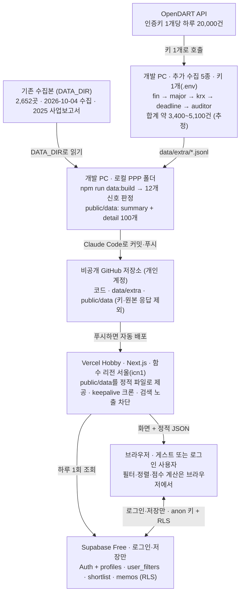

# PA Insight(가칭) 개발 설계서

> 온라인 설계서(https://claude.ai/artifact/JcG83vdy2MsFCa23vBuThz)를 2026-10-05에 Markdown으로 내보낸 사본이다. 설계가 바뀌면 이 파일도 함께 고친다. 같은 날 바뀐 계획(개발 PC 한 대·OpenDART 키 1개로 추가 수집 5종, 기존 수집본으로 먼저 배포)은 이 파일에 먼저 반영했다.

2026-10-05 · @유태상

기존 수집본(2026-10-04, 상장사 2,652곳)에 부족한 항목만 OpenDART로 추가 수집해, 4개 용역 × 3개 신호로 PA 제안 후보를 고르는 웹서비스를 2026-10-07까지 완성한다. 무료 플랜(Vercel Hobby·Supabase Free)만 쓰고, 로컬 폴더 `C:\Users\yjh51\Desktop\PPP`에 구현한 뒤 Claude Code로 GitHub에 올려 Vercel로 배포한다.

## 범위와 제약

앱은 기존 수집본에 추가 수집분을 합친 스냅샷으로 동작하고, 실행 중에는 OpenDART나 LLM API를 호출하지 않는다.

| 구분 | 내용 |
| --- | --- |
| 대상 기업 | 기존 수집본 2,652곳(코스피 831·코스닥 1,821) 중 스팩 71곳과 리츠·인프라펀드 26곳을 뺀 2,555곳 |
| 용역·신호 | 회계·결산 지원(PA), 내부회계관리제도, IFRS 18 도입 지원, 재무자문·구조조정 × 각 3개 = 12개 |
| 데이터 | 기존 수집본(2025 사업보고서 기준) + 추가 수집 5종. 화면에 데이터 기준일과 추가 수집 반영 여부 표시 |
| 화면 | 5개: 로그인, 대시보드, 추천 목록, 기업 상세, 내 후보·설정 |
| 사용자 | 로그인 없이 모든 조회 가능. 로그인하면 조건·후보·메모·프로필 저장 |
| 일정 | 개발 완료 2026-10-07, 제출 2026-10-08 11:00, 링크 유지 2026-10-30까지 |

**만들지 않는 것**

- 앱 실행 중 OpenDART·LLM API 호출, 데이터 자동 갱신
- 기존 수집본에 이미 있는 항목의 재수집
- 감사시간 초과, 감사보고서 강조사항, 감사 전 재무제표 미제출: 기존 수집본에 있어도 신호·화면에 쓰지 않는다
- 회원가입 화면, 이메일 인증, 비밀번호 찾기, 계정 삭제(내 데이터 지우기만 제공)
- 관리자 화면

**원칙**

- 무료 플랜만 쓴다: Supabase Free, Vercel Hobby.
- OpenDART 키는 1개이며 개발 PC의 `.env`에만 둔다. GitHub·Vercel·브라우저 어디에도 두지 않고, Supabase service\_role 키는 쓰지 않는다.
- 브라우저에는 공개용 Supabase URL과 anon 키만 두고, 사용자 데이터는 RLS로 보호한다.
- 대표자명은 공시된 기업개황 정보로 적재해 상세·연락처 복사·CSV에 표시한다. 담당자 개인 연락처와 법인·사업자등록번호는 수집하지 않는다.
- 사용자 데이터는 로그인 이메일과 본인이 입력한 프로필·메모뿐이다.
- 독립성: 현재 감사인이 삼일회계법인인 회사는 기본으로 숨기고 상세 화면에 경고를 띄운다. 최종 판단은 사내 독립성 절차를 따른다.
- 모든 추천은 공시 신호 기반 검토 후보이며 용역 수요를 확정하지 않는다고 화면에 적는다.

## 시스템 구성

공시 데이터는 빌드 때 정적 JSON으로 만들어 저장소에 커밋하고, Vercel이 그대로 내보낸다. Supabase는 로그인과 개인 저장에만 쓴다. 추가 수집과 `data:build`, 커밋·푸시는 모두 개발 PC 한 대에서 한다(2026-10-05 변경).



OpenDART 키는 개발 PC의 `.env` 밖으로 나가지 않는다. 방문자는 Vercel이 내보내는 JSON만 읽으므로 Supabase가 멈춰도 조회는 계속된다.

Vercel 함수 리전은 서울(`vercel.json`의 `regions: ["icn1"]`), Node.js는 `package.json`의 `engines.node` `"24.x"`로 고정한다. 링크를 아는 사람만 쓰는 프로토타입이라 모든 페이지에 robots `noindex`를 붙여 검색 노출을 막는다. 자세한 설정은 '배포와 운영'에 있다.

## 데이터 수집

수집은 두 겹이다. 기존 수집본은 그대로 쓰고, 신호에 모자란 항목만 OpenDART로 5종 추가 수집한다. 추가 수집은 개발 PC 한 대에서 OpenDART 키 1개로 5종을 모두 실행한다(2026-10-05 변경). 예상 호출은 모두 합쳐 약 3,400\~5,100건으로 키 하나의 하루 한도(20,000건)의 17\~26%다(추정).

**기존 수집본** — `상장기업자료_최종검토본/08_상장기업전체_웹앱용_기업데이터.json`, 2026-10-04 수집·10-05 검토 완료

| 항목 | 내용 | 쓰는 곳 |
| --- | --- | --- |
| 대상 | 네이버 증권 목록(2026-10-04 22:53) 기준 2,652곳. 중복 우선주 114종목과 상장펀드 2종목은 이미 제외 | 대상 목록 |
| 기업개황 | 시장, 업종코드, 대표자, 결산월, 상장일, 홈페이지·IR·대표전화·팩스·주소 | 목록·상세·CSV, IF2 |
| 재무 | 2025 사업보고서 자산총계·매출액·영업이익. 연결·별도 중 한 기준, 원래 통화 | 규모 구간, IC1·IF3 근사 |
| 감사인 이력 | 2020\~2025 사업연도별 감사인 (연도마다 직접 조회) | PA2, 독립성 |
| 감사의견·핵심감사사항 | 2025 감사의견과 핵심감사사항 원문 | RS2, 상세 참고 |
| M&A 공시 | 2025-10-04\~2026-10-04 주요사항보고서 중 합병·주식양수·영업양수·주식교환 | PA3·IC3 |
| 쓰지 않음 | 감사시간·감사보수, 감사보고서 강조사항, 감사 전 재무제표 미제출, 비감사용역 | — |

**추가 수집** — 부족한 항목만, 대상은 `data/universe.json`의 2,555곳

| 명령 | API · 요청 조건 | 받는 것 | 호출 수 | 풀리는 신호 | 담당 · 순서 |
| --- | --- | --- | --- | --- | --- |
| `collect:fin` | 다중회사 주요계정 `fnlttMultiAcnt.json` · 100곳씩, 2025 사업보고서(11011), 없으면 2024 | 연결·별도 자산·부채·자본금·자본총계·매출·영업이익 3개년·세전이익·순이익 | 약 30 | IF1, RS3, IC1 정확화 | 개발 · 1 |
| `collect:major` | 공시검색 `list.json` · 주요사항보고서(B), 최근 12개월을 89일 이하 구간으로, 코스피·코스닥 | 합병·분할·영업양수, 부도·회생·감자 등 | 10\~60 | RS1, PA3·IC3에 분할 추가 | 개발 · 2 |
| `collect:krx` | `list.json` · 거래소공시(I), 최근 12개월 | 제목에 횡령·배임이 든 공시 | 수백\~1,200 | IC2 | 개발 · 3 (2와 같은 날) |
| `collect:deadline` | `list.json` · 2024\~2026년 3/20\~4/10, 유형 전체(응답에 공시유형 필드가 없어 유형으로 좁히지 않음) | 사업보고서 제출기한 연장신고 | 수백\~1,200 | PA1 | 개발 · 4 |
| `collect:auditor` | 회계감사인 `accnutAdtorNmNdAdtOpinion.json` · 2026 반기(11012), 회사당 1회, 2,555곳 한 번에 | 2026 반기 감사인 | 약 2,560 | 현재 감사인, PA2 확정 | 개발 · 5 |

**권장 실행 순서**: `collect:fin` → `collect:major` → `collect:krx` → `collect:deadline` → `collect:auditor`.

- `collect:major`와 `collect:krx`는 같은 날 끝낸다. 조회 종료일 기본값이 실행일이라, 다음 날 옵션 없이 다시 돌리면 구간이 바뀌어 캐시를 못 쓰고 처음부터 다시 호출한다. 그래서 시작할 때 조회 종료일을 크게 출력하고, 실패·중단하면 `다시 실행: npm run collect:major -- --end YYYYMMDD`를 덧붙인다. 다음 날 이어받을 때도 같은 `--end`(첫 실행일)를 준다. 형식이 틀리거나 오늘보다 뒤인 `--end`는 호출 전에 멈춘다.
- `collect:deadline`은 날짜가 고정(2024\~2026년 3/20\~4/10)이라 언제 다시 돌려도 캐시를 쓴다. 이 기간은 12월 결산 회사의 사업보고서 기한(3월 말) 기준이라, 12월 결산이 아닌 회사(대상 2,555곳 중 31곳)는 PA1 판정 범위 밖이다. `-- --probe`는 '연장'이 들어간 제목 목록만 출력하고 결과 파일을 쓰지 않는다.
- 저장하지 않고 멈추는 경우(결과 `*.jsonl`·`*.meta.json`을 쓰지 않음): 응답 상태가 000·013이 아닌 요청이 하나라도 있을 때(모든 명령, 상위 10건 출력), `collect:fin`에서 주요계정을 받은 회사가 대상의 90% 미만일 때(`-- --allow-low`로만 저장), `collect:deadline`에서 연장신고가 0건일 때(제목 목록 출력, `-- --allow-empty`로만 저장). 받은 응답은 캐시에 남으므로 같은 명령을 다시 실행하면 새 호출이 거의 없다.
- `collect:fin`의 90%는 저장을 막는 최소선이고, 출시 합격 기준은 95%다(검증 '추가 수집 품질 기준'). 90\~95%면 저장은 되지만 합격이 아니므로 '매칭 안 된 계정명'을 보고 `fin.mjs` 계정 규칙을 고쳐 다시 실행한다(받은 응답은 캐시라 새 호출이 거의 없다).
- `*.meta.json`에는 결과 내용과 조회 조건(구간 `from`·`to`, 연도 등 기록 항목)을 함께 넣어 만든 해시(`hash`)를 남긴다. 캐시로 같은 조건·같은 결과를 다시 쓰면 수집 시각(`collectedAt`)을 그대로 두어 데이터 기준일이 밀리지 않고, 조회 구간이 바뀌면 결과가 같아도 새 수집 시각이 된다. 대시보드 '데이터 상태'는 이 기록으로 `반영 · 수집 YYYY-MM-DD · 개수`를 보여 준다. 개수는 주요계정이 받은 회사 `N곳`, 2026 반기 감사인이 `감사인 확인 N곳`(파트 합계), 주요사항·거래소공시·연장신고가 `N건`이다. 개수가 0이거나 감사인 파트가 덜 모이면 주황색으로 표시한다.
- `collect:auditor`는 호출이 가장 많아 가장 오래 걸린다(약 10\~25분, 추정). 마지막에 돌리고, 그동안 배포 작업을 나란히 해도 된다.
- `--part 1/2`·`2/2` 분할은 여럿이 키를 나눠 받을 때만 쓰는 선택 기능이다. 지금 계획에서는 쓰지 않는다.

결과는 `data/extra/`에 명령(파트)마다 다른 파일(`*.jsonl`, `*.meta.json`)로 쌓여, 나중에 여럿이 나눠 받아도 커밋이 충돌하지 않는다. 추가 수집 전인 신호는 화면에서 '추가 수집 전'으로 비활성 표시된다.

**공통 수집 규칙**

1. 모든 호출은 `scripts/lib/dart.mjs` 하나로 한다. 요청 간격 0.22초, 타임아웃 20초. 네트워크 오류·HTTP 오류·800·900이면 2·4·8초 뒤 다시 시도해 최대 4번까지 하고(마지막 시도 뒤에는 기다리지 않는다), 4번 모두 실패하면 멈춘다.
2. 상태코드: 000 정상 · 013 데이터 없음 · 020 한도 초과(즉시 멈추고 다음 날 같은 명령으로 이어받기) · 800·900 재시도 · 010·011·012·901 키 문제(멈추고 알림). 그 밖의 상태(100 잘못된 값 등)는 모아 두었다가 끝에 상위 10건(상태코드·메시지·요청 인자)을 보여 주고 결과 파일을 저장하지 않고 멈춘다. 이 응답은 캐시에 남기지 않아 다시 실행하면 그 요청부터 다시 받는다. 정상(000·013) 응답 없이 이런 응답이 10번 연속 오면 키·기간 같은 설정 문제로 보고 끝까지 가지 않고 그 자리에서 멈춘다(마지막 응답 출력, 한도 낭비 방지). 캐시에서 읽은 정상 응답도 연속 수를 되돌린다(다시 실행할 때 흩어진 실패만 몰려 와서 잘못 멈추지 않게). 요청이 10건보다 적은 명령(`collect:deadline`은 기본 6건)은 끝까지 받은 뒤 저장 전 검사에서 멈춘다.
3. 000·013 원본 응답은 `data/raw/`에 저장하고 커밋하지 않는다. 이미 받은 요청은 건너뛰어, 끊겨도 같은 명령으로 이어받는다. 캐시는 임시 파일에 다 쓴 뒤 이름을 바꿔 저장하고, 읽을 수 없는(쓰다 끊긴) 캐시는 지우고 다시 받는다. 모의 서버(`DART_BASE_URL`)로 받은 응답은 `data/raw/_mock/`에 따로 저장해 실제 캐시와 섞이지 않게 한다.
4. 수집 플래그(`--part`·`--year`·`--fallback`·`--end`·`--years`·`--type`) 뒤에 값을 빠뜨리면 기본값으로 넘어가지 않고 호출 전에 멈춘다.
5. 수집은 개발 PC에서 `.env`의 키 1개로 5종을 모두 실행한다(2026-10-05 변경). 대상 목록은 `data/universe.json` 하나라 기존 수집본 폴더 없이도 수집할 수 있고, 여럿이 나눌 때 쓰는 `--part` 분할(선택)도 어긋나지 않는다.
6. 금액은 쉼표를 지운 원 단위 정수로, '-'·빈 값은 null로 저장한다.
7. 끝나면 새 호출·캐시·정상·데이터 없음·기타·확인 필요 건수를 출력한다.

**첫날 확인할 것**

모두 개발이 실행 순서대로 확인한다.

- [ ] 모든 명령에서 `확인 필요 0건`인지 확인. 0건이 아니면 저장 없이 멈춘 것이니 출력된 상태코드를 보고 같은 명령을 다시 실행한다
- [ ] `collect:fin`의 받은 회사 `N/2555곳`이 합격 기준 95% 이상인지(90% 미만이면 저장 없이 멈춤), '매칭 안 된 계정명'에 자본금·세전이익 변형이 있는지 확인 → 있으면 `fin.mjs` 계정 규칙에 추가
- [ ] `collect:major`·`collect:krx` 시작 줄의 조회 종료일을 적어 둔다. 다음 날 이어받으면 그 날짜를 `-- --end`로 준다
- [ ] `collect:krx`가 출력하는 제목 예에서 횡령·배임 표기('ㆆ' 등)가 잡히는지 확인
- [ ] `collect:deadline`은 옵션 없이 유형 전체·3개년으로 받는다. `list.json` 응답에는 공시유형 필드가 없어 유형을 확인해 `--type`으로 좁힐 수 없다. `-- --probe`는 '연장'이 들어간 실제 제목 목록(규칙 밖 제목 표시)만 보여 주고 파일은 쓰지 않는다. 제목 규칙에 안 맞는 표기가 있거나 0건으로 멈추면 규칙을 고쳐 다시 실행한다(받은 응답은 캐시라 새 호출이 거의 없다)
- [ ] `collect:auditor`의 `감사인 확인 N곳` 비율 확인. 반기보고서가 없는 회사는 2025 감사인을 그대로 쓴다
- [ ] `npm run data:build` 뒤 대시보드 '데이터 상태' 칩 5개가 모두 `반영 · 수집 날짜 · 개수`(초록, 주요계정·감사인은 `N곳`, 공시 3종은 `N건`)인지 확인

## 데이터 구조

공시 데이터는 DB에 넣지 않고 `npm run data:build`가 만드는 정적 JSON으로 제공한다. Supabase에는 사용자 데이터 테이블 4개만 두며, 금액은 원 단위 정수다.

| 파일·테이블 | 내용 | 만드는 곳 |
| --- | --- | --- |
| `public/data/summary.json` (약 1MB) | 메타(기준일, 대상·제외 수, 추가 수집 반영 여부, 신호별 수, 최근 신호 공시 8건) + 회사 2,555곳 요약 | `data:build` |
| `public/data/detail/00~99.json` | 회사 상세. 고유번호 끝 2자리로 100개 파일에 나눔 | `data:build` |
| `data/universe.json` | 추가 수집 대상 2,555곳 (고유번호·종목코드·회사명·시장) | `data:build` |
| `data/extra/*.jsonl`, `*.meta.json` | 추가 수집 결과와 수집 기록 | `collect:*` |
| profiles · user\_filters · shortlist · memos | 사용자별 저장 데이터. 본인 행만 읽고 쓴다 | 웹 (로그인 사용자) |

**summary.json 회사 행**

```text
c    고유번호        n    회사명          s    종목코드        m    시장(KOSPI·KOSDAQ)
ig   업종 그룹       au   현재 감사인     ag   감사인 그룹(SAMIL·BIG4·OTHER)
a    자산총계(원, 원화 재무만)            sz   규모(L 2조 이상 · M 5천억~2조 · S 5천억 미만 · U 모름)
ceo  대표자          ph   대표전화        fx   팩스            hp   홈페이지        ad   주소
h    신호 목록 [[신호 ID, 근거 문구, 근거일, 중복 방지 키, 접수번호], …]
```

**detail 회사 항목**: 기업개황(대표자·상장일·업종코드·결산월), 연락처(대표전화·팩스·홈페이지·IR·주소), 재무(기존 수집본 3개 항목 + 추가 수집한 연결·별도 주요계정), 감사인 이력(2026 반기 포함), 감사의견·핵심감사사항, 근거 공시, 신호별 근거, 판정하지 않은 이유.

```sql
-- PA Insight: 사용자 데이터 테이블 (본인 행만 읽기·쓰기)
-- Supabase 대시보드 → SQL Editor에 이 파일 내용을 붙여 넣고 Run 한다.
-- 공시 데이터는 DB에 넣지 않고 public/data의 JSON으로 제공한다.

create table if not exists public.profiles (
  user_id      uuid primary key default auth.uid() references auth.users on delete cascade,
  display_name text,
  team         text,
  memo_sign    text,
  updated_at   timestamptz not null default now()
);

create table if not exists public.user_filters (
  user_id    uuid primary key default auth.uid() references auth.users on delete cascade,
  filters    jsonb not null,
  updated_at timestamptz not null default now()
);

create table if not exists public.shortlist (
  user_id    uuid not null default auth.uid() references auth.users on delete cascade,
  corp_code  text not null,
  status     text not null default '검토 전'
             check (status in ('검토 전', '검토 중', '제안 대상', '제외')),
  saved_at   timestamptz not null default now(),
  updated_at timestamptz not null default now(),
  primary key (user_id, corp_code)
);

create table if not exists public.memos (
  user_id    uuid not null default auth.uid() references auth.users on delete cascade,
  corp_code  text not null,
  body       text not null check (char_length(body) <= 200),
  updated_at timestamptz not null default now(),
  primary key (user_id, corp_code)
);

alter table public.profiles     enable row level security;
alter table public.user_filters enable row level security;
alter table public.shortlist    enable row level security;
alter table public.memos        enable row level security;

drop policy if exists own_rows on public.profiles;
drop policy if exists own_rows on public.user_filters;
drop policy if exists own_rows on public.shortlist;
drop policy if exists own_rows on public.memos;

create policy own_rows on public.profiles     for all using (user_id = auth.uid()) with check (user_id = auth.uid());
create policy own_rows on public.user_filters for all using (user_id = auth.uid()) with check (user_id = auth.uid());
create policy own_rows on public.shortlist    for all using (user_id = auth.uid()) with check (user_id = auth.uid());
create policy own_rows on public.memos        for all using (user_id = auth.uid()) with check (user_id = auth.uid());
```

공시 테이블과 적재 스크립트가 없으므로 service\_role 키도 필요 없다.

## 신호 판정 로직

12개 신호는 `scripts/build-data.mjs`가 예/아니오로 판정해 JSON에 넣는다. 기준값과 문구는 `config/signals.json` 한 곳에서 관리하고, 실행이 끝나면 신호별 해당 회사 수를 출력한다. 추가 수집 전인 신호는 판정하지 않는다.

**공통 정의**

- 기준일 D = 기존 수집일(2026-10-04)과 추가 수집일 중 가장 늦은 날(한국 날짜). '최근 12개월' = D−364일 \~ D.
- 최근 사업연도 = 2025 사업보고서. 추가 수집에서 2025가 없으면 2024를 쓴다.
- 별도 = OFS, 연결 = CFS. '연결 작성' = CFS 행이 있음. 추가 수집 전에는 기존 수집본의 재무기준이 CFS인지로 본다.
- 재무 통화가 원화가 아니면 규모 기준 신호(IC1·IF1·IF3·RS3)를 판정하지 않고 상세에 이유를 적는다.
- 공시검색은 최종 보고서만(`last_reprt_at=Y`) 받아 정정 전 원공시와 겹치지 않는다. 같은 접수번호는 1건으로 센다.

| ID | 신호 | 데이터 | 판정식 | 근거 문구 예 | 해당 수 (10/4) |
| --- | --- | --- | --- | --- | --- |
| PA1 | 사업보고서 제출기한 연장신고 이력 | 추가: 연장신고 | 2024\~2026년 중 1회 이상. 연속 2개년이면 표시 | "2025·2026년 사업보고서 제출기한 연장신고 (2년 연속)" | 추가 수집 후 |
| PA2 | 주기적 지정 도래 추정 (6+3) | 기존: 감사인 2020\~2025, 추가: 2026 반기 감사인 | 아래 PA2 규칙 | "2021\~2026 같은 감사인(○○회계법인) 6년 연속 → 2027 사업연도 주기적 지정 가능(추정)" | 231 (10/5 감사인명 정규화 보강 뒤, 이전 228) |
| PA3 | 합병·분할·영업양수 결정 | 기존: M&A 공시, 추가: 주요사항보고서 | 최근 12개월 1건 이상 | "주요사항보고서(회사합병결정) · 2026-07-15" | 208 (분할 제외) |
| IC1 | 2029 연결 내부회계 감사 대상 | 추가: 주요계정 (전에는 기존 재무) | 2025 별도 자산총계 5,000억 이상 2조 미만 + 연결 작성. 추가 수집 전에는 연결 자산총계로 근사 | "자산총계 1조 2,000억(별도) · 연결 작성 → 2029 사업연도 연결 내부회계 감사(현행 일정)" | 427 (근사) |
| IC2 | 횡령·배임 혐의 발생 공시 | 추가: 거래소공시 | 최근 12개월 1건 이상 | "횡령ㆍ배임혐의발생 · 2026-05-19" | 추가 수집 후 |
| IC3 | 합병·분할·영업양수 결정 (통제 통합) | PA3과 같음 | PA3과 같음 | PA3과 같음 | 208 |
| IF1 | 영업외손익 비중 큼 | 추가: 주요계정 | 지주·금융 제외. 연결(없으면 별도)에서 abs(세전이익 − 영업이익) ≥ abs(영업이익) × 0.3, 그리고 10억 원 이상 | "영업외손익 +412억 (영업이익의 58%) · 연결" | 추가 수집 후 |
| IF2 | 지주회사·금융업 | 기존: 업종코드·회사명 | 업종코드 715·64992 → 지주회사, 64·65·66 → 금융업, 회사명에 '홀딩스'·'지주' → 지주회사(회사명 기준) | "업종: 지주회사 · 주된 사업활동 판단 필요" | 201 |
| IF3 | 자산 5천억 이상 + 연결 | 기존: 재무, 추가: 주요계정 | 연결 자산총계 5,000억 이상 | "연결 자산총계 2조 1,000억 · 연결 작성" | 713 |
| RS1 | 부도·회생·채권은행 관리·감자 공시 | 추가: 주요사항보고서 | 최근 12개월 1건 이상 | "주요사항보고서(감자결정) · 2026-05-19" | 추가 수집 후 |
| RS2 | 감사의견 비적정 | 기존: 2025 감사의견 | '한정'·'부적정'·'의견거절' 중 하나 포함 | "2025 감사의견: 의견거절" | 42 |
| RS3 | 자본잠식 50% 이상 | 추가: 주요계정 | 연결(없으면 별도) 자본금 > 0, (자본금 − 자본총계) ÷ 자본금 ≥ 0.5. 자본총계 ≤ 0이면 '전액잠식' | "자본잠식률 63% (자본금 420억, 자본총계 155억)" | 추가 수집 후 |

해당 수는 기존 수집본만으로 판정한 2026-10-04 기준이다. RS2는 '적정'이라는 글자로 판정하지 않는다. '부적정'에도 '적정'이 들어 있어서다. IF1의 0.3과 10억 원은 자체 기준이며 json에서 조정한다.

**PA2 규칙** (결산 기수 표기가 불규칙한 회사는 판정하지 않음)

| 2026 반기 감사인 | 같은 감사인 연속 | 근거 문구 |
| --- | --- | --- |
| 있음 | 2021\~2026 정확히 6년 | 2027 사업연도 주기적 지정 가능(추정) |
| 있음 | 7년 이상 | 지정 유예(우수기업) 또는 과거 지정 이력 포함 가능, 2027 지정 여부 확인 필요(추정) |
| 있음 | 2020\~2025 6년 뒤 2026년 변경 | 주기적 지정 첫해 추정 |
| 없음 (추가 수집 전) | 2020\~2025 6년 | 2026년 지정 첫해이거나 유예 추정 (2026 감사인 확인 필요) |
| 없음 (추가 수집 전) | 2021\~2025 5년 | 2026년에도 같으면 2027 사업연도 지정 대상(추정) |

**화면에 고정으로 붙는 주의 문구**

- PA2: "2026년부터 회계·감사 지배구조 우수기업은 주기적 지정이 3년 유예돼 '9년 자유선임 + 3년 지정'이 됩니다(2025.5.20 시행 외부감사법 시행령). 유예 여부와 과거 지정 이력은 공시로 확인할 수 없어 추정입니다."
- PA3: "추가 수집 전에는 기존 수집본의 분류(합병·주식양수·영업양수·주식교환)만 쓰고, 회사분할결정은 빠져 있습니다."
- IC1: "판정 자산은 별도 자산총계로 가정했고, 일정은 현행 기준입니다. 추가 수집 전에는 연결 자산총계로 근사합니다." 시행령 원문 확인 후 `ic1AssetBasis`를 연결로 바꿀 수 있게 한다.
- IF1: "기타손익과 금융·지분법손익이 섞인 근사치입니다. 정밀 분석은 제안 단계에서 합니다."
- RS3: "상장규정은 지배기업 소유주지분 기준이라 근사치입니다."
- 모든 신호: "공시 신호 기반 검토 후보이며 용역 수요를 확정하지 않습니다. 독립성은 사내 절차로 최종 확인하세요."

**공시 제목 분류 규칙**

```text
전처리    report_nm에서 공백과 맨 앞 대괄호 머리말([기재정정] 등)을 지운다
MNA       회사합병결정|회사분할결정|회사분할합병결정|영업양수결정|타법인주식및출자증권양수결정|주식교환[ㆍ·]?이전결정
DISTRESS  부도발생|영업정지|회생절차개시신청|해산사유발생|채권은행등의관리절차개시|감자결정
FRAUD     횡령|배임   (거래소공시 제목)
DEADLINE  '연장'을 포함하고 (사업보고서|제출기한)도 포함  → 첫날 --probe로 실제 제목 확인
```

**점수와 우선순위**

- 점수 = 사용자가 고른 용역·신호 중 해당 신호들의 서로 다른 근거 키 개수. 같은 공시로 걸린 PA3·IC3은 1개로 센다.
- 우선순위: 3 이상 '높음', 2 '보통', 1 '낮음'.
- 기본 정렬: 점수 내림차순 → 최신 근거일 → 회사명. '재무위험' 정렬은 재무자문·구조조정 신호 수, '자산' 정렬은 자산총계 기준이다.

**독립성 규칙**

- 현재 감사인 = 2026 반기 감사인(추가 수집), 없으면 2025 사업 감사인(기존 수집본).
- 2026 반기 감사인 고르기: 반기보고서 감사인 표에서 기수('제N기'의 N)가 가장 큰 행을 현재 행으로 본다(기수 표기가 없으면 연도가 가장 큰 행). 같은 기 행이 여럿이면 당기·당반기 표기 행을 먼저 보고(같은 기의 전기 행은 뺀다), 가장 큰 기 행에 당기·당반기 표기가 없는데 당기·당반기로 적힌 행이 따로 있으면, 그 행이 기수·연도 없는 '당반기'이거나 가장 큰 기 행들이 모두 전기·전전기·직전으로 적힌 경우(합병·분할로 기수가 다시 시작된 회사)에만 그 행을 쓴다. 가장 큰 기 행이 표기 없음이면 그 행을 그대로 쓴다(옛 행에 남은 '(당기)'로 지난해 감사인을 고르지 않게). 현재 행의 감사인 칸이 감사인 이름이 아니면(감사의견 '적정' 등, 문서명 '감사보고서' 등, '해당사항없음'·'-'·빈 값) 전기 행으로 대신하지 않고 2025 감사인을 쓴다. 버린 원문은 `auditor_2026h1.part*.jsonl`의 `invalid_raw`에 남긴다. 감사인 이름 판정은 공백을 지운 뒤 '회계'(오타 '회게'·'화계'·'…계법인' 포함)·'감사반'·'삼일'·'삼정'·'안진'·'한영'·'이촌'·KPMG·Deloitte·딜로이트·PwC·EY(대문자, 앞이 영문이 아닐 때) 중 하나가 들어 있는지로 하고, 수집 스크립트와 `data:build`가 같은 기준을 쓴다.
- 감사인명 정규화(비교·그룹 판정용, 화면에는 원문을 보여 준다): 괄호와 그 안의 글자(겹괄호 포함), '주식회사'·'㈜', '대표이사 …'·'대표공인회계사 …' 이하, 공백·기호를 지운다 → 흔한 오타를 고친다('회게법인'·'화계법인'·'회계겁인'·'회계버인'·'회계벙인' → '회계법인', 끝의 '회계법' → '회계법인', '우리계법인'처럼 '회'가 빠진 '계법인' → '회계법인') → 같은 이름 반복을 하나로 줄인다('안경회계법인 안경회계법인' → '안경회계법인') → 대형 4곳은 '삼일'·'삼정'·'안진'·'한영'으로 통일한다('EY한영회계법인' → '한영') → 나머지는 맨 앞 영문 접두(EY·딜로이트·Deloitte·KPMG·PwC)와 앞뒤의 '회계법인', 끝에 남은 '회계'를 뗀다('회계법인 세일원'·'세일원 회계법인' → '세일원', '우리회계' → '우리'). 단 반복을 지운 뒤에도 '회계법인'이 두 번 이상이면 서로 다른 법인 두 곳을 함께 적은 것으로 보고 통일하지 않는다('대주회계법인 삼일회계법인' → '대주회계법인삼일회계법인').
- 이름이 바뀐 법인(예: 대성삼경 → 대성)은 정규화 결과가 달라 같은 감사인으로 보지 않는다. 연속 연수가 짧게 잡히는 쪽(보수적)이며, PA2 문구는 '추정'을 그대로 쓴다.
- 감사인 그룹: '삼일' 포함 → SAMIL, '삼정'·'안진'·'한영' 포함 → BIG4, 나머지 → OTHER(두 법인을 함께 적은 표기도 '삼일'이 들어 있으면 SAMIL). 10/4 기준 SAMIL은 390곳이다.
- SAMIL은 추천 목록과 대시보드 집계에서 기본으로 숨기고(필터로 표시 가능), 최근 공시 목록에는 '삼일 감사 고객'으로 표시하며, 상세 화면 맨 위에 빨간 경고를 띄운다. 나머지는 '타 법인 감사 고객' 태그를 붙이며, 추천 목록 표와 상세 헤더에 같은 문구를 쓴다.

## 화면 설계

화면은 5개다. 게스트도 조회·추천·상세·CSV를 모두 쓰고, 저장 기능만 로그인 사용자에게 열린다. 구성과 문구는 로컬 구현(PPP)이 기준이며, 스타일은 프로토타입 v3에서 옮겼다.

| 화면 | 경로 | 구성 요소 | 데이터 | 게스트일 때 |
| --- | --- | --- | --- | --- |
| ① 로그인 | `/` | 서비스 소개, 이메일·비밀번호, '로그인하고 개인 맞춤으로 시작', '로그인 없이 둘러보기', 안내 문구. Supabase 키가 없으면 둘러보기만 열림 | 없음 | — |
| ② 대시보드 | `/dashboard` | KPI 4개(탐색 대상 상장사 수, 현재 조건 추천 기업 수, 내 후보 수와 진행 중 수, 최근 3개월 신호 공시 수), 용역별 추천 기업 수 막대, 최근 포착한 공시 신호 8건, 데이터 상태(기준일, 기존 수집본, 추가 수집 5종 반영 여부) | summary.json, shortlist | 게스트 배너(조건·후보·메모는 저장되지 않음) |
| ③ 추천 목록 | `/companies` | 필터(용역·신호·시장·자산 규모·업종·삼일 감사 고객 숨김·회사명 검색), 정렬(점수·회사명·재무위험·자산), 표(기업·점수·주요 근거·추천 용역·대표 연락처·우선순위·작업), 50곳씩 더 보기, CSV, '내 기본 조건으로 저장'. 추가 수집 전인 신호는 '추가 수집 전'으로 비활성 | summary.json, user\_filters | 기본 조건 저장 → 로그인 안내 |
| ④ 기업 상세 | `/companies/[corp]` | 헤더(시장·업종·현재 감사인·독립성 표시·점수·우선순위), 지표 4개(자산총계·부채비율·영업이익 3개년·영업외손익), 추천 근거, 제안 방향 초안, 회사 정보·컨택 포인트, 공시 보고서 바로가기, 감사인 이력, 감사의견·핵심감사사항(참고), 내 메모, 후보 저장, 검토 메모 초안 복사 | detail/{끝 2자리}.json, memos, shortlist | 메모·저장은 화면에만 유지 |
| ⑤ 내 후보·설정 | `/me` | 후보 탭: 상태 탭(전체·검토 전·검토 중·제안 대상·제외), 표(기업·상태 선택·대표 연락처·메모·저장일·작업). 설정 탭: 프로필(표시 이름·팀·메모 서명), 내 기본 조건 보기·초기화, 내 데이터 모두 지우기, 로그아웃 | profiles, user\_filters, shortlist, memos | 새로고침하면 사라진다는 안내 |

**공통 규칙**

- ①에서 로그인이나 둘러보기를 고르기 전에는 다른 경로로 들어와도 `/`로 보낸다. 원래 경로는 `?next=`로 기억했다가 돌려보낸다(같은 사이트의 앱 화면 경로만 허용).
- 왼쪽 메뉴는 대시보드·추천 목록·내 후보·설정 3개다. ④은 ③에서 들어간다. 위쪽 바에 화면 이름, 사용자 이름(또는 '게스트'), 로그인·로그아웃을 둔다.
- 폭 900px 이하에서는 메뉴를 아이콘만 남기고 표는 가로 스크롤한다. 360px에서 깨지지 않아야 한다.
- 외부 링크(DART 원문·홈페이지·IR)는 새 창으로 연다. DART 원문 = `https://dart.fss.or.kr/dsaf001/main.do?rcpNo={rcept_no}`.
- 금액은 억·조로 표시한다(예: 1조 2,400억). 외화 재무는 통화를 붙여 원래 금액 그대로 보여 준다. 비율은 정수 %.
- 근거 문구는 '가능'·'추정'으로 쓰고 '용역 필요'처럼 단정하지 않는다.

**④ 기업 상세 세부**

- 독립성: SAMIL이면 헤더 위에 빨간 띠 "삼일 감사 고객 · 현재 감사인이 삼일회계법인이에요. 재무제표 작성 지원·재무정보체제 구축 등 비감사업무는 법적으로 제한될 수 있으니, 제안 전 사내 독립성 검토가 필요해요." 그 밖에는 '타 법인 감사 고객' 태그.
- 점수·우선순위·추천 용역: 목록과 같은 기준(사용자가 고른 용역·신호, 추가 수집 전 신호 제외)으로 계산해, 목록에서 본 점수와 상세 점수가 같다. 현재 조건 밖 신호도 추천 근거 목록에는 보이되 '현재 조건 밖'으로 흐리게 표시한다.
- 컨택 포인트: 대표자, 홈페이지, 대표전화, 팩스, IR 페이지, 본사 주소. 값이 없으면 '공시에 없음'. '연락처 복사'는 대표자와 출처·기준일까지 복사한다. 아래에 "공시된 회사 대표 연락처만 보여줘요. 담당자 개인 연락처는 제공하지 않아요" 문구.
- 지표: 추가 수집 전에는 기존 수집본의 자산총계·영업이익(2025)만 보이고, 부채비율·영업외손익은 '추가 수집 후 표시'. 주요계정을 추가 수집한 뒤에도 그 회사 주요계정이 없으면 '주요계정 없음'. 외화 재무는 통화를 붙여 원래 금액으로 보이고 영업외손익 출처에 '외화 재무 · 규모 신호 제외'를 표시한다. 자산총계 출처는 주요계정의 사업연도(예: 2024 보완분은 '2024 사업보고서').
- 공시 보고서 바로가기: 2025 사업보고서(감사인 정보가 나온 보고서)와 근거 공시 목록(합병·분할, 부도·회생, 횡령·배임, 연장신고).
- 감사인 이력: 2020\~2025(추가 수집 뒤 2026 반기 포함) 연도별 감사인과 DART 원문 링크.
- 감사의견·핵심감사사항: 기존 수집본 원문을 참고로만 보여 준다. 신호에는 감사의견만 쓴다.
- 검토 메모 초안 복사: 회사명·시장·업종, 해당 신호와 날짜, 검토 용역, 회사 대표 연락처, 독립성 상태, '용역 수요를 확정하지 않음', 프로필 서명. 해당 신호 개수는 목록과 같은 현재 조건 기준이고, 전체와 다르면 '(현재 조건 기준 · 전체 N개)'를 붙인다.

**제안 방향 템플릿** (해당 용역마다 한 줄, 화면에 '템플릿 · 검토 필요' 표시)

| 용역 | 문구 |
| --- | --- |
| PA | 결산 일정과 감사 대응 부담을 줄이기 위한 결산 프로세스 진단과 재무제표·주석 작성 지원 범위를 논의해 볼 수 있어요. |
| 내부회계 | 2029년 연결 내부회계 감사 일정에 맞춘 현황 진단(갭 분석)과 단계별 구축 로드맵을 제안해 볼 수 있어요. 횡령·배임 공시가 있으면 자금 통제 재설계를 먼저 다뤄요. |
| IFRS 18 | 2027년 시행에 대비한 손익 구분 영향 분석, 2026년 비교정보 재작성, 연결 보고 양식 변경 준비를 제안해 볼 수 있어요. |
| 재무자문·구조조정 | 유동성·차입 구조를 점검하는 재무구조 진단과 개선 방안 검토를 제안하되, 공시 신호만으로 위기를 단정하지 않아요. |
| 삼일 감사 고객 | 맨 앞에 "감사 고객이므로 제안 전 독립성 검토가 먼저예요."를 붙인다. |

## 인증과 개인화

로그인은 Supabase 이메일·비밀번호 하나뿐이고, 처음 쓰는 이메일이면 그 자리에서 계정을 만든다. 로그인하지 않아도 저장을 뺀 모든 기능을 쓴다.

**Supabase 설정**

- Authentication → Providers → Email 사용, Confirm email 끔.
- 비밀번호 최소 길이 8자.
- Rate Limits: 로그인·가입 한도를 확인하고 올린다. 사내에서는 같은 IP로 요청이 몰릴 수 있다.
- URL Configuration의 Site URL = Vercel 배포 주소.

**로그인 흐름**

1. 이메일 형식과 비밀번호 8자 이상을 화면에서 먼저 확인한다.
2. `signInWithPassword({ email, password })`가 성공하면 개인 데이터를 불러오고 `/dashboard`(또는 `next`)로 간다.
3. 자격 증명 오류로 실패하면 `signUp({ email, password })`을 부른다.
4. signUp이 성공하면 이메일 인증을 꺼서 세션이 바로 나온다. "새 개인 공간을 만들었어요"를 띄우고 이동한다. 세션이 없으면 Supabase에서 Confirm email을 끄라는 안내를 띄운다.
5. signUp이 '이미 가입된 사용자' 오류를 주면 "비밀번호가 맞지 않아요"를 띄우고, 계정은 만들지 않는다.
6. 그 밖의 오류(요청 한도 등)는 "잠시 후 다시 시도하거나 로그인 없이 둘러보기를 이용해 주세요"를 띄운다.

이메일을 잘못 치면 새 계정이 생긴다. 프로토타입에서는 허용하고, 로그인 화면에 "처음 입력한 이메일로 새 공간이 만들어져요. 오타에 주의해 주세요."라고 알린다.

**게스트 모드**

- Supabase 세션 없이 들어오고, sessionStorage의 pa\_mode에 'guest'만 남긴다.
- 후보·메모는 React 상태에만 두어 새로고침하면 사라지고, 저장할 때마다 "새로고침하면 사라져요. 로그인하면 저장돼요"를 띄운다.
- 내 기본 조건 저장과 프로필 저장은 막고 로그인을 안내한다.
- 게스트가 '로그인'·'로그인하고 저장하기'·'로그인하러 가기'를 누르면, 담은 후보·메모가 있을 때 사라진다는 확인(브라우저 확인 창)을 거친 뒤 지금 화면을 `?next=`로 넘겨 로그인 화면으로 보낸다.
- 대시보드 집계는 추천 목록의 회사명 검색어를 쓰지 않는다(검색어는 ③에서만 적용).
- `lib/app-state.tsx`는 게스트(메모리)와 로그인(Supabase)에 같은 함수를 제공해, 화면 코드가 모드를 구분하지 않게 한다.

**저장 항목**

| 항목 | 테이블 | 저장 시점 |
| --- | --- | --- |
| 프로필(표시 이름·팀·메모 서명) | profiles | ⑤ 설정의 '프로필 저장' |
| 내 기본 조건 | user\_filters | ③의 '내 기본 조건으로 저장'. 다음 로그인부터 ②·③에 자동 적용 |
| 제안 후보와 상태 | shortlist | 저장 버튼·상태 선택 즉시 |
| 회사별 메모(200자) | memos | ④의 '메모 저장' |
| 내 데이터 지우기 | 위 4개 테이블의 본인 행 삭제 | ⑤ 설정, 화면 안 확인 창을 거친 뒤 |

**고정 안내 문구**

- 로그인 화면 상자: "회원가입이 필요 없어요. 처음 입력한 이메일이면 개인 공간이 자동으로 만들어지고, 다음에 같은 이메일·비밀번호로 들어오면 저장한 내용이 그대로 보여요. 이메일 인증 메일도 보내지 않아요."
- 로그인 화면 아래: "로그인은 개인 맞춤 기능을 위한 것이에요. 로그인하지 않아도 기업 추천·상세 분석 등 모든 기능을 쓸 수 있어요. 다만 게스트로 쓰면 후보·메모·조건이 저장되지 않아요." 그 아래 목록: "처음 입력한 이메일로 새 공간이 만들어져요. 오타에 주의해 주세요." / "회사 계정 비밀번호를 다시 쓰지 마세요." / "메모에는 고객 기밀·실명·금액을 입력하지 마세요."
- 로그인 화면 왼쪽 아래: "코스피·코스닥 상장사 OpenDART 공시 스냅샷 기반 프로토타입입니다." / "추천은 용역 수요를 확정하지 않으며, 독립성은 사내 절차로 최종 확인해야 합니다."
- 게스트 배너: "게스트 모드 · 모든 추천 기능을 그대로 쓸 수 있어요. 다만 조건·후보·메모는 이 화면을 떠나면 사라져요."
- 메모 입력란 아래: "고객 기밀·실명·금액은 입력하지 마세요."

## 웹 구현

웹·수집·빌드 스크립트·SQL을 저장소 하나(로컬 `C:\Users\yjh51\Desktop\PPP`)에 두었다. 공시 데이터는 빌드 때 만든 정적 JSON이라, 방문자는 Vercel이 내보내는 파일만 읽는다.

**기술 선택**

- 웹: Next.js 15 App Router + TypeScript, React 19, `@supabase/supabase-js`. 화면은 클라이언트 컴포넌트이고, 스타일은 프로토타입 v3의 CSS를 `app/globals.css`로 옮겼다. 디자인을 바꿀 때는 색상 변수와 서비스 이름만 바꾼다.
- 수집·빌드: Node.js 24.x(LTS) 스크립트(`scripts/`)이며 추가 의존성은 `dotenv`뿐이다. Python은 쓰지 않는다. `package.json`의 `engines.node`도 `"24.x"`라 Vercel이 같은 버전으로 빌드한다.

```text
PPP/
├─ CLAUDE.md                          # Claude Code 공통 규칙 (아래)
├─ README.md                          # 실행·추가 수집·배포 안내
├─ docs/design.md                     # 이 설계서 (Markdown으로 내보낸 것)
├─ .env.example                       # 환경변수 견본 → 복사해 .env (커밋 안 함)
├─ app/
│  ├─ page.tsx                        # ① 로그인
│  ├─ (app)/layout.tsx                # 입장 확인, 왼쪽 메뉴·위쪽 바
│  ├─ (app)/dashboard/page.tsx        # ② 대시보드
│  ├─ (app)/companies/page.tsx        # ③ 추천 목록
│  ├─ (app)/companies/[corp]/page.tsx # ④ 기업 상세
│  ├─ (app)/me/page.tsx               # ⑤ 내 후보·설정
│  └─ api/keepalive/route.ts          # 일시정지 방지 (하루 1회 크론)
├─ components/ModeBanner.tsx          # 게스트·로그인 안내 띠
├─ lib/
│  ├─ app-state.tsx                   # 로그인·게스트, 조건·후보·메모·프로필 (모드 공통)
│  ├─ data.ts                         # summary.json·detail 불러오기
│  ├─ scoring.ts                      # 필터·점수·우선순위·정렬
│  └─ config.ts · types.ts · format.ts · supabase.ts
├─ config/signals.json                # 신호 정의·기준값·문구 (스크립트·화면 공용)
├─ scripts/
│  ├─ build-data.mjs                  # 기존 수집본 + 추가 수집분 → public/data, data/universe.json
│  ├─ lib/common.mjs · lib/dart.mjs   # 경로·대상 목록, OpenDART 호출 공통
│  └─ collect/                        # fin · auditor-2026h1 · filings-major · filings-krx · filings-deadline
├─ data/
│  ├─ universe.json                   # 추가 수집 대상 2,555곳 (커밋)
│  ├─ extra/                          # 추가 수집 결과 *.jsonl, *.meta.json (커밋)
│  └─ raw/                            # OpenDART 원본 응답 캐시 (커밋 안 함)
├─ public/data/                       # summary.json, detail/00~99.json (커밋)
├─ supabase/migrations/001_user_tables.sql
└─ vercel.json                        # keepalive 크론, 함수 리전 icn1(서울)
```

**데이터 전달 방식**

- `npm run data:build`가 `public/data/summary.json`(약 1MB, 2,555곳 요약·신호·대시보드 메타)과 `detail/00~99.json`(고유번호 끝 2자리로 나눈 상세)을 만든다.
- ②·③은 `summary.json`을 한 번 받아 메모리에 두고, 필터·정렬·점수는 브라우저에서 계산한다(`lib/scoring.ts`).
- ④는 그 회사가 든 `detail/{끝 2자리}.json` 한 개(16\~50KB)만 받는다.
- 정적 파일이라 Vercel CDN이 내보내고, Supabase는 로그인·저장에만 쓰인다. Supabase가 멈춰도 조회는 된다.
- CSV는 브라우저에서 현재 목록으로 만들고 엑셀 한글을 위해 UTF-8 BOM을 붙인다. 열: 기업, 종목코드, 시장, 업종, 점수, 우선순위, 해당 신호, 추천 용역, 현재 감사인, 감사인 구분, 자산총계(원), 대표자, 대표전화, 팩스, 홈페이지, 주소.

**환경변수** (`copy .env.example .env`로 만든 뒤 값을 채운다)

| 변수 | 두는 곳 | 용도 |
| --- | --- | --- |
| `DART_API_KEY` | 개발 PC의 `.env`만 | OpenDART 추가 수집(키 1개). 공유·커밋·Vercel 입력 금지 |
| `DART_BASE_URL` | 개발 PC `.env` (보통 비워 둠) | 모의 서버 시험 전용. `http://127.0.0.1:포트`·`http://localhost:포트`만 받고 다른 값이면 호출 전에 멈춘다. 이때 캐시는 `data/raw/_mock/`에 따로 쌓인다. 실제 수집 때는 비워 둔다 |
| `DATA_DIR` | 개발 PC `.env` | 기존 수집본 폴더. `data:build`에만 필요 |
| `NEXT_PUBLIC_SUPABASE_URL` | 개발 PC `.env`, Vercel | Supabase 주소 (공개) |
| `NEXT_PUBLIC_SUPABASE_ANON_KEY` | 개발 PC `.env`, Vercel | 공개용 anon(publishable) 키. RLS로 보호 |
| `CRON_SECRET` | Vercel (로컬은 선택) | keepalive 요청 확인용. 영문·숫자 20자 이상 |

Vercel 환경변수는 `NEXT_PUBLIC_` 값을 포함해 모두 바꾼 뒤 다시 배포해야 반영된다. `NEXT_PUBLIC_` 값은 빌드할 때 화면 코드에 들어간다.

**CLAUDE.md (Claude Code 공통 규칙)** — 저장소에 있는 파일 그대로다.

```markdown
# PA Insight — Claude Code 공통 규칙

## 프로젝트
- Next.js 15 (App Router, TypeScript) + Supabase(Auth와 사용자 테이블 4개만) + Vercel Hobby.
- 공시 데이터는 DB가 아니라 `public/data/*.json` 정적 파일로 제공한다. 만드는 곳은 `scripts/build-data.mjs` 하나다.
- 데이터 흐름: 기존 수집본(`DATA_DIR`) + 추가 수집분(`data/extra/*.jsonl`) → `npm run data:build` → `public/data`.
- 추가 수집 대상은 `data/universe.json`(2,555곳)이다. 이 파일과 `public/data`는 `data:build`로만 만들고 손으로 고치지 않는다.
- 추가 수집 결과는 명령마다 다른 파일(`*.jsonl`, `*.meta.json`)로 남겨 여러 사람이 커밋해도 충돌하지 않게 한다.
- 설계서는 `docs/design.md`다. 파일·필드 이름은 설계서를 따르고, 바꿔야 하면 설계서를 먼저 고친다.

## 지켜야 할 것
- 비밀 키(`DART_API_KEY`, Supabase service_role 등)를 코드·커밋·`NEXT_PUBLIC_` 변수에 넣지 않는다. `.env`와 `data/raw/`는 커밋하지 않는다.
- 앱 실행 중에 OpenDART나 LLM API를 호출하지 않는다. OpenDART는 `scripts/collect/`에서만 부른다.
- 신호 이름·기준값·문구는 `config/signals.json`에서만 고친다. 화면과 스크립트에 따로 정의하지 않는다.
- 공시 데이터에서 쓰지 않는 항목: 감사시간 초과, 감사보고서 강조사항, 감사 전 재무제표 미제출. 다시 넣지 않는다.
- 대표자명은 공시된 기업개황 정보로 적재·표시한다. 담당자 개인 연락처, 법인·사업자등록번호는 수집하지 않는다.
- 독립성: 현재 감사인이 삼일회계법인이면 목록에서 기본 숨김, 상세 화면에 경고. 문구는 '추정'·'가능'으로 쓰고 용역 수요를 단정하지 않는다.
- 금액은 원 단위 정수로 저장하고 화면에서 조·억으로 바꾼다. 외화 재무는 규모 기준 신호에서 빼고 이유를 표시한다.
- 스팩(이름에 '스팩')과 리츠·인프라펀드(instrument_type RT·IF·MF)는 추천 대상에서 뺀다.

## 자주 쓰는 명령
- `npm run dev` 로컬 실행 / `npm run build` 배포 빌드 확인
- `npm run data:build` 화면용 데이터 다시 만들기
- `npm run collect:fin | collect:auditor | collect:major | collect:krx | collect:deadline` 추가 수집
```

## 배포와 운영

로컬 PPP 폴더를 Claude Code로 GitHub 비공개 저장소(개인 계정 YTS-12)에 올리고, Vercel이 그 저장소를 배포한다. 추가 수집을 기다리지 않고 2026-10-05에 기존 수집본 데이터로 먼저 배포하고, 추가 수집분은 `data:build` 뒤 푸시해 다시 배포한다. 10/30까지 Vercel Hobby와 Supabase Free로 운영하며, 하루 한 번 도는 크론으로 Supabase 일시정지를 막는다. 담당은 개발이다.

**배포 순서**

- [ ] 로컬: `npm install` → `copy .env.example .env` → `npm run dev`로 화면 확인 → `npm run build` 통과
- [ ] Supabase(Vercel 첫 배포 전에): 프로젝트 생성(가능하면 서울 리전) → SQL Editor에서 `001_user_tables.sql` 실행 → Auth 설정(Email 사용, Confirm email 끔, 비밀번호 8자, 요청 한도 상향) → Project Settings → API에서 URL·anon 키를 확보해 `.env`에 넣기
- [ ] GitHub 저장소: 웹에서 개인 계정에 비공개 저장소를 README·.gitignore·license 없이 빈 저장소로 만든다. 기본 브랜치는 `main`이다. 팀원은 초대하지 않는다(Vercel Hobby는 비공개 저장소 협업을 지원하지 않는다)
- [ ] 커밋 작성자: 로컬 저장소의 커밋 작성자 이메일(`git config user.email`)을 그 GitHub 계정에 인증된 이메일로 설정한다. Hobby에서는 커밋 작성자가 Vercel에 연결한 GitHub 계정 본인이어야 배포된다
- [ ] 푸시: Claude Code에 "이 폴더를 GitHub 비공개 저장소의 main으로 올려줘. .env와 data/raw는 빼고"처럼 요청한다. `public/data`와 `data/universe.json`은 반드시 올린다(Vercel에는 기존 수집본 폴더가 없다)
- [ ] Vercel: 저장소 Import → Import 화면의 Environment Variables에 3개(`NEXT_PUBLIC_SUPABASE_URL`, `NEXT_PUBLIC_SUPABASE_ANON_KEY`, `CRON_SECRET`) 입력 → 첫 Deploy. `DART_API_KEY`는 넣지 않는다. `NEXT_PUBLIC_` 값을 포함해 모든 환경변수는 바꾼 뒤 다시 배포(Redeploy)해야 반영된다
- [ ] Supabase → Authentication → URL Configuration의 Site URL을 Vercel 주소로 바꾼다
- [ ] 배포 주소에서 5개 화면·로그인·저장을 확인하고, keepalive는 Vercel → Settings → Cron Jobs의 Run 또는 `Authorization: Bearer <CRON_SECRET>` 헤더로 호출해 본문이 `ok:true`인지 확인한다

이후에는 로컬에서 고치고 Claude Code로 커밋·푸시하면 Vercel이 자동으로 다시 배포한다. 데이터를 바꿀 때는 `npm run data:build` 뒤 `data/extra`와 `public/data`를 함께 커밋한다.

**배포 설정**

- 함수 리전: `vercel.json`의 `regions: ["icn1"]`(서울). keepalive 같은 서버 함수가 서울에서 돈다.
- Node.js: `package.json`의 `engines.node`를 `"24.x"`로 둬 Vercel 빌드도 Node.js 24를 쓴다.
- 검색 노출 차단: 모든 페이지에 robots `noindex`를 붙인다.

**일시정지 방지 크론**

Supabase Free는 7일 동안 활동이 없으면 프로젝트를 멈춘다. `/api/keepalive`가 하루 한 번 anon 키로 profiles 테이블을 조회해 요청을 만든다. Vercel 크론은 `Authorization: Bearer <CRON_SECRET>` 헤더를 붙여 부르므로, 값이 다르면 401을 돌려준다. 브라우저로 그냥 열면 401이 정상이다. 배포 환경에서 `CRON_SECRET`이 빠져 있으면 누구나 부를 수 없게 503을 돌려준다(로컬은 없어도 동작).

Supabase 조회 헤더: 새 publishable 키(`sb_publishable_…`)는 `apikey` 헤더로만 보내고, 예전 anon 키(JWT, `eyJ…`)일 때만 `Authorization: Bearer <키>`도 붙인다. publishable 키는 JWT가 아니어서 Bearer 토큰으로 쓰지 않는다.

| 응답 | 뜻 |
| --- | --- |
| 200, 본문 `ok:true` | Supabase 조회 성공 |
| 401 | `Authorization` 헤더가 없거나 `CRON_SECRET`과 다름 |
| 503 | Supabase 환경변수 또는 (배포 환경의) `CRON_SECRET`이 없음 |
| 502 | Supabase 응답 실패 |

실패하면 200이 아닌 오류 코드(503·502)를 돌려줘, 수동 호출 결과나 로그에서 성공과 바로 구분된다.

```json
{
  "regions": ["icn1"],
  "crons": [{ "path": "/api/keepalive", "schedule": "0 0 * * *" }]
}
```

UTC 0시는 한국 시간 오전 9시다. Hobby 플랜 크론은 정한 시각에서 최대 1시간 안에 실행된다.

**10/30까지 점검**

2026-10-12 · 2026-10-19 · 2026-10-26에 접속·로그인·저장을 확인한다. Hobby는 런타임 로그를 1시간만 보관하므로 크론이 돌았는지는 Vercel 로그가 아니라 Supabase 대시보드(Paused 상태가 아닌지, API 요청이 매일 있는지)를 기준으로 본다. 멈춰 있으면 Restore 후 Vercel → Settings → Cron Jobs의 Run으로 keepalive를 한 번 불러 `ok:true`를 확인한다.

**동시 접속 대비 (300\~400명)**

- 공개 화면과 공시 데이터는 정적 파일이라 Vercel CDN이 처리하고, Supabase에는 부하가 가지 않는다.
- Supabase는 로그인과 저장에만 쓰인다. 사내에서 같은 IP로 로그인이 몰려 한도에 걸리면, 오류 문구에서 '로그인 없이 둘러보기'를 안내한다.
- 시연과 투표 동선은 '로그인 없이 둘러보기'를 기본으로 안내한다.

## 일정과 역할

4일 일정의 관문은 10/6 12시 추가 수집 마감, 10/6 18시 실데이터 배포, 10/7 18시 기능 동결, 10/8 11시 제출이다.

| 구분 | 작업 | 일정 |
| --- | --- | --- |
| 개발 | Supabase·GitHub·첫 배포 (기존 수집본 데이터) | 10/5 09시 – 22시 |
| 개발 | 추가 수집 5종 (개발 PC 한 대·키 1개, fin → major → krx → deadline → auditor) | 10/5 09시 – 10/6 12시 |
| 개발 | 신호 샘플 검증 | 10/6 12시 – 18시 |
| 개발 | 추가 수집 반영·재배포 | 10/6 12시 – 18시 |
| 개발 | 디자인·이름 변경·수정 | 10/6 18시 – 10/7 18시 |
| 전원 | 화면 QA·시연 리허설 | 10/7 13시 – 20시 |
| 관문 | **추가 수집 마감** | **10/6 12시** |
| 관문 | 실데이터 배포 | 10/6 18시 |
| 관문 | 기능 동결 | 10/7 18시 |
| 관문 | 제출 마감 | 10/8 11시 |

로컬 구현은 끝나 있어, 10/5에는 개발이 기존 수집본 데이터로 Supabase·GitHub·Vercel 첫 배포를 먼저 마치고, 같은 PC에서 키 1개로 추가 수집 5종을 돌린다(2026-10-05 변경, 수집 담당 3명 없음). 가장 오래 걸리는 `collect:auditor`는 배포 작업과 나란히 돌려도 된다. 추가 수집이 늦어져도 기존 수집본만으로 7개 신호가 동작하므로 배포는 막히지 않는다.

## 작업 목록

남은 작업은 Claude Code에 하나씩 넣을 수 있는 크기로 나눴고, 완료 조건을 확인한 뒤 다음으로 넘어간다. 설계서를 Markdown으로 내보낸 `docs/design.md`를 저장소에 두고, 작업마다 "design.md의 ○○ 섹션과 CLAUDE.md를 따라 W2를 진행하고, 완료 조건을 확인한 방법을 알려줘"처럼 요청한다.

| ID | 담당 | 작업 | 상태 | 완료 조건 |
| --- | --- | --- | --- | --- |
| W0 | 개발 | 로컬 구현: 5개 화면, 신호 판정(`data:build`), 추가 수집 스크립트 5종, 게스트 모드 | 완료 | `npm run build` 통과, 게스트로 5개 화면·필터·CSV 동작, 모의 응답으로 수집 5종·이어받기·파트 분할 확인 |
| W1 | 개발 | 로컬 실행: `npm install`, `.env` 만들기, `npm run dev` | 완료 (10/5) | localhost:3000에서 로그인 없이 둘러보기 동작 |
| W2 | 개발 | Supabase 프로젝트, `001_user_tables.sql`, Auth 설정, `.env`에 URL·anon 키 | 진행 전 | 새 이메일 생성, 틀린 비밀번호 오류, 재로그인 뒤 저장 유지, 계정 2개로 서로의 행이 안 보임 |
| W3 | 개발 | 웹에서 빈 비공개 저장소(개인 계정, `main`) 생성, 커밋 작성자 이메일을 그 계정의 인증 이메일로 설정, Claude Code로 푸시 | 진행 전 | `.env`·`data/raw`는 빠지고 `public/data`·`data/universe.json`은 올라감 |
| W4 | 개발 | Vercel 연결, 환경변수 3개, 첫 배포 (기존 수집본 데이터) | 진행 전 | 배포 주소에서 5개 화면 동작, keepalive를 Vercel → Settings → Cron Jobs의 Run 또는 `Authorization: Bearer <CRON_SECRET>` 헤더로 호출해 본문 `ok:true` |
| C1 | 개발 | `collect:fin` → `collect:major` → `collect:krx` (major·krx는 같은 날 끝냄) | 진행 전 | 주요계정 보유 비율과 매칭 안 된 계정명 확인, 주요사항보고서 건수 출력, 횡령·배임 제목 예 확인 |
| C2 | 개발 | `collect:deadline` (옵션 없이 유형 전체·3개년, `-- --probe`로 '연장' 제목 목록 확인) | 진행 전 | 연장신고 실제 제목 확인, 건수 출력 |
| C3 | 개발 | `collect:auditor` (옵션 없이 2,555곳 한 번에, 약 10\~25분) | 진행 전 | 2,555곳 처리, 감사인 확인 비율 출력 |
| W5 | 개발 | 추가 수집분으로 `data:build`, `data/extra`·`public/data` 커밋·푸시해 재배포 | 진행 전 | 대시보드 데이터 상태가 모두 '반영', 신호별 해당 수 리포트. 0건 신호는 원인 확인 |
| W6 | 개발 | 디자인·서비스 이름 변경 | 진행 전 | 색상 변수와 이름만 바꾸고 화면 QA 통과 |
| Q1 | 개발 | 신호별 샘플 검증 | 진행 전 | 신호마다 해당 3곳·비해당 1곳을 DART 원문과 대조해 불일치 0 |
| Q2 | 전원 | 화면 QA·시연 리허설 | 진행 전 | 검증 섹션의 화면 QA 모두 통과 |

## 검증

출시 조건은 세 가지다: 추가 수집 품질 기준 통과, 12개 신호 샘플 검증 통과, 화면 QA 통과.

**추가 수집 품질 기준** (자체 기준)

| 항목 | 기준 | 담당 |
| --- | --- | --- |
| 주요계정 | 대상 2,555곳의 95% 이상이 2025 또는 2024 주요계정 보유 | 개발 |
| 2026 반기 감사인 | 2,555곳 처리(`--part`로 나눴으면 파트 합계), 감사인 확인 비율 리포트 | 개발 |
| 공시 분류 | 분류(합병·분할, 부도·회생·감자, 횡령·배임, 연장신고)마다 샘플 10건에서 오분류 0 | 개발 |

기존 수집본은 2026-10-05에 검토를 마쳤다. 확인된 재무 7,782칸이 원문과 일치했고, 감사인 이력 15,912개 기업연도는 연도마다 직접 조회했다.

**신호 샘플 검증**

신호마다 해당 3곳과 비해당 1곳을 DART 원문과 대조한다. 추가 수집을 개발 PC 한 대에서 모두 받으므로(2026-10-05 변경) 검증도 개발이 맡고, 아래 묶음 순서로 한다.

- 주요계정·주요사항보고서: IC1, IF1, IF3, RS1, RS3
- 감사인·거래소공시: PA2, RS2, IC2, 독립성(삼일 감사 고객 표시)
- 연장신고·M&A·기업개황: PA1, PA3, IC3, IF2, 대표자·연락처 표시

**화면 QA**

- [ ] 게스트: 5개 화면 이동, 필터·정렬·상세·CSV 동작, 저장 시 안내 문구
- [ ] 로그인: 새 이메일 생성, 틀린 비밀번호 오류, 재로그인 뒤 조건·후보·메모·프로필 유지
- [ ] RLS: 계정 2개로 서로의 후보·메모가 보이지 않음
- [ ] 독립성: 삼일 감사 고객이 기본으로 숨겨지고, 상세에서 경고가 보임
- [ ] 추가 수집 전 신호는 '추가 수집 전'으로 비활성, 반영 뒤 활성
- [ ] 상세 컨택 카드·연락처 복사·CSV에 대표자가 보임
- [ ] 화면 폭 360px·1440px에서 깨짐 없음
- [ ] DART 원문·홈페이지·IR 링크가 새 창으로 열림

**시연 동선 (1\~2분)**

1. '로그인 없이 둘러보기'(또는 로그인)로 들어가 대시보드의 용역별 추천 수를 보여준다.
2. 추천 목록에서 PA 용역과 '주기적 지정 도래 추정' 신호로 거른다.
3. 상위 회사 상세에서 근거 공시·대표자·컨택 포인트·제안 방향 초안을 보여준다.
4. 후보로 저장하고 상태를 '검토 중'으로 바꾼 뒤 내 후보에서 확인한다.

## 리스크와 대응

가장 큰 리스크는 추가 수집이 늦어지는 것이지만, 기존 수집본만으로 7개 신호가 동작해 배포는 막히지 않는다.

| 리스크 | 영향 | 대응 | 담당 |
| --- | --- | --- | --- |
| 추가 수집이 늦거나 일부 실패 | PA1·IC2·IF1·RS1·RS3 비활성, PA2·IC1은 근사 | 기존 수집본으로 먼저 배포. 같은 명령을 다시 실행해 이어받기(major·krx를 다음 날 이어받을 때는 `-- --end`에 첫 실행일) | 개발 |
| 키 1개로 5종을 모두 받음 | 하루 한도(020)에 걸리면 그날 수집 중단 | 예상 합계 약 3,400\~5,100건으로 한도의 17\~26%(추정). 020이면 다음 날 같은 명령으로 이어받기 | 개발 |
| 연장신고·횡령·배임 제목이 예상과 다름 | PA1·IC2 누락 | `collect:deadline -- --probe`의 '연장' 제목 목록과 `collect:krx` 제목 예로 첫날 확인, 정규식 수정. `list.json` 응답에 공시유형 필드가 없어 유형으로 좁히지 않고 유형 전체·3개년으로 받는다 | 개발 |
| 주요계정 계정명 변형(자본금·세전이익) | RS3·IF1 누락 | '매칭 안 된 계정명' 출력 확인 후 `fin.mjs` 계정 규칙 추가 | 개발 |
| 연결 내부회계 자산 판정 기준(별도·연결) | IC1 오판 | 시행령 원문 확인 후 `signals.json`의 `ic1AssetBasis`만 바꿔 다시 빌드 | 개발 |
| 감사인명 정규화 오류 | 독립성 오표시 | 상세 화면에 원래 감사인명 표시, 샘플 검증 | 개발 |
| 여럿이 나눠 수집할 때(선택) 같은 파일을 커밋 | 병합 충돌 | 수집 결과는 명령·파트별 파일. `data:build`와 `public/data` 커밋은 개발만. 지금은 개발 PC 한 대라 해당 적음 | 개발 |
| 커밋 작성자가 Vercel에 연결한 GitHub 계정과 다름 | 푸시해도 배포 안 됨 (Hobby는 비공개 저장소 협업 미지원) | `git config user.email`을 그 계정에 인증된 이메일로 설정. 팀원 초대 안 함 | 개발 |
| `.env`가 저장소에 올라감 | 키 유출 | `.gitignore`에 `.env`, 커밋 전 Claude Code로 확인. 올라갔으면 OpenDART 키 재발급 | 개발 |
| Supabase 7일 비활동 일시정지 | 로그인·저장 불가 (조회는 정상) | 하루 1회 keepalive, 주 1회 Supabase 대시보드(Paused 여부·API 요청) 확인. Hobby 런타임 로그는 1시간만 남음 | 개발 |
| 사내 같은 IP에서 로그인이 몰림 | 로그인 한도 초과 | Auth 한도 상향, 오류 시 게스트 안내 | 개발 |
| 개인정보·고객정보 입력 | 대회 규정 위반 | 대표자명은 공시된 기업개황만 표시, 개인 연락처 미수집, 메모 경고 문구 | 전원 |

## 출처

2026-10-05에 확인한 API 가이드, 규정·기사와 기존 수집본 안내 파일이다.

**OpenDART 개발가이드**

- [공시검색 (list.json)](https://opendart.fss.or.kr/guide/detail.do?apiGrpCd=DS001&apiId=2019001) — 요청 인자, 3개월 제한, 상태코드, 하루 20,000건 한도
- [기업개황 (company.json)](https://opendart.fss.or.kr/guide/detail.do?apiGrpCd=DS001&apiId=2019002) — 기존 수집본
- [고유번호 (corpCode.xml)](https://opendart.fss.or.kr/guide/detail.do?apiGrpCd=DS001&apiId=2019018) — 기존 수집본
- [다중회사 주요계정 (fnlttMultiAcnt)](https://opendart.fss.or.kr/guide/detail.do?apiGrpCd=DS003&apiId=2019017)
- [회계감사인의 명칭 및 감사의견 (accnutAdtorNmNdAdtOpinion)](https://opendart.fss.or.kr/guide/detail.do?apiGrpCd=DS002&apiId=2020009)
- [주요사항보고서 API 목록 (DS005)](https://opendart.fss.or.kr/guide/main.do?apiGrpCd=DS005)

**규정·기사**

- [금융위원회 — 외부감사법 시행령 개정, 주기적 지정 유예 (2025.5)](https://www.fsc.go.kr/no010101/84565)
- [금융감독원 — 최근 감사인 지정 제도 개선사항 설명회 자료 (2025.7)](https://files-scs.pstatic.net/2025/07/14/iusTXzN9mU/%EC%84%A4%EB%AA%85%ED%9A%8C%EC%9E%90%EB%A3%8C%2002_%EC%B5%9C%EA%B7%BC%20%EA%B0%90%EC%82%AC%EC%9D%B8%20%EC%A7%80%EC%A0%95%20%EC%A0%9C%EB%8F%84%20%EA%B0%9C%EC%84%A0%EC%82%AC%ED%95%AD.pdf)
- [금융위원회 — 연결 내부회계 감사 2029·2030년 연기 (2023.12)](https://www.fsc.go.kr/no010101/81242)
- [이투데이 — 사업보고서 제출기한 연장 기업 현황 (2025.3)](https://www.etoday.co.kr/news/view/2454939)
- [뉴스토마토 — 코스닥 횡령·배임 현황과 내부통제 (2026.9)](https://newstomato.com/ReadNews.aspx?no=1314243)
- [시대 — 자금 부정 통제활동 기재 의무화 (2024.11)](https://www.sidae.com/article/2024111108305817245)
- [Crowe — 금감원 K-IFRS 1118 안내 (2026.4)](https://www.crowe.com/kr/news/news20260428_kr)

**기존 수집본** (로컬 폴더 `상장기업자료_최종검토본`)

- `00_파일설명_먼저읽어주세요.txt` — 대상 2,652곳의 선정 기준, 기준 시점, 신호 해석의 한계
- `10_기업데이터_수집완료현황과검증결과.json` — API별 수집 상태와 검증 수치
- `12_전체검토결과_수정사항과미확인기업.txt` — 검토·수정 내용, 공시 링크 미확인 37곳
